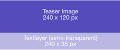
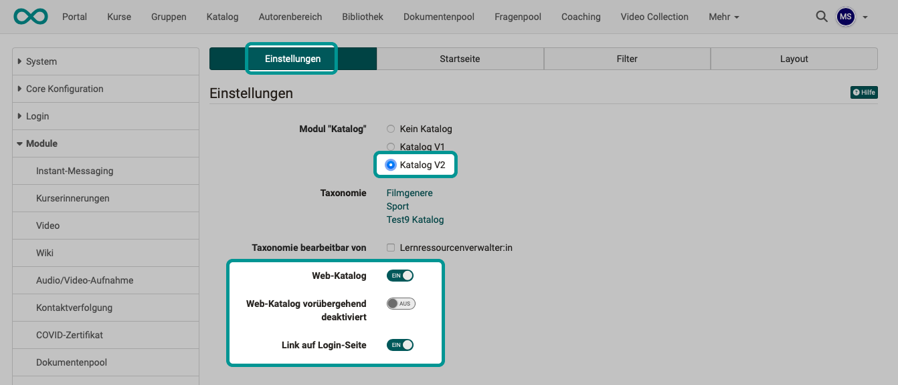

# Modul Katalog {: #modul_catalog}

## Tab Einstellungen {: #tab_settings}

Hier können Administrator:innen das Modul des Kataloges einschalten. Man kann den Katalog V1 oder V2 aktivieren oder ihn komplett deaktivieren. Je nachdem welche Option Sie wählen, erscheinen unterschiedliche weitere Tabs.

Ist der [Katalog V2](#config_catalog_v2) aktiviert, kann zusätzlich ab Release 20 der [Web-Katalog](#config_web-catalog) aktiviert werden. 

Ausserdem kann eine [Taxonomie](Modules_Taxonomy.de.md) für den Katalog gewählt werden.

{ class="shadow lightbox" }

[Zum Seitenanfang ^](#modul_catalog)

---

## Konfiguration des Katalogs V1 {: #config_catalog_v1}

Wenn Sie den Katalog V1 einschalten, erscheint der Tab "Konfiguration" und Sie können weitere Einstellungen vornehmen. 

    
[Zum Seitenanfang ^](#modul_catalog)

---

## Konfiguration des Katalogs V2 {: #config_catalog_v2}

### Tab Startseite {: #tab_start_page}

Auf der Startseite kann man sogenannte **"Launcher"** hinzufügen. Launcher sind die konfigurierbaren Zeilen der Startseite. Standardmässig ist ein Launcher vom Typ "Zuletzt hinzugefügt" aktiviert. Die Launcher kommen in 3 Typen: Statischer Text, Statisch (Manuell auswählen), Taxonomie-Ebenen.
Allen Launcher kann ich einen sprachabhängigen Namen geben. Dieser Name erscheint dann als Headline über den Kacheln. Die Launcher können auch nur für spezifische Organisationen freigegeben werden. Dies erreiche ich über das Label "Einschränkung auf Organisation".

#### Taxonomie Launcher

Taxonomie Launcher nutzen die Katalogfachbereichsstruktur, um die verschiedenen Taxonomielevel als Baum anzuzeigen.

#### (Taxonomie-) Microsite

Klickt man auf einen Level bei einem Launcher kommt man auf die Taxonomie Microsite. Hier werden alle Kurse angezeigt, die unter diesem Level eingeordnet wurden. Hat die Fachbereichstaxonomie mehrere Level in diesem Strang werden die weiteren Level angezeigt.

Man kann die Kursliste weiter durch Filter oder Suche verfeinern.

#### Statischer Launcher

In diesem Launcher kann man statischen Text hinzufügen. Einige Optionen beinhalten: Fett, Kursiv, Textgrösse, Schriftart, Bild hinzufügen, Video hinzufügen, Trennstriche ...

### Tab Filter {: #tab_filter}

Dieser Tab steuert, welche Filter auf den Microseiten und der Suchergebnisseite verfügbar sind und vom User genutzt werden können. Filter können z.B. Fachbereiche, Taxonomieebene, Angebotsart, Durchführungsformat, Semester, Lizenz, Hauptsprache, Lernressourcentyp, Autor usw. sein. 

### Tab Layout {: #tab_layout}

Dieser Tab beinhaltet alles, was das Erscheinungsbild des Katalogs V2 angeht. Man kann den Anzeigetitel des Katalogs anpassen und ein Hintergrundbild für den Header der Startseite auswählen.

Unter **Kacheln Taxonomieebenen Launcher**, kann man das Aussehen der Kacheln der Microsites beeinflussen.

Die **Anzeige der Lernressourcen Card** steuert, welche Metadaten auf der Card der Startseite angezeigt werden sollen. Diese Metadaten müssen in der jeweiligen Lernressource unter `Einstellungen > Metadaten` ausgefüllt werden.

{class="lightbox"}

### Verwalten des Kataloges {: #v2_admin}

Der Katalog V2 wird aus der Fachbereichs-Taxonomie gespeist. Benutzer mit der Rolle [Lernressourcenverwalter](../../manual_user/basic_concepts/Roles_Rights.de.md) und Administratoren können die Verschlagwortung über das Menü verwalten.
Bei Klick gelangt man auf die Fachbereiche. Dort kann man die aktuelle Taxonomie auswählen, Neue Taxonomieebenen erstellen und importieren und auch Ebenen löschen.

Das Löschen der Ebenen löscht nur die Verschlagwortung, keine verknüpften Lernressourcen. Ist diese gelöscht, taucht eine Lernressource nicht mehr im Katalog auf.

!!! warning "Achtung"

    Die Fachbereiche, Verschlagwortung, Taxonomie die man als Lernressourcenverwalter bearbeiten kann, kann auch andere Bereiche betreffen, in denen die Taxonomie benutzt wird. Diese können sein: ePortfolio Einträge, Curriculum Einträge, Dokumentenpool.

{ class="shadow lightbox" }

Das Recht zur Verwaltung eines Katalog- bzw. Fachbereichteils kann verschiedenen Personen gegeben werden. (Initial wird dieses Recht von Administrator:innen vergeben.) Wählen Sie den gewünschten (Teil-)Fachbereich und dann den Tab "Verwaltung".

{ class="shadow lightbox" }

[Zum Seitenanfang ^](#modul_catalog)

---

### Erstellung von passendem Bildmaterial für den Katalog {: #pictures_for_the_catalog}

Im Katalog werden Bilder für unterschiedliche illustrative Zwecke benutzt. Dies ist eine Auflistung der Bildgrössen und des Verhaltens bei unterschiedlichen Dimensionen. Die unten angebotenen Schemata kann man sich als Richtlinie im Grafikprogramm über das aktuelle Bild legen, um den passenden Auschnitt zu wählen.

#### Hintergrundbilder

Für die Hintergründe der Taxonomieunterseiten, sowie der Startseite werden Bilddimensionen von **1324 x 240 px** empfohlen. Ist das Bild höher als 240px wird ein passender Ausschnitt aus der Mitte heraus genommen.
Taxonomieebenen-Hintergründe lassen sich im Tab "Taxonomie" anpassen.
Das Hintergrundbild für die Startseite finet man unter Layout.

Das Anschnitt (Cropping) Verhalten bei kleineren Bildgrössen illustriert:

Hintergrund für den Start
{class="lightbox"}

Hintergrund für die Taxonomyebenen
{class="lightbox"}

#### Taxonomie-Launcher-Bilder
Je nach Einstellung haben wir es hier mit quadratischen oder rechteckigen Bildern zu tun.
Die Rechteckigen Bilder besitzen eine Aspect Ratio von **16:9** mit empfohlener Anzeige von **640 x 360 px**. Der Textbalken darunter verdeckt ca. 80px.

Rechteckig

{class="lightbox"}

Quadratisch

{class="lightbox"}

#### Kursbilder

Können direkt im Kurs eingestellt werden und sollten die Dimensionen 570x380 px nicht überschreiten. Ansonsten wird hier auch ein passender Ausschnitt aus der Mitte genommen. Siehe hier

{class="lightbox"}

[Zum Seitenanfang ^](#modul_catalog)

---

## Konfiguration des Web-Katalogs {: #config_web-catalog}

Wurde im Tab "Einstellungen" der Katalog V2 gewählt, steht als weitere Option die Aktivierung des Web-Katalogs zur Auswahl (ab Release 20).

Der Web-Katalog ist ein nach aussen gespiegelter Katalog, auf den auch Personen zugreifen können, die noch nicht in OpenOlat registriert sind. Deshalb kann auch ein Link auf der Login-Seite eingerichtet werden, so dass der Web-Katalog ohne Login aufgerufen werden kann. Erst bei Buchung eines Kurses werden die Besucher:innen dann durch den Registrierungsprozess geführt.

Der Web-Katalog kann auch vorübergehend deaktiviert werden.

{ class="shadow lightbox" }

[Zum Seitenanfang ^](#modul_catalog)

---

## Weitere Informationen {: #further_information}

[Taxonomie einrichten >](Modules_Taxonomy.de.md) 
[Beschreibung des Katalogs im Benutzerhandbuch >](../../manual_user/area_modules/catalog2.0.de.md) 

