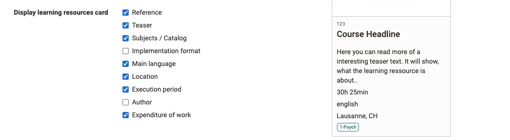
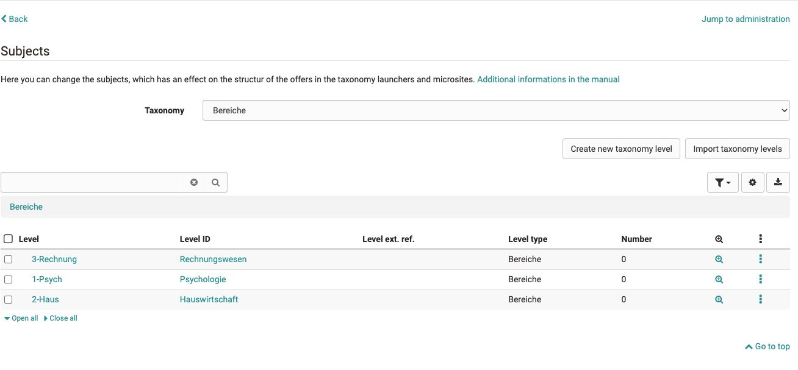

# Module: Catalog

## Settings

Here you can set the module of the catalogue. Either deactivate the catalogue or use version 1 or version 2.

## Catalog V1

If you activate the catalogue V1, you have the configuration available as a further tab.

### Configuration

On this tag you can indicate whether the catalogue should be displayed in the "Courses" tab.

## Catalog V2

### Start page

On the start page you can add so-called "launchers". Launcher are the configurable lines of the start page.  By default, a launcher of the type "Last added" is activated. The launchers come in 3 types: Static Text, Static (Select Manually), Taxonomy Levels.
I can give all launchers a language-dependent name. This name then appears as a headline above the tiles. The launchers can also be released for specific organisations only. I achieve this via the label 'Restriction to organisation'.

### Taxonomy Launcher

Taxonomy launchers use the catalogue subject area structure to display the different taxonomy levels as a tree.

### (Taxonomy) Microsite

Clicking on a level in a launcher takes you to the taxonomy microsite. All courses that have been classified under this level are displayed here. If the subject area taxonomy has several levels in this strand, the other levels are displayed.

You can further refine the course list by filtering or searching.

### Static Launcher

In this launcher one can add static text. Some options include: Bold,Italic, Text size, Font, Add image, Add video, Hyphens....

### Filters

This tab controls which filters are available on the microsites and search results page. Here you can select which filters should be available for participants. By default, these filters are activated here.

To add filters, press Add Filter in the top left-hand corner.

### Layout

This tab contains everything concerning the appearance of the catalogue. You can customise the display title of the catalogue and select a background image for the header of the start page.

Under **Tiles Taxonomy Levels Launcher**, one can influence the appearance of the tiles of the microsites.

The **Learning Resources Card display** controls which metadata should be displayed on the card of the start page. This metadata must be filled in in the respective learning resource under 'Settings > Metadata'.

{class="lightbox"}

### Management of subjects,taxonomy

{class="lightbox"}

Catalogue V2 is fed from the subject taxonomy, who can be administrated  under ´Administration > Taxonomy´. Users with the role [learning resource manager](../../manual_user/access_roles_rights/index.md) and administrator can manage the keywording via the menu.
Clicking takes you to the subjects. There you can select the current taxonomy, create and import new taxonomy levels and also delete levels.

Deleting levels only deletes the keywording, not any linked learning resources. Once deleted, a learning resource no longer appears in the catalogue.

!!! warning

    The subjects, keywording, taxonomy that can be edited as a learning resource administrator can also affect other areas in which the taxonomy is used. These can be: ePortfolio entries, curriculum entries, document pool.
