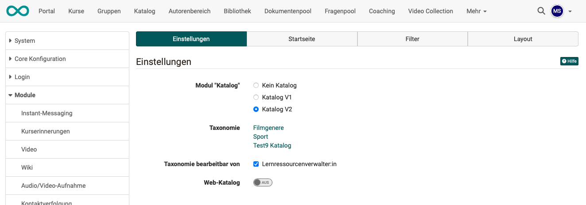
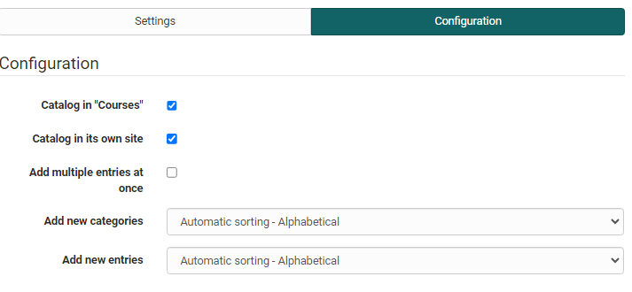
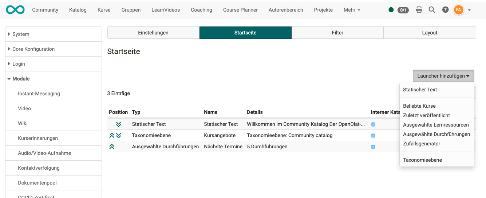
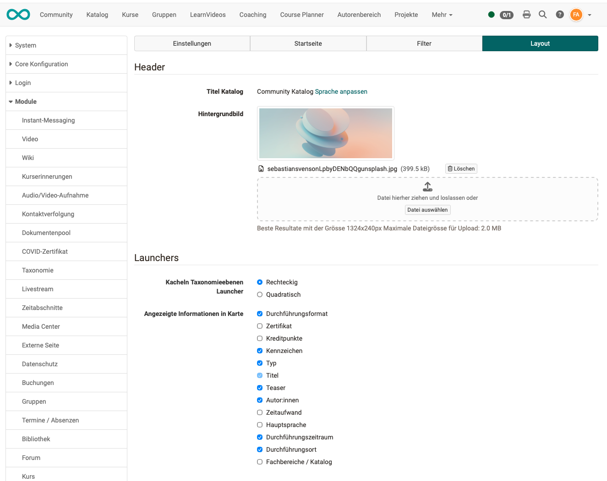
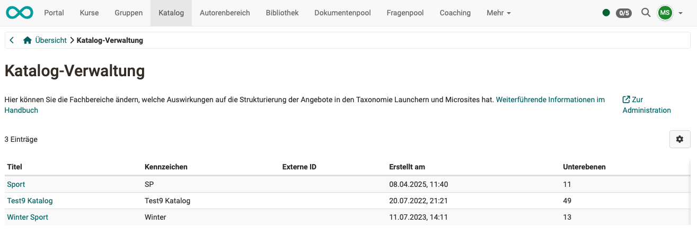
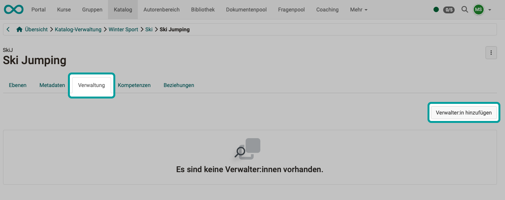
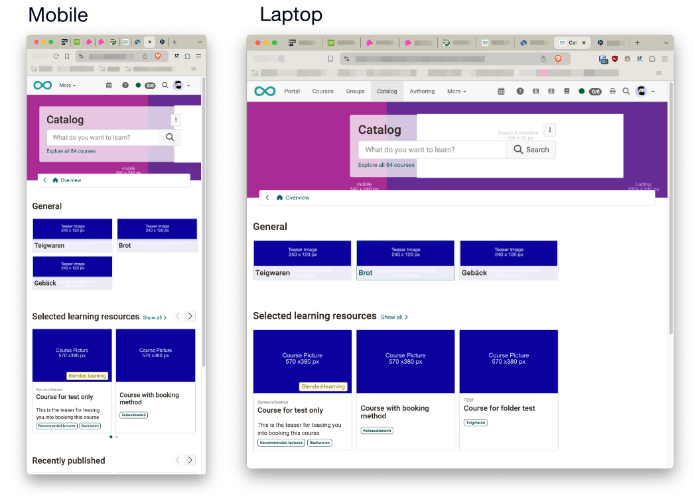
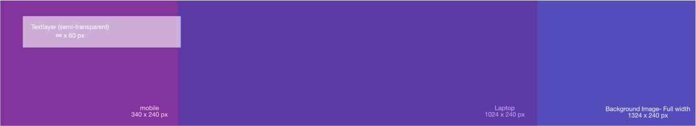
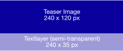
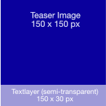

# Module Catalog {: #modul_catalog}

## Tab Settings {: #tab_settings}

Administrators can activate the catalog module here. You can activate the catalog V1 or V2 or deactivate it completely. Depending on which option you select, different additional tabs appear.

If the [Catalog V2](#config_catalog_v2) is activated, the [Web catalog](#config_web-catalog) can also be activated from release 20. 

In addition, a [Taxonomy](Modules_Taxonomy.md) can be selected for the catalog.

{ class="shadow lightbox" }

[To the top of the page ^](#modul_catalog)

---

## Configuration of Catalog V1 {: #config_catalog_v1}

If you activate the catalog V1 you see the tab "configuration" and can configure more details.

[To the top of the page ^](#modul_catalog)

---

## Configuration of Catalog V2 {: #config_catalog_v2}

### Tab "Launch page" {: #tab_start_page}

You can add so-called **"launchers"** to the start page. Launchers are the configurable sections of the start page.

The content displayed in a launcher is automatically selected based on the selected launcher type. The available launcher types are described below. By default, a launcher of the type “Recently published” is activated. 

All launchers can be given a name in different languages. The name then appears as a header above the tiles. Launchers can also be released only for specific organizations. To do this, select "Restriction to organization." In addition, you can specify separately whether a launcher is displayed in the internal and/or external catalog.

{ class="shadow lightbox" }

#### Launcher type "Static text"

Static text can be added manually in this launcher.

#### Launcher type "Popular courses"

The order of the offers in this launcher is determined by the number of clicks on course elements during the last 28 days. Only courses with the status "Published" are taken into account.

#### Launcher type "Recently published"

The offers are sorted by publication date.

#### Launcher type "Random generator"

The offers displayed in this Lauchner are shown in random order.

#### Launcher type "Taxonomy level"

Taxonomy launchers use the catalog department structure to display the various taxonomy levels.
In a “taxonomy” launcher, courses and learning resources are not displayed directly; instead, the taxonomy levels shown correspond to folders where the learning resources can be found.

Clicking on one of the categories (taxonomy levels) displayed in a taxonomy launcher takes you to a microsite. All courses classified under this level are displayed here. If the department taxonomy has several levels in this string, the other levels are displayed.

The offers are automatically selected according to the defined taxonomy level and then displayed in alphabetical order.

When configuring this launcher, you use the **Type** field [:octicons-tag-16:{ title="from Release 21.0 (OO-9431)" }](https://track.frentix.com/issue/OO-9431){:target="_blank"} to define what the launcher refers to:

* **Taxonomy:** Selection of a taxonomy from the taxonomies available for the catalog.
* **Taxonomy level:** Selection of a specific taxonomy level.

#### Launcher type "Selected learning resources"

The manually added learning resources can be sorted by clicking on the double arrows in front of the entries.  

#### Launcher type "Selected implementations"

The manually added entries can be sorted by clicking on the double arrows in front of the entries.

[To the top of the page ^](#modul_catalog)

---

### Tab Filters {: #tab_filter}

This tab controls which filters are available on the microsites and the search results page and can be used by the user. Filters can be, for example, subject areas, taxonomy level, offer type, implementation format, semester, license, main language, learning resource type, author, etc. 

### Layout {: #tab_layout}

This tab contains everything concerning the appearance of the catalog V2. You can customize the display title of the catalogue and select a background image for the header of the start page.

Under **Tiles Taxonomy Levels Launcher**, one can influence the appearance of the tiles of the microsites.

The **Learning Resources Card display** controls which metadata should be displayed on the card of the start page. This metadata must be filled in in the respective learning resource under `Settings > Metadata`.

{ class="shadow lightbox" }

[To the top of the page ^](#modul_catalog)

---

### Management of catalog V2 {: #v2_admin}

Catalog V2 is fed from the subject taxonomy, who can be administrated  under `Administration > Taxonomy`. Users with the role [learning resource manager](../../manual_user/basic_concepts/Roles_Rights.md) and administrator can manage the keywording via the menu.
Clicking takes you to the subjects. There you can select the current taxonomy, create and import new taxonomy levels and also delete levels.

Deleting levels only deletes the keywording, not any linked learning resources. Once deleted, a learning resource no longer appears in the catalog.

!!! warning "Attention"

    The subjects, keywording, taxonomy that can be edited as a learning resource administrator can also affect other areas in which the taxonomy is used. These can be: ePortfolio entries, curriculum entries, document pool.

{ class="shadow lightbox" }

The right to manage a catalog or subject area section can be granted to different persons. (Initially, this right is assigned by administrators.) Select the desired subject area section and then the "management" tab.

{ class="shadow lightbox" }

The following applies to users with this right:

- **Editing:** They can edit, move or delete elements within the taxonomy levels or create new sub-levels.
- **Inheritance:** Anyone who has rights at a higher level (e.g. at institute level) may automatically edit the levels below (e.g. study programs).
- **Sub-delegation:** These rights can be passed on from top to bottom.  
Example: An administrator gives a person the rights for a taxonomy level below (e.g. faculty). This person can then give similar rights to others within this faculty - even for subordinate areas.

Users with this right cannot:

- Create / edit / delete taxonomies
- Create / edit / delete layer types
- Create / edit / delete target, credit and lecturer competencies

[To the top of the page ^](#modul_catalog)

---

### Creation of suitable image material for the catalog {: #pictures_for_the_catalog}

Images are used for various illustrative purposes in the catalog. This is a list of image sizes and their behaviour in different dimensions. It is advised to use the provided images below as overlay guidelines in your graphic program. They already have reduced opacity build-in.

#### Background images

Image dimensions of **1324 x 240 px** are recommended for the backgrounds of the taxonomy subpages and the homepage. If the image is higher than 240px, a suitable section is taken from the centre. All the Images get cropped from the left, when viewing on smaller screens.
Taxonomy level backgrounds can be customised in the "Taxonomy" tab.
The background image for the start page can be found under Layout.

Cropping Behaviour illustrated.

Background for the start page
{class="lightbox"}

Background for the taxonomy levels
{class="lightbox"}

#### Taxonomy launcher images
Depending on the setting, we are dealing here with square or rectangular images.
The rectangular images have an aspect ratio of **16:9** with a recommended display of **640 x 360 px**. The text bar underneath covers approx. 80px.

Rectangular

{class="lightbox"}

Square

{class="lightbox"}

#### Course images

Can be set directly in the course and should not exceed the dimensions 570x380 px. Otherwise a suitable section from the centre will be used.

{class="lightbox"}

[To the top of the page ^](#modul_catalog)

---

## Further information {: #further_information}

[Configure taxonomy >](Modules_Taxonomy.md) 
[Description of the catalog in the user manual >](../../manual_user/area_modules/catalog2.0.md) 
