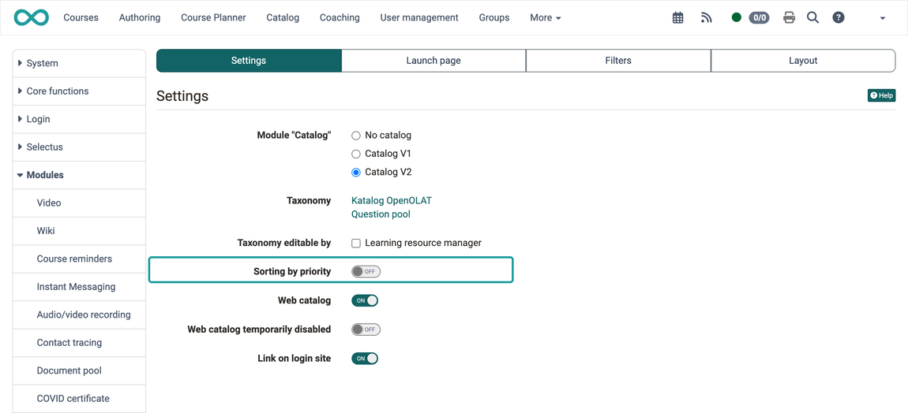

# Module Catalog {: #modul_catalog}

## Tab Settings [:octicons-tag-16:{ title="from Release 17.0 (OO-6145)" }](https://track.frentix.com/issue/OO-6145) {: #tab_settings}

Administrators define here whether users see a catalog and which one. The setting is located in the system administration under: 
`Administration > Modules > Catalog > Tab "Settings"`

Under Module "Catalog" three options are available: "No catalog", "Catalog V1" and "Catalog V2". Depending on the choice, different additional tabs appear.

On a new installation, Catalog V2 is preset, and Catalog V1 including its catalog administration is switched off. After an update from an older version, the existing setting remains. [:octicons-tag-16:{ title="from Release 21.0 (OO-9562)" }](https://track.frentix.com/issue/OO-9562)

If [Catalog V2](#config_catalog_v2) is activated, additional settings appear: the selection of the [Taxonomy](Modules_Taxonomy.md) for the catalog, the option "Taxonomy editable by" with the role Learning resource manager, the switch "Sorting by priority" and the switch [Web catalog](#config_web-catalog).

The switch "Sorting by priority" adds a sort button to the lists of the catalog. Its default criterion "Relevance" orders the offers first by their priority, then by start date, end date and title. The page [Catalog 2.0: Sorting/order](../../manual_user/area_modules/catalog2.0_sort_offers.md#sorting_microsites_by_priority) describes the effect. [:octicons-tag-16:{ title="from Release 20.2 (OO-9039)" }](https://track.frentix.com/issue/OO-9039)

{ class="shadow lightbox" }

### Migration from Catalog V1 to V2 [:octicons-tag-16:{ title="from Release 17.0 (OO-6148)" }](https://track.frentix.com/issue/OO-6148) {: #migration_v1_v2}

Whoever switches from Catalog V1 to Catalog V2 does not have to rebuild the existing catalog structure. As long as the migration has not run, the "Settings" tab shows, with Catalog V2 active, a second section below the settings with the title "Migration". It consists of an explanatory text listing the objects to be migrated and the button "Start migration".

The button opens the confirmation dialog "Catalog 2.0 migration" with the question "Do you really want to start the migration?" and the buttons "Yes" and "No". After "Yes", OpenOlat migrates in the background:

- The catalog structure becomes a new taxonomy: title, short title and description of the catalog become the taxonomy, each category becomes a taxonomy level. The taxonomy then appears in the "Settings" tab under "Taxonomy" and in the system administration under `Administration > Modules > Taxonomy`.
- Titles, short titles and descriptions of the subcategories are shown on the redesigned subpages.
- Catalog images are displayed as rectangular tiles in 2:1 format; the shape can be changed in the "Layout" tab.
- The image of the top catalog level becomes the background image of the header of the launch page.
- Launchers are created on the launch page: a launcher "Taxonomy level" for the new taxonomy, a launcher "Static text" with the description of the top catalog level and, if learning resources were placed directly on the top level, a launcher "Selected learning resources" with these learning resources.
- In the "Filters" tab, the filter for the taxonomy levels is created if it does not exist yet.

While the migration runs, the notice "The migration is in progress." replaces the button. After completion, the "Migration" section disappears permanently; the migration can only be run once.

[To the top of the page ^](#modul_catalog)

---

## Configuration of Catalog V1 {: #config_catalog_v1}

Whoever works with Catalog V1 sets in the "Configuration" tab where the catalog appears and where new categories and entries are placed. The tab appears as soon as Catalog V1 is selected in the "Settings" tab:

- **Catalog in its own site:** The catalog appears as a separate [site](../../manual_user/area_modules/index.md) in the main navigation.
- **Add multiple entries at once:** When you add learning resources to a category, you can select several learning resources at once.
- **Add new categories** and **Add new entries:** These drop-down lists set where new categories and new entries are placed. "Automatic sorting - Alphabetical" sorts them alphabetically, "Manual sorting - At the beginning" and "Manual sorting - At the end" place them at the beginning or at the end. With manual sorting, you can change the order by hand afterwards. A single category can deviate from this default in its own settings.

[To the top of the page ^](#modul_catalog)

---

## Configuration of Catalog V2 {: #config_catalog_v2}

### Tab "Launch page" {: #tab_start_page}

You can add so-called **"launchers"** to the start page. Launchers are the configurable sections of the start page.

The content displayed in a launcher is automatically selected based on the selected launcher type. The available launcher types are described below. By default, a launcher of the type “Recently published” is activated. 

All launchers can be given a name in different languages. The name then appears as a header above the tiles. Launchers can also be released only for specific organizations. To do this, select "Restriction to organization." In addition, you can specify separately whether a launcher is displayed in the internal and/or external catalog.

{ class="shadow lightbox" }

#### Launcher type "Static text"

Static text can be added manually in this launcher.

#### Launcher type "Popular courses"

The order of the offers in this launcher is determined by the number of clicks on course elements during the last 28 days. Only courses with the status "Published" are taken into account.

#### Launcher type "Recently published"

The offers are sorted by publication date.

#### Launcher type "Random generator"

The offers displayed in this launcher are shown in random order.

#### Launcher type "Taxonomy level"

Taxonomy launchers use the subjects of the catalog to display the various taxonomy levels.
In a taxonomy launcher, courses and learning resources are not displayed directly; instead, the taxonomy levels shown correspond to folders where the learning resources can be found.

Clicking on one of the categories (taxonomy level) displayed in a taxonomy launcher takes you to a microsite. All courses classified under this taxonomy level are displayed here. If the taxonomy has further levels below it, these are displayed as well.

The offers are automatically selected according to the defined taxonomy level and then displayed in alphabetical order.

When configuring this launcher, you use the **Type** field [:octicons-tag-16:{ title="from Release 21.0 (OO-9431)" }](https://track.frentix.com/issue/OO-9431){:target="_blank"} to define what the launcher refers to:

* **Taxonomy:** Selection of a taxonomy from the taxonomies available for the catalog.
* **Taxonomy level:** Selection of a specific taxonomy level.

#### Launcher type "Selected learning resources"

The manually added learning resources can be sorted by clicking on the double arrows in front of the entries.

#### Launcher type "Selected implementations"

The manually added entries can be sorted by clicking on the double arrows in front of the entries.

[To the top of the page ^](#modul_catalog)

---

### Tab Filters {: #tab_filter}

The course list can be further refined by filters or search. This tab controls which filters are available on the microsites and the search results page and can be used by the users. Filters can be, for example, subject areas, taxonomy level, offer type, implementation format, semester, license, main language, learning resource type, author, etc.

### Tab Layout {: #tab_layout}

This tab contains everything concerning the appearance of the catalog V2. You can customize the display title of the catalogue and select a background image for the header of the start page.

Under **Tiles Taxonomy Levels Launcher**, one can influence the appearance of the tiles of the microsites.

The **Information displayed in card** field controls which metadata is displayed on the card of the start page. This metadata must be filled in in the respective learning resource under `Settings > Metadata`.

{ class="shadow lightbox" }

[To the top of the page ^](#modul_catalog)

---

### Management of catalog V2 [:octicons-tag-16:{ title="from Release 17.1 (OO-6201)" }](https://track.frentix.com/issue/OO-6201) {: #v2_admin}

Catalog V2 is fed from the taxonomy of the subjects. Users with the role [Learning resource manager](../../manual_user/basic_concepts/Roles_Rights.md) and administrators can manage the keywording via the menu. Clicking takes you to the subjects. There you can select the current taxonomy, create and import new taxonomy levels and also delete levels.

Deleting levels only deletes the keywording, not any linked learning resources. Once deleted, a learning resource no longer appears in the catalog.

!!! warning "Attention"

    The subjects, keywording, taxonomy that can be edited as a Learning resource manager can also affect other areas in which the taxonomy is used. These can be: ePortfolio entries, curriculum entries, document pool.

{ class="shadow lightbox" }

The right to manage a catalog or subject area section can be granted to different persons. Initially, administrators assign this right. Select the desired subject area section and then the "management" tab. [:octicons-tag-16:{ title="from Release 20.1 (OO-8544)" }](https://track.frentix.com/issue/OO-8544)

{ class="shadow lightbox" }

The following applies to users with this right:

- **Editing:** They can edit, move or delete elements within the taxonomy levels or create new sub-levels.
- **Inheritance:** Anyone who has rights at a higher level (e.g. at institute level) may automatically edit the levels below (e.g. study programs).
- **Passing on:** These rights can be passed on from top to bottom. 
Example: An administrator gives a person the rights for a taxonomy level below (e.g. faculty). This person can then give similar rights to others within this faculty: even for subordinate areas.

Users with this right cannot:

- Create / edit / delete taxonomies
- Create / edit / delete layer types
- Create / edit / delete target, credit and lecturer competencies

[To the top of the page ^](#modul_catalog)

---

### Creation of suitable image material for the catalog {: #pictures_for_the_catalog}

Images are used for various illustrative purposes in the catalog. This is a list of image sizes and their behaviour in different dimensions. It is advised to use the provided images below as overlay guidelines in your graphic program. They already have reduced opacity build-in.

#### Background images

Image dimensions of **1324 x 240 px** are recommended for the backgrounds of the taxonomy subpages and the homepage, the maximum file size for the upload is **2.0 MB**. If the image is higher than 240px, a suitable section is taken from the centre. Taxonomy level backgrounds can be customised in the "Taxonomy" tab. The background image for the launch page is in the "Layout" tab.

This is how OpenOlat chooses the section for smaller image sizes:

{ class="shadow lightbox" }

**Background for the launch page**

{ class="shadow lightbox" }

**Background for the taxonomy levels**

{ class="shadow lightbox" }

#### Taxonomy launcher images

Depending on the setting, we are dealing here with square or rectangular images. The rectangular images have an aspect ratio of **16:9** with a recommended display of **640 x 360 px**. The text bar underneath covers approx. 80px.

**Rectangular**

{ class="shadow lightbox" }

**Square**

{ class="shadow lightbox" }

#### Course images

Can be set directly in the course and should not exceed the dimensions 570x380 px. Otherwise a suitable section from the centre will be used.

{ class="shadow lightbox" }

[To the top of the page ^](#modul_catalog)

---

## Configuration of the Web catalog [:octicons-tag-16:{ title="from Release 20.0 (OO-8002)" }](https://track.frentix.com/issue/OO-8002) {: #config_web-catalog}

If Catalog V2 is selected in the "Settings" tab, activating the web catalog is available as a further option.

The web catalog is a catalog mirrored to the outside, which can also be accessed by persons who are not yet registered in OpenOlat. A link can therefore also be set up on the login page, so that the web catalog can be opened without logging in. Visitors are only guided through the registration process when booking a course.

The web catalog can also be deactivated temporarily.

{ class="shadow lightbox" }

[To the top of the page ^](#modul_catalog)

---

## Further information {: #further_information}

**Mentioned on this page** 
[Module Taxonomy](Modules_Taxonomy.md) 
[Catalog 2.0: Sorting/order](../../manual_user/area_modules/catalog2.0_sort_offers.md) 
[Area and modules](../../manual_user/area_modules/index.md) 
[Roles and Rights: Overview](../../manual_user/basic_concepts/Roles_Rights.md)

**Further reading** 
[Catalog 2.0: Overview](../../manual_user/area_modules/catalog2.0.md) 
[Module Learning Resource](Modules_Learning_Resource.md)

[To the top of the page ^](#modul_catalog)
