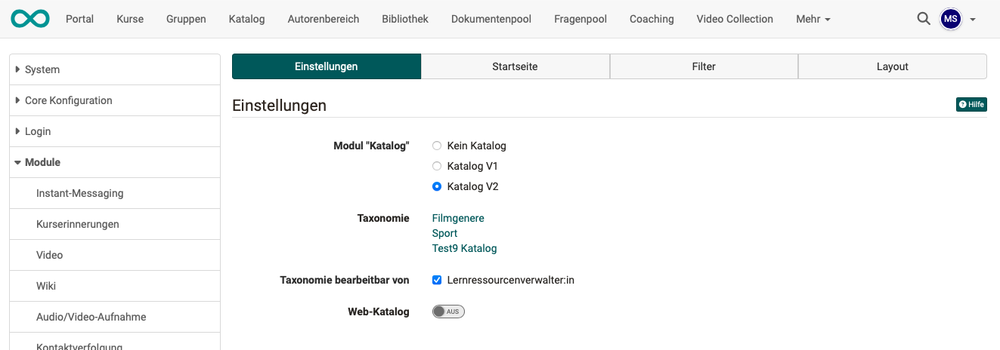
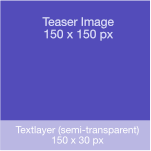

# Module Catalog

## Tab Settings {: #tab_settings}

Administrators can activate the catalog module here. You can activate the catalog V1 or V2 or deactivate it completely. Depending on which option you select, different additional tabs appear.

If the [Catalog V2](#config_catalog_v2) is activated, the [Web catalog](#config_web-catalog) can also be activated from release 20. 

In addition, a [Taxonomy](Modules_Taxonomy.md) can be selected for the catalog.

{ class="shadow lightbox" }

[To the top of the page ^](#modul_catalog)

---

## Configuration of Catalog V1 {: #config_catalog_v1}

If you activate the catalog V1 you see the tab "configuration" and can configure more details.

[To the top of the page ^](#modul_catalog)

---

## Configuration of Catalog V2 {: #config_catalog_v2}

### Tab "Launch page" {: #tab_start_page}

On the start page you can add so-called "**launchers**". Launcher are the configurable lines of the start page.  By default, a launcher of the type "Last added" is activated. The launchers come in 3 types: Static Text, Static (Select Manually), Taxonomy Levels.
I can give all launchers a language-dependent name. This name then appears as a headline above the tiles. The launchers can also be released for specific organizations only. I achieve this via the label "Restriction to organization".

#### Taxonomy Launcher

Taxonomy launchers use the catalog subject area structure to display the different taxonomy levels as a tree.

#### (Taxonomy) Microsite

Clicking on a level in a launcher takes you to the taxonomy microsite. All courses that have been classified under this level are displayed here. If the subject area taxonomy has several levels in this strand, the other levels are displayed.

You can further refine the course list by filtering or searching.

#### Static Launcher

In this launcher one can add static text. Some options include: Bold, Italic, Text size, Font, Add image, Add video, Hyphens ...

### Tab Filters {: #tab_filter}

This tab controls which filters are available on the microsites and the search results page and can be used by the user. Filters can be, for example, subject areas, taxonomy level, offer type, implementation format, semester, license, main language, learning resource type, author, etc. 

### Layout {: #tab_layout}

This tab contains everything concerning the appearance of the catalog V2. You can customize the display title of the catalogue and select a background image for the header of the start page.

Under **Tiles Taxonomy Levels Launcher**, one can influence the appearance of the tiles of the microsites.

The **Learning Resources Card display** controls which metadata should be displayed on the card of the start page. This metadata must be filled in in the respective learning resource under `Settings > Metadata`.

{class="lightbox"}

### Management of catalog V2 {: #v2_admin}

Catalog V2 is fed from the subject taxonomy, who can be administrated  under `Administration > Taxonomy`. Users with the role [learning resource manager](../../manual_user/basic_concepts/Roles_Rights.md) and administrator can manage the keywording via the menu.
Clicking takes you to the subjects. There you can select the current taxonomy, create and import new taxonomy levels and also delete levels.

Deleting levels only deletes the keywording, not any linked learning resources. Once deleted, a learning resource no longer appears in the catalog.

!!! warning "Attention"

    The subjects, keywording, taxonomy that can be edited as a learning resource administrator can also affect other areas in which the taxonomy is used. These can be: ePortfolio entries, curriculum entries, document pool.

{class="lightbox"}

[To the top of the page ^](#modul_catalog)

---

### Creation of suitable image material for the catalog {: #pictures_for_the_catalog}

Images are used for various illustrative purposes in the catalog. This is a list of image sizes and their behaviour in different dimensions. It is advised to use the provided images below as overlay guidelines in your graphic program. They already have reduced opacity build-in.

#### Background images

Image dimensions of **1324 x 240 px** are recommended for the backgrounds of the taxonomy subpages and the homepage. If the image is higher than 240px, a suitable section is taken from the centre. All the Images get cropped from the left, when viewing on smaller screens.
Taxonomy level backgrounds can be customised in the "Taxonomy" tab.
The background image for the start page can be found under Layout.

Cropping Behaviour illustrated.

Background for the start page
{class="lightbox"}

Background for the taxonomy levels
{class="lightbox"}

#### Taxonomy launcher images
Depending on the setting, we are dealing here with square or rectangular images.
The rectangular images have an aspect ratio of **16:9** with a recommended display of **640 x 360 px**. The text bar underneath covers approx. 80px.

Rectangular

{class="lightbox"}

Square

{class="lightbox"}

#### Course images

Can be set directly in the course and should not exceed the dimensions 570x380 px. Otherwise a suitable section from the centre will be used.

{class="lightbox"}

[To the top of the page ^](#modul_catalog)

---

## Further information {: #further_information}

[Taxonomie einrichten >](Modules_Taxonomy.md) 
[Beschreibung des Katalogs im Benutzerhandbuch >](../../manual_user/area_modules/catalog2.0.md) 
