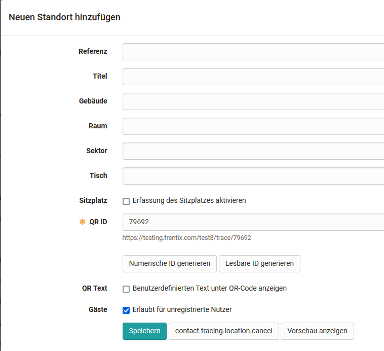

#  [Modul: Kontaktverfolgung](Modul%EF%B9%95+Kontaktverfolgung.html)

Mit diesem Modul ermöglicht OpenOlat eine software-unterstützte physische
Kontaktverfolgung an einer Institution.

>  **Wikipedia: _"_** _Als Kontakpersonennachverfolgung (Englisch: Contact
> Tracing), oder auch nur als Kontaktverfolgung, bezeichnet man im Rahmen der
> Umgebungsuntersuchung das Nachverfolgen von Kontaktpersonen, sowie das
> aktive Ermitteln von Personen, die Kontakt zu einem Erkrankten hatten und
> infiziert sein könnten."_

  

  

## Übersicht und Praxiseinsatz

Das Contact Tracing Modul funktioniert mit den folgenden fünf Schritten:

  1. Erfassung der **Standorte** (manuell oder via Import)
  2. Generierung der **QR-Codes** für die Platzierung an den Standorten
  3.  **Registration** von bestehenden OpenOlat-Benutzern oder Gästen an den Standorten
  4. Versand einer **E-Mail Bestätigung** nach der Registration
  5.  **Export** der Daten bei einer behördlichen Anfrage

Die Daten werden datenschutzkonform in OpenOlat abgelegt und nach der von
Ihnen definierten Frist automatisch gelöscht.

OOacademy-Video (Kontaktverfolgung im Praxiseinsatz)

  

  

## Aktivierung des Moduls

Das Modul "Kontaktverfolgung" ist für die Rolle "Systemadministrator"
zugänglich (Administration → Modules → Kontaktverfolung). Im Tab
"Konfiguration" wird das Modul insgesamt aktiviert und auch eine
Aufbewahrungsfrist und Standardaufhaltedauer definiert werden. Die optionalen
und verbindlichen Felder des Kontaktverfolgungsfragebogens werden hier
konfiguriert und weitere Texte und Nachrichten können konfiguriert werden.

Im Tab "Standorte" können Standorte importiert bzw. hinzugefügt werden.

  

