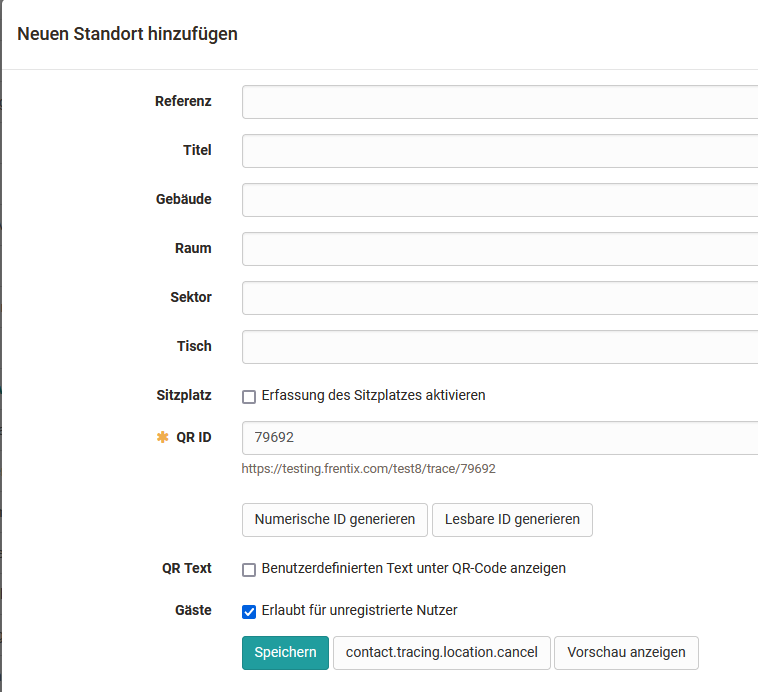

# Module Contact Tracing {: #contact_tracing}

With this module, OpenOlat enables software-supported physical contact tracing at an institution.

>  **Wikipedia:** _" In public health,  **contact tracing**  is the process of
> identifying persons who may have come into contact with an infected person
> ("contacts") and subsequent collection of further information about these
> contacts._ _"_

## Overview and practical use {: #overview_practical}

The Contact Tracing module works with the following five steps:

  1. Capturing the **locations** (manually or via import)
  2. Generation of **QR codes** for placement at the locations
  3. **Registration** of existing OpenOlat users or guests at the locations
  4. Sending an **email confirmation** after registration
  5. **Export** of the data in case of an official request

The data is stored in OpenOlat in accordance with data protection regulations
and is automatically deleted after the time period defined by you.

### OOacademy Video (Contact Tracing in Practice, German)

<iframe width="300" height="200" src="https://www.youtube.com/embed/4fO16U6iaiU" title="YouTube video player" frameborder="0" allow="accelerometer; autoplay; clipboard-write; encrypted-media; gyroscope; picture-in-picture" allowfullscreen></iframe>

## Activation of the module {: #module_activation}

The "Contact Tracing" module is accessible for System Administrators: 
`Administration > Modules > Contact Tracing`

In the "Configuration" tab, you activate the module and set a retention period and a default retention period. Here you also configure the optional and mandatory fields of the contact tracing questionnaire as well as additional texts and messages.

Locations can be imported or added in the "Locations" tab.

{ class="shadow lightbox" }

