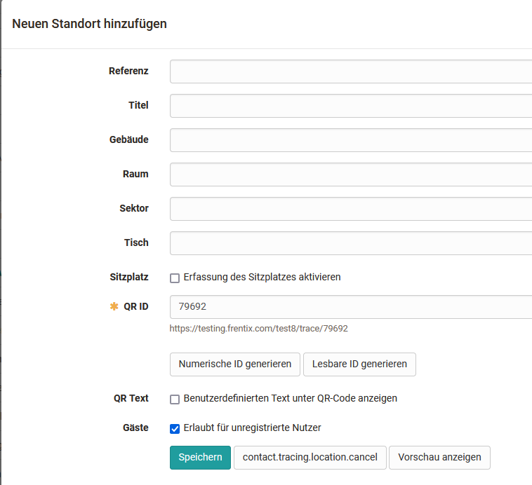

# Modules: Contact Tracing

With this module, OpenOlat enables software-supported physical contact tracing
at an institution.

>  **Wikipedia:** _" In public health,  **contact tracing**  is the process of
> identifying persons who may have come into contact with an infected person
> ("contacts") and subsequent collection of further information about these
> contacts._ _"_

## Overview and practical use

The Contact Tracing module works with the following five steps:

  1. Capturing the **locations** (manually or via import)
  2. Generation of **QR codes** for placement at the locations
  3.  **Registration** of existing OpenOlat users or guests at the locations
  4. Sending an **e-mail confirmation** after registration
  5.  **Export** of the data in case of an official request

The data is stored in OpenOlat in accordance with data protection regulations
and is automatically deleted after the time period defined by you.

### OOacademy-Video (Kontaktverfolgung im Praxiseinsatz)

<iframe width="300" height="200" src="https://www.youtube.com/embed/4fO16U6iaiU" title="YouTube video player" frameborder="0" allow="accelerometer; autoplay; clipboard-write; encrypted-media; gyroscope; picture-in-picture" allowfullscreen></iframe>
  

## Activation of the module

The "Contact Tracing" module is accessible for the "System Administrator" role
(Administration → Modules → Contact Tracing). In the "Configuration" tab, the
module as a whole will be activated and also a retention period and default
retention period will be defined. The optional and mandatory fields of the
contact tracing questionnaire are configured here and additional texts and
messages can be configured.

Locations can be imported or added in the "Locations" tab.

{ class="shadow" }

