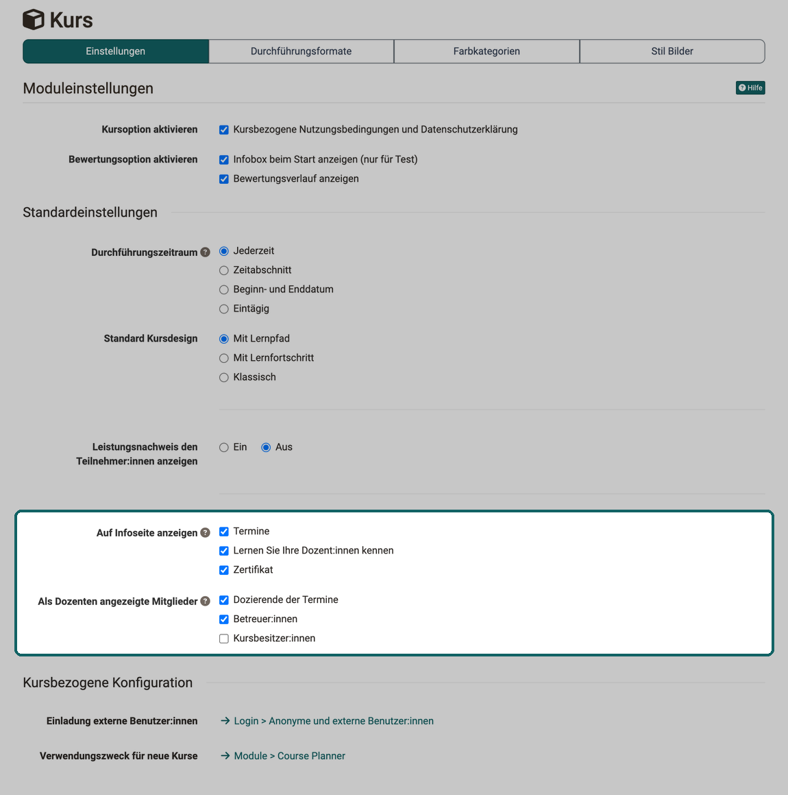
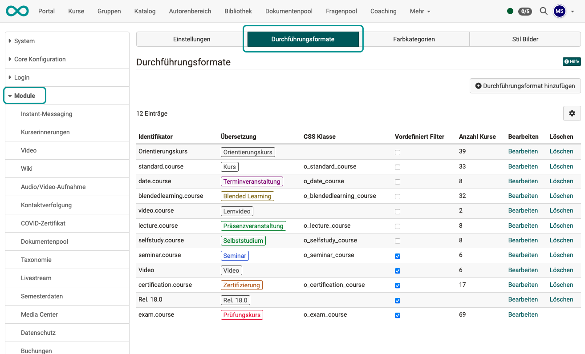
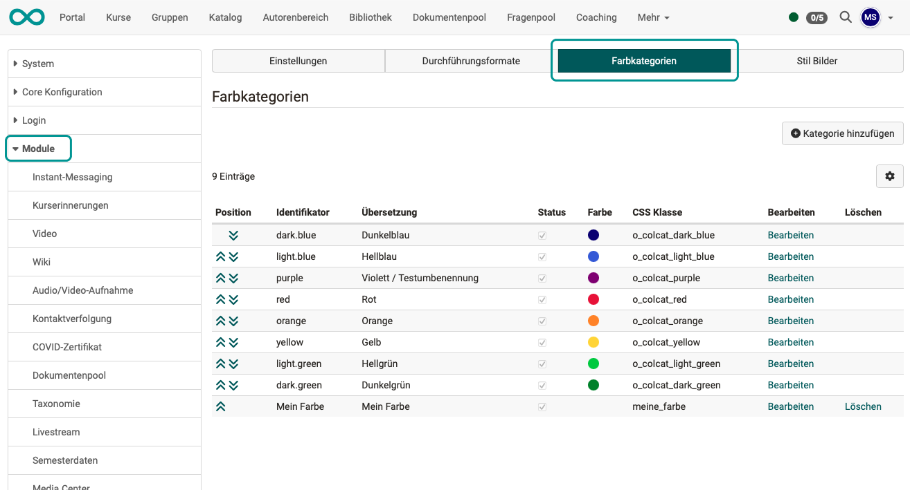
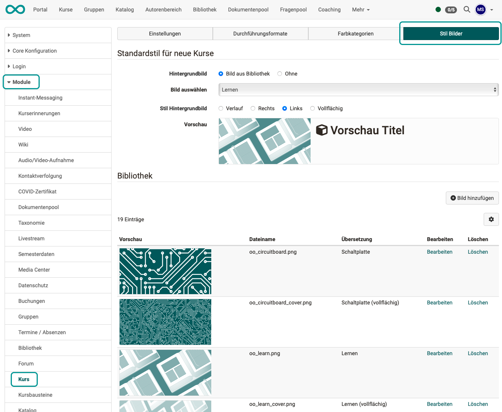

# Modul Kurs {: #course}

Im Modul Kurs legen Sie als Administrator:in fest, welche Kursoptionen systemweit zur Verfügung stehen und mit welchen Voreinstellungen neue Kurse starten. Sie finden es in der System-Administration unter: `Administration > Module > Kurs`.

## Tab Einstellungen {: #settings}

{ class="shadow lightbox" title="Tab Einstellungen im Modul Kurs · 2026.10.09" }

### Moduleinstellungen {: #module_settings}

#### Kursoption aktivieren {: #enable_course_option}

Die Option "Kursbezogene Nutzungsbedingungen und Datenschutzerklärung" gibt Kursbesitzer:innen in den Kurseinstellungen den [Tab "Nutzungsbedingungen"](../../manual_user/learningresources/Course_Settings.de.md#disclaimer). Dort legen sie Nutzungsbedingungen und eine Datenschutzerklärung fest, die Teilnehmer:innen vor dem Kursbesuch bestätigen.

#### Bewertungsoption aktivieren {: #enable_assessment_option}

Die [bewertbaren Kursbausteine](../../manual_user/learningresources/Assessment_of_course_modules.de.md) haben einige gemeinsame Eigenschaften, die hier systemweit eingestellt werden:

- **Infobox beim Start anzeigen (nur für Test)**: Der Kursbaustein "Test" zeigt vor dem Start eine Infobox.
- **Bewertungsverlauf anzeigen**: Teilnehmer:innen sehen in bewertbaren Kursbausteinen den Verlauf ihrer Bewertung.

### Standardeinstellungen [:octicons-tag-16:{ title="ab Release 21.1 (OO-9756)" }](https://track.frentix.com/issue/OO-9756){:target="_blank"} {: #default_settings}

Wer neue Kurse anlegt, startet mit den Werten, die hier gesetzt sind, und muss sie nicht in jedem Kurs nachziehen. Die Standardeinstellungen gelten für Kurse, die nach der Änderung neu erstellt werden. Bestehende Kurse behalten ihre Einstellungen, und eine Kopie übernimmt die Einstellungen des Originals.

#### Durchführungszeitraum {: #execution_period}

Hier legen Sie fest, welcher Durchführungszeitraum beim Erstellen eines neuen Kurses vorgewählt ist: "Jederzeit", "Zeitabschnitt", "Beginn- und Enddatum" oder "Eintägig".

!!! tip "Tipp"

    Wenn als Durchführungszeitraum "Zeitabschnitt" gewählt wird, kann ein Zeitabschnitt als Standard (Default) festgelegt werden unter `Administration > Module > Zeitabschnitte`.

#### Standard Kursdesign {: #default_course_design}

Hier wird die Voreinstellung festgelegt, mit welchem Kursdesign das Erstellen eines neuen Kurses vorgeschlagen wird: "Mit Lernpfad", "Mit Lernfortschritt" oder "Klassisch".

#### Leistungsnachweis den Teilnehmer:innen anzeigen {: #efficiency_statement}

Hier legen Sie fest, ob der Leistungsnachweis in neuen Kursen eingeschaltet ist. Kursbesitzer:innen ändern die Einstellung je Kurs im [Tab "Bewertung"](../../manual_user/learningresources/Course_Settings_Assessment.de.md#section_evidence_of_achievements) der Kurseinstellungen.

#### Auf Infoseite anzeigen {: #default_display_on_info_page}

Hier legen Sie fest, welche Abschnitte die Infoseite eines neuen Kurses zeigt: "Termine", "Lernen Sie Ihre Dozent:innen kennen" und "Zertifikat". Ab Werk sind alle drei Optionen gewählt. Für "Kreditpunkte" gibt es keinen Standardwert, die Option wird in jedem Kurs einzeln gewählt.

"Lernen Sie Ihre Dozent:innen kennen" gilt für neue Kurse als gewählt, solange unter "Als Dozenten angezeigte Mitglieder" mindestens eine Rolle gewählt ist. Sollen neue Kurse ohne diesen Abschnitt starten, wählen Sie dort keine Rolle.

#### Als Dozenten angezeigte Mitglieder {: #default_taught_by}

Hier legen Sie fest, welche Rollen ein neuer Kurs im Abschnitt "Lernen Sie Ihre Dozent:innen kennen" zeigt: "Dozierende der Termine", "Betreuer:innen" oder "Kursbesitzer:innen". Dieselben Rollen sind vorgewählt, wenn jemand in einem bestehenden Kurs "Lernen Sie Ihre Dozent:innen kennen" neu auswählt. Ab Werk sind "Dozierende der Termine" und "Betreuer:innen" gewählt.

Wie Kursbesitzer:innen die Anzeigeeinstellungen eines einzelnen Kurses ändern, beschreibt [Kurseinstellungen - Tab Info](../../manual_user/learningresources/Course_Settings_Info.de.md#display_settings). Für Durchführungen im Course Planner gelten eigene Standardwerte, siehe [Modul Course Planner](Modules_Course_Planner.de.md#default_settings).

### Kursbezogene Konfiguration {: #course_related_configuration}

Zwei Links führen zu Einstellungen, die Kurse betreffen, aber in anderen Menüs der System-Administration liegen:

- **Einladung externe Benutzer:innen**: Der Link "Login > Anonyme und externe Benutzer:innen" öffnet die Einstellungen für [Anonyme Gäste und externe Benutzer:innen](Guest_and_invitation.de.md#externals).
- **Verwendungszweck für neue Kurse**: Der Link "Module > Course Planner" öffnet den [Verwendungszweck für neue Kurse](Modules_Course_Planner.de.md#default_purpose_new_courses) im Modul Course Planner.

[Zum Seitenanfang ^](#course)

---

## Tab Durchführungsformate [:octicons-tag-16:{ title="ab Release 15.4 (OO-5236)" }](https://track.frentix.com/issue/OO-5236){:target="_blank"} {: #implementation_formats}

{ class="shadow lightbox" title="Tab Durchführungsformate im Modul Kurs" }

Die hier erstellten und aufgeführten Durchführungsformate können von Autor:innen zur Klassifizierung der Kurse verwendet werden. Sie können von den Kursbesitzer:innen bei der Konfiguration eines Kurses gewählt werden unter: `Kurs > Administration > Einstellungen > Metadaten`

[Zum Seitenanfang ^](#course)

---

## Tab Farbkategorien [:octicons-tag-16:{ title="ab Release 16.0 (OO-5544)" }](https://track.frentix.com/issue/OO-5544){:target="_blank"} {: #color_categories}

{ class="shadow lightbox" title="Tab Farbkategorien im Modul Kurs" }

Die hier angelegten Farbkategorien stehen als CSS Klassen zur Verfügung. Sie können z.B. im Kurseditor im Tab "Layout" von den Autor:innen für die Gestaltung der Kursbausteine verwendet werden.

[Zum Seitenanfang ^](#course)

---

## Tab Stil Bilder {: #style_images}

{ class="shadow lightbox" title="Tab Stil Bilder im Modul Kurs" }

Die hier aufgelisteten Bilder können im Kurseditor im Tab "Layout" von den Autor:innen für die Gestaltung der Kopfzeile der Kursbausteine verwendet werden. Durch Wahl einer Farbkategorie können sie unterschiedlich eingefärbt werden.

[Zum Seitenanfang ^](#course)

---

## Weiterführende Informationen {: #further_information}

**Auf dieser Seite erwähnt** 
[Kurseinstellungen >](../../manual_user/learningresources/Course_Settings.de.md) 
[Bewertung von Kursbausteinen >](../../manual_user/learningresources/Assessment_of_course_modules.de.md) 
[Kurseinstellungen - Tab Bewertung >](../../manual_user/learningresources/Course_Settings_Assessment.de.md) 
[Kurseinstellungen - Tab Info >](../../manual_user/learningresources/Course_Settings_Info.de.md) 
[Modul Course Planner >](Modules_Course_Planner.de.md) 
[Anonyme Gäste und externe Benutzer:innen >](Guest_and_invitation.de.md)

**Weiterführend** 
[Modul Zeitabschnitte >](Modules_Time_Period.de.md) 
[Allgemeine Funktionen: Infoseite >](../../manual_user/learningresources/General_Functions_Infopage.de.md)

[Zum Seitenanfang ^](#course)

