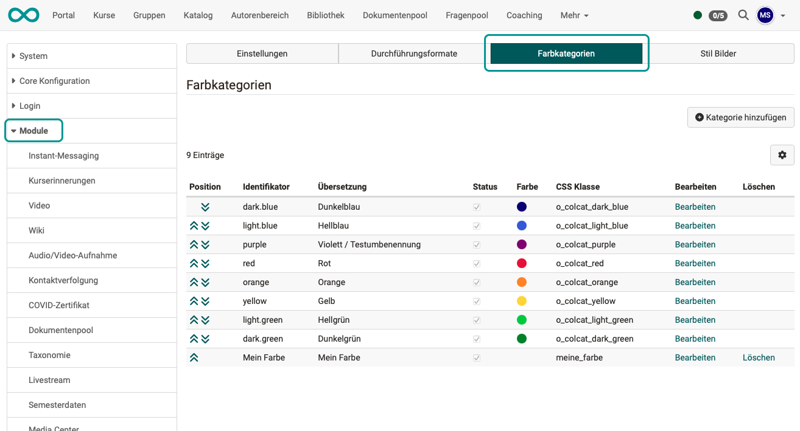
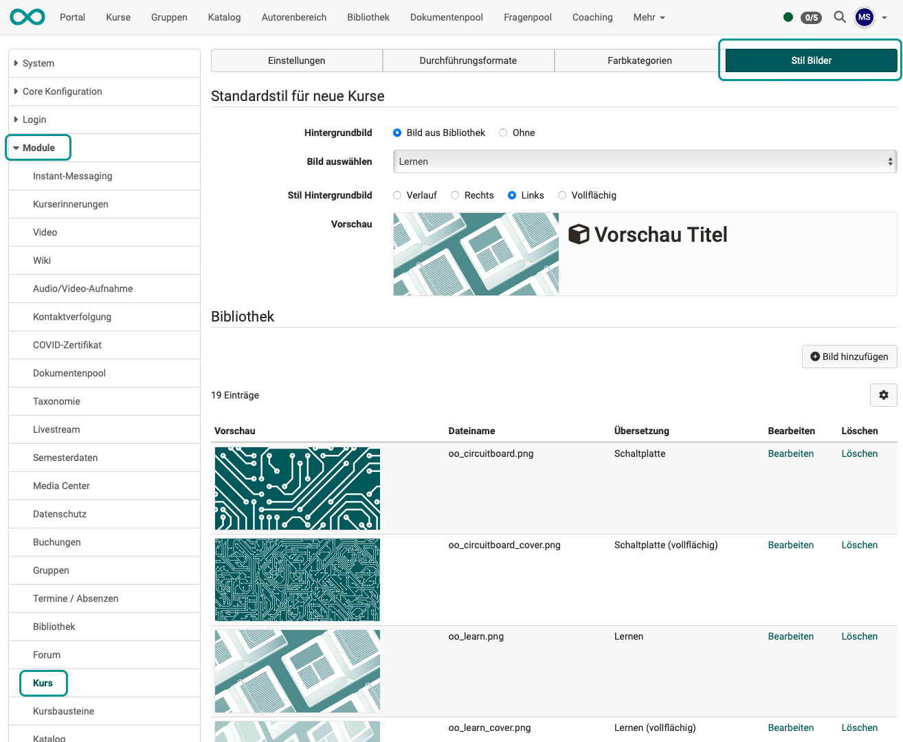

# Modul Kurs {: #course}

Hier machen Sie als Administrator:in Voreinstellungen, die für die Erstellung von neuen Kursen gelten.

## Tab Einstellungen {: #settings}

{ class="shadow lightbox" }

**Standardeinstellung**

Zum Durchführungszeitraum eines Kurses kann ab Release 19.1.6 ein Standard (Default) voreingestellt werden.

!!! tip "Hinweis"

    Wenn als Durchführungszeitraum "Semester" gewählt werden, kann eine Semesterbezeichnung als Standard (Default) eingestellt werden unter **Module > Semesterdaten > Semester bearbeiten**.

**Kursdesign**

Hier wird die Voreinstellung festgelegt, mit welchem Kurstyp das Erstellen eines neuen Kurses vorgeschlagen wird.

**Einstellungen für bewertbare Kursbausteine**

Die [bewertbaren Kursbausteine](../../manual_user/learningresources/Assessment_of_course_modules.de.md) haben einige gemeinsame Eigenschaften, die hier systemweit eingestellt werden können.

**Weitere kursbezogene Einstellungen**

Hier finden Sie relevante Links, die Sie direkt zu weiteren kursbezogenen Einstellungen führen.
Z.B. betreffend Login für anonyme und externe Benutzer:innen.

[Zum Seitenanfang ^](#course)

---

## Tab Durchführungsformate {: #implementation_formats}

{ class="shadow lightbox" }

Die hier erstellten und aufgeführten Durchführungsformate können von Autor:innen zur Klassifizierung der Kurse verwendet werden. Sie können von den Kursbesitzer:innen bei der Konfiguration eines Kurses gewählt werden unter: **(Kurs-)Administration > Einstellungen > Metadaten**

[Zum Seitenanfang ^](#course)

---

## Tab Farbkategorien {: #color_categories}

{ class="shadow lightbox" }

Die hier angelegten Farbkategorien stehen als css-Klassen zur Verfügung. Sie können z.B. im Kurseditor im Tab "Layout" von den Autor:innen für die Gestaltung der Kursbausteine verwendet werden.

[Zum Seitenanfang ^](#course)

---

## Tab Stil Bilder {: #style_images}

{ class="shadow lightbox" }

Die hier aufgelisteten Bilder können im Kurseditor im Tab "Layout" von den Autor:innen für die Gestaltung der Kopfzeile der Kursbausteine verwendet werden. Durch Wahl einer Farbkategorie können sie unterschiedlich eingefärbt werden.

[Zum Seitenanfang ^](#course)

