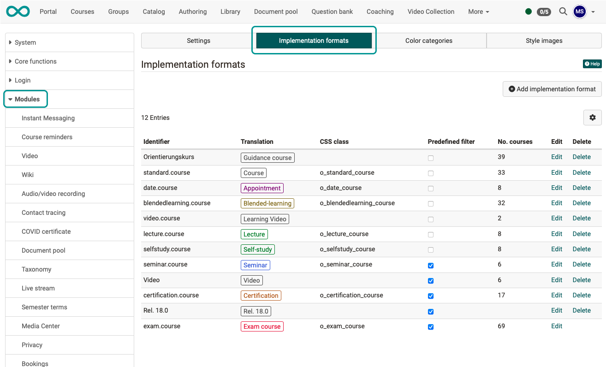
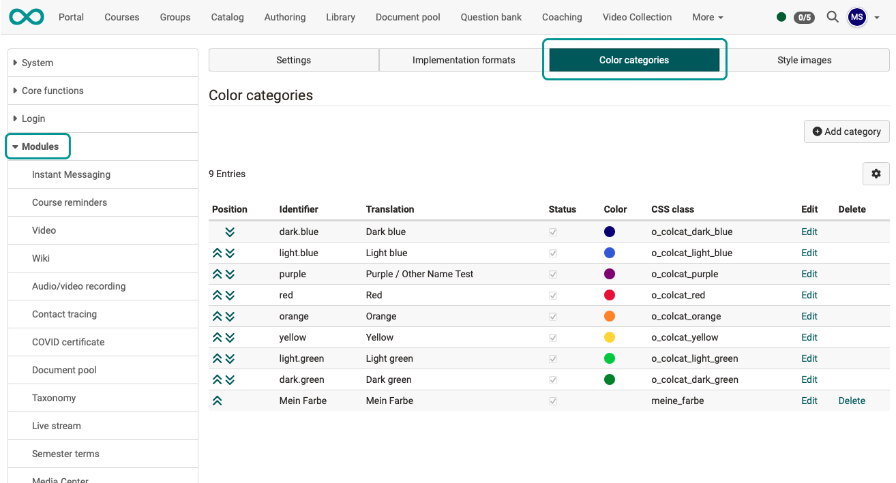
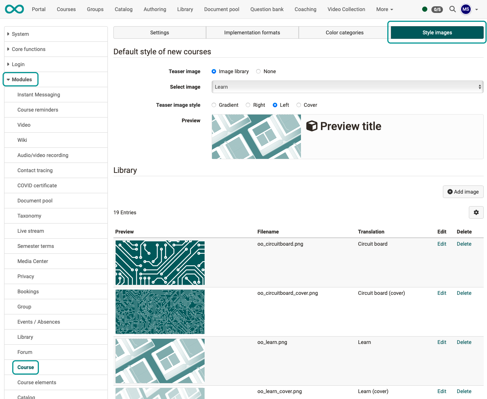

# Module Course {: #course}

In the Module Course, you as an administrator define which course options are available system-wide and with which presets new courses start. You find it in the system administration under: `Administration > Modules > Course`.

## Tab Settings {: #settings}

### Module settings {: #module_settings}

#### Enable course option {: #enable_course_option}

The option "Course related terms of use and data protection" gives course owners the ["Terms of use" tab](../../manual_user/learningresources/Course_Settings.md#disclaimer) in the course settings. There they define terms of use and a data protection declaration that participants confirm before visiting the course.

#### Enable assessment option {: #enable_assessment_option}

The [assessable course elements](../../manual_user/learningresources/Assessment_of_course_modules.md) have some common properties that are set system-wide here:

- **Show info box on start (only for test)**: The course element "Test" shows an info box before the start.
- **Show assessment change log to user**: Participants see the history of their assessment in assessable course elements.

### Default settings [:octicons-tag-16:{ title="from Release 21.1 (OO-9756)" }](https://track.frentix.com/issue/OO-9756){:target="_blank"} {: #default_settings}

Anyone who creates new courses starts with the values set here and does not have to adjust them in every course. The default settings apply to courses that are newly created after the change. Existing courses keep their settings, and a copy adopts the settings of the original.

#### Execution period {: #execution_period}

Here you define which execution period is preselected when a new course is created: "Anytime", "Time period", "Begin and end date" or "One-day".

!!! tip "Tip"

    If "Time period" is selected as the execution period, a time period can be set as the default under `Administration > Modules > Time periods`.

#### Default course design {: #default_course_design}

The default setting for the course design with which the creation of a new course is suggested is defined here: "With learning path", "With learning progress" or "Classic".

#### Show evidence of achievement to participants {: #efficiency_statement}

Here you define whether the evidence of achievement is switched on in new courses. Course owners change the setting for each course in the ["Assessment" tab](../../manual_user/learningresources/Course_Settings_Assessment.md#section_evidence_of_achievements) of the course settings.

#### Display on info page {: #default_display_on_info_page}

Here you define which sections the info page of a new course shows: "Events", "Meet your teachers" and "Certificate". By default, all three options are selected. There is no default value for "Credit points", the option is selected in each course individually.

"Meet your teachers" counts as selected for new courses as long as at least one role is selected under "Members displayed as teacher". If new courses are to start without this section, select no role there.

#### Members displayed as teacher {: #default_taught_by}

Here you define which roles a new course shows in the "Meet your teachers" section: "Teachers in events", "Coaches" or "Course owners". The same roles are preselected when someone selects "Meet your teachers" again in an existing course. By default, "Teachers in events" and "Coaches" are selected.

How course owners change the display settings of an individual course is described in [Course Settings - Tab Info](../../manual_user/learningresources/Course_Settings_Info.md#display_settings). Separate default values apply to implementations in the Course Planner, see [Module Course Planner](Modules_Course_Planner.md#default_settings).

### Course related configuration {: #course_related_configuration}

Two links lead to settings that concern courses but are located in other menus of the system administration:

- **Invitation external users**: The link "Login > Anonymous and external user" opens the settings for [Anonymous guests and external users](Guest_and_invitation.md#externals).
- **Usage for new courses**: The link "Modules > Course Planner" opens the [Usage for new courses](Modules_Course_Planner.md#default_purpose_new_courses) in the Module Course Planner.

[To the top of the page ^](#course)

---

## Tab Implementation formats [:octicons-tag-16:{ title="from Release 15.4 (OO-5236)" }](https://track.frentix.com/issue/OO-5236){:target="_blank"} {: #implementation_formats}

{ class="shadow lightbox" title="Implementation formats tab in the Module Course" }

The implementation formats created and listed here can be used by authors to classify courses. They can be selected by course owners when configuring a course under: `Course > Administration > Settings > Metadata`

[To the top of the page ^](#course)

---

## Tab Color categories [:octicons-tag-16:{ title="from Release 16.0 (OO-5544)" }](https://track.frentix.com/issue/OO-5544){:target="_blank"} {: #color_categories}

{ class="shadow lightbox" title="Color categories tab in the Module Course" }

The color categories created here are available as CSS classes. They can be used by authors to design course elements in the "Layout" tab of the course editor, for example.

[To the top of the page ^](#course)

---

## Tab Style images {: #style_images}

{ class="shadow lightbox" title="Style images tab in the Module Course" }

The images listed here can be used by the authors in the "Layout" tab of the course editor to design the header of the course elements. They can be colored differently by selecting a color category.

[To the top of the page ^](#course)

---

## Further information {: #further_information}

**Mentioned on this page** 
[Course Settings >](../../manual_user/learningresources/Course_Settings.md) 
[Assessment of course modules >](../../manual_user/learningresources/Assessment_of_course_modules.md) 
[Course Settings - Tab Assessment >](../../manual_user/learningresources/Course_Settings_Assessment.md) 
[Course Settings - Tab Info >](../../manual_user/learningresources/Course_Settings_Info.md) 
[Module Course Planner >](Modules_Course_Planner.md) 
[Anonymous guests and external users >](Guest_and_invitation.md)

**Further reading** 
[Module Time periods >](Modules_Time_Period.md) 
[General Functions: Info Page >](../../manual_user/learningresources/General_Functions_Infopage.md)

[To the top of the page ^](#course)
