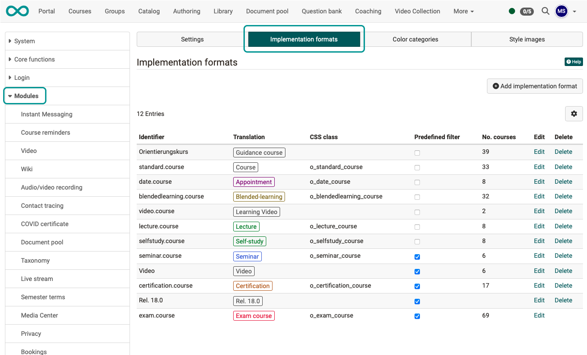

# Module Course {: #course}

As an administrator, you make the default settings here that apply to the creation of new courses.

## Tab Settings {: #settings}

{ class="shadow lightbox" }

**Default setting**

From release 19.1.6, a default can be preset for the implementation period of a course.

!!! tip "Note"

    If “Semester” is selected as the implementation period, a semester name can be set as the default under **Modules > Semester data > Edit semester**.

**Course design**

The default setting for the course type with which the creation of a new course is suggested is defined here.

**Settings for assessable course elements**

[Assessable course elements](../../manual_user/learningresources/Assessment_of_course_modules.md) have some common properties that can be set system-wide here.

**Additional course related settings**

Here you will find relevant links that will take you directly to other course-related settings.
E.g. regarding login for anonymous and external users.

[To the top of the page ^](#course)

---

## Tab Implementation formats {: #implementation_formats}

{ class="shadow lightbox" }

The implementation formats created and listed here can be used by authors to classify courses. They can be selected by course owners when configuring a course under **(Course-)Administration > Settings > Metadata**

[To the top of the page ^](#course)

---

## Tab Color categories {: #color_categories}

{ class="shadow lightbox" }

The color categories created here are available as css classes. They can be used by authors to design course elements in the “Layout” tab of the course editor, for example.

[To the top of the page ^](#course)

---

## Tab Style images {: #style_images}

{ class="shadow lightbox" }

The images listed here can be used by the authors in the “Layout” tab of the course editor to design the header of the course elements. They can be colored differently by selecting a color category.

[To the top of the page ^](#course)

