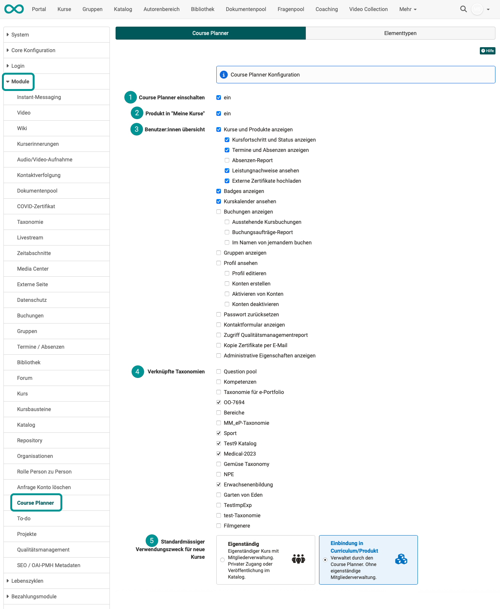

# Modul Course Planner {: #module_course_planner}

## Aktivierung des Course Planners {: #activation}

Das Modul Course Planner ist optional an Stelle des Moduls Curriculum in OpenOlat verfügbar und muss in der Administration aktiviert werden.

!!! tip "Hosting-Kunden von frentix"
	 Wenden Sie sich für die Aktivierung bitte an [contact@frentix.com](mailto:contact@frentix.com).   Nach der Aktivierung kann zusätzlich die Anzeige des persönlichen Curriculums («Lehrgänge») im Bereich «Kurse» aktiviert werden.

### Tab Course Planner {: #tab_course_planner}

{ class="shadow lightbox" }

 **Course Planner einschalten** 
Mit dieser Checkbox wird das gesamte Modul aktiviert.

 **Produkt in "Meine Kurse"** 
Alle Teilnehmer:innen finden in der Hauptnavigation in der Kopfzeile den Menü-Eintrag "Kurse". Unter diesem Menüpunkt können den Teilnehmer:innen ebenfalls Produkte angezeigt werden.

 **Benutzer:innen Übersicht** 
Hier bestimmen Sie als Administrator:in, welche Optionen die Rollen

* Course Planner
* Education Manager und
* Linienvorgesetzter

angezeigt bekommen. Was also z.B. eine mit dem Course Planner arbeitende Person von den Benutzer:innen sehen darf.

 **Verknüpfte Taxonomien** 
Von den im Modul "Taxonomie" erstellten Taxonomien können hier diejenigen ausgewählt werden, die auch im Course Planner verfügbar sein sollen.

**Hinweis:** 
Die hier gewählten Taxonomien sollten die gleichen sein, wie die im Katalog verwendeten. Nur dann kann im Katalog auch nach diesen Taxonomien gesucht werden.

 **Standardmässiger Verwendungszweck für neue Kurse** 

Kurse können für eigenständige Verwendung oder zur Einbindung in ein Produkt vorgesehen werden. Als Administrator:in legen Sie hier fest, welche Verwendung standardmässig voreingestellt ist.

**Eigenständig**: Ein eigenständiger Kurs besitzt eine Mitgliederverwaltung. Der Zugang kann mit der Angebotsart "Privat" durch Eintragung als Mitglied (z.B. durch Kursbesitzer:innen), durch Vergabe eines Zugangscodes oder über eine Veröffentlichung im Katalog erfolgen.

**Einbindung in Produkt**: Wird der Kurs in ein Produkt eingebunden, werden die Mitgliedschaften durch den Course Planner vergeben und verwaltet. Der Kurs benötigt dann keine zweite, eigenständige Mitgliederverwaltung.

!!! tip "Tipp"

	Wird der Course Planner umfassend eingesetzt, bietet es sich an, den Standard-Verwendungszweck für neue Kurse unter `Systemadministration > Course Planner-Settings` auf "Einbindung in Produkt" einzustellen.

[Zum Seitenanfang ^](#module_course_planner)

---
## Tab Elementtypen {: #tab_element_types}

### Übersicht der Elementtypen [:octicons-tag-16:{ title="ab Release 21.0 (OO-8924)" }](https://track.frentix.com/issue/OO-8924){:target="_blank"} {: #element_types_overview}

Element-Typen definieren, welche Elemente ein Produkt enthalten kann und geben diesen Elementen eine Bedeutung. Beim Anlegen der Element-Typen kann eine hierarchische Struktur abgebildet werden. Ein Beispiel für ein hierarchisches Produkt ist `Lehrgang > Semester > Modul > Kurs`.

Die Übersichtstabelle zeigt alle angelegten Elementtypen. Ein Elementtyp wird über das :fontawesome-regular-pen-to-square:-Symbol bearbeitet. Über den 3-Punkte-Link kann der Typ kopiert oder gelöscht werden.

**Tabellenspalten:**

| Spalte | Bedeutung |
|---|---|
| Typ | Name und Kennzeichen des Elementtyps |
| Verwendung als | Funktion des Elementtyps im Produkt: «Durchführung», «Element» oder «Durchführung oder Element (legacy)» |
| Aktiv / Inaktiv  | Ob der Typ für neue Elemente zur Auswahl steht |
| #Eltern | Anzahl übergeordneter Elementtypen, die diesen Typ als Kindelement zulassen |
| #Kinder | Anzahl der Elementtypen, die als Kindelemente dieses Typs definiert sind |
| #Verwendungen | Anzahl der im System vorhandenen Elemente dieses Typs |
| Mit Kursinhalt | Ob Elemente dieses Typs Kurse als Inhalt enthalten können |

**Sammelaktion Typ ändern** [:octicons-tag-16:{ title="ab Release 21.0 (OO-9583)" }](https://track.frentix.com/issue/OO-9583){:target="_blank"}

Durch Aktivieren der Checkbox in der ersten Spalte markieren Sie mehrere Elemente. Über die Aktion **«Typ ändern»** weisen Sie allen markierten Elementen einen anderen Elementtyp zu.

[Zum Seitenanfang ^](#module_course_planner)

---

### Elementtyp erstellen und bearbeiten {: #create_element_types}

Über den Button **«Neuen Typ hinzufügen»** legen Sie weitere Elementtypen an. Das Formular enthält folgende Felder:

**Titel** (Pflichtfeld) 
Der Name des Elementtyps, der bei der Auswahl beim Anlegen eines Elements angezeigt wird.

**Kennzeichen** (Pflichtfeld) 
Ein eindeutiger Identifier, der zur Unterscheidung bei Elementen mit gleichem Titel dient. Erscheint bei der Erstellung eines neuen Curriculum-Elements als Auswahloption.

**Verwendung als** 
Bestimmt die Funktion von Elementen dieses Typs im Produkt:

* **Durchführung**: Elemente dieses Typs sind Durchführungen (das oberste Elternelement). Sie verfügen über einen Durchführungszeitraum und sind der Ausgangspunkt für Automatisierungsregeln.
* **Element**: Elemente dieses Typs sind Subelemente unterhalb einer Durchführung und haben keinen eigenen Durchführungszeitraum.
* **Durchführung oder Element (legacy)**: Elemente dieses Typs können sowohl als Durchführung als auch als Subelement verwendet werden. Dieser Modus dient der Abwärtskompatibilität mit bestehenden Produktstrukturen.

**Status** 
* **Aktiv**: Der Typ steht beim Anlegen neuer Elemente zur Auswahl.
* **Inaktiv**: Der Typ ist ausgeblendet und steht für neue Elemente nicht mehr zur Auswahl. Bestehende Elemente dieses Typs bleiben erhalten.

!!! note "CSS class"
	Hier kann per CSS-Klasse ein typenspezifisches Layout hinterlegt werden. Bei Interesse an spezifischen Layouts wenden Sie sich an frentix: [contact@frentix.com](mailto:contact@frentix.com).

**Beschreibung** 
Erklärender Text zum Elementtyp.

**Features** 
* **Absenzenmanagement**: Kursplaner:innen erhalten auf Elementen dieses Typs den Tab «Absenz» und können die Absenzen aller Teilnehmer:innen einsehen. Voraussetzung: Modul Absenzenverwaltung ist aktiviert.
* **Stundenplan**: Vereint alle Kurskalender-Termine der dem Produkt-Element zugeordneten Kurse.
* **Fortschritt**: Zeigt den Lernfortschritt in Lernpfadkursen als Kreisdiagramm. Bei mehreren Unterelementen wird der Durchschnitt der Unterelemente berechnet.

**Als Durchführung erlauben** 
Bestimmt, welches Element ein Elternelement sein darf. Eine Durchführung ist das oberste Elternelement im Produkt.

**Mit Kursinhalt** 
Schalten Sie diese Option ein, wenn Elemente dieses Typs Kurse als Inhalt enthalten sollen. Elemente ohne Kursinhalt sind reine Strukturelemente, vergleichbar mit dem Kursbaustein «Struktur».

**Typ Composite** 
Wenn aktiviert, können bereits bestehende Elementtypen als Sub-Typen untergeordnet werden.

[Zum Seitenanfang ^](#module_course_planner)

---

### Automatisierungsregeln je Elementtyp [:octicons-tag-16:{ title="ab Release 21.0 (OO-9452)" }](https://track.frentix.com/issue/OO-9452){:target="_blank"} {: #automation_rules}

Für jeden Elementtyp lassen sich Automatisierungsregeln hinterlegen. Diese Regeln gelten als Vorlage für alle Elemente dieses Typs: Elemente können die Vorlage übernehmen oder individuell überschreiben (siehe [Automatisierung in den Einstellungen einer Durchführung](../../manual_user/area_modules/Course_Planner_Implementations.de.md#tab_settings_automation)).

**Automatisierungsregeln konfigurieren**

Öffnen Sie den gewünschten Elementtyp über das :fontawesome-regular-pen-to-square:-Symbol und wechseln Sie zum Tab **«Automatisierung»**. Über **«Automatisierungsregel hinzufügen»** fügen Sie neue Regeln hinzu.

Jede Automatisierungsregel enthält:

* **Auslösertyp**:
  * **Bei Statuswechsel**: Die Aktion wird ausgelöst, sobald der Durchführungs- oder Elementstatus einen definierten Wert annimmt.
  * **Zeitgesteuert**: Die Aktion wird relativ zum Beginn oder Ende des Durchführungszeitraums ausgelöst. Dabei legen Sie das Bezugsdatum (Beginn oder Ende) sowie einen optionalen Versatz (Anzahl Tage/Wochen/Monate vor oder nach dem Bezugsdatum) fest.
* **Aktion**: Was automatisch ausgeführt wird, z. B. Kurs aus Vorlage erstellen (Instanzierung) oder Kursstatus setzen.

[Zum Seitenanfang ^](#module_course_planner)

---

## Weitere Informationen {: #further_information}

[Wie kann ich mit dem Course Planner Kursdurchführungen planen und durchführen? >](../../manual_how-to/course_planner_courses/course_planner_courses.de.md) 
[Wie kann ich mit dem Course Planner einen Bildungsgang planen und durchführen? >](../../manual_how-to/course_planner_curriculum/course_planner_curriculum.de.md) 
[Course Planner: Übersicht >](../../manual_user/area_modules/Course_Planner.de.md) 
[Course Planner: Produkte >](../../manual_user/area_modules/Course_Planner_Products.de.md) 
[Course Planner: Durchführungen >](../../manual_user/area_modules/Course_Planner_Implementations.de.md) 
[Course Planner: Termine >](../../manual_user/area_modules/Course_Planner_Events.de.md) 
[Course Planner: Reports >](../../manual_user/area_modules/Course_Planner_Reports.de.md) 

[Zum Seitenanfang ^](#module_course_planner)

