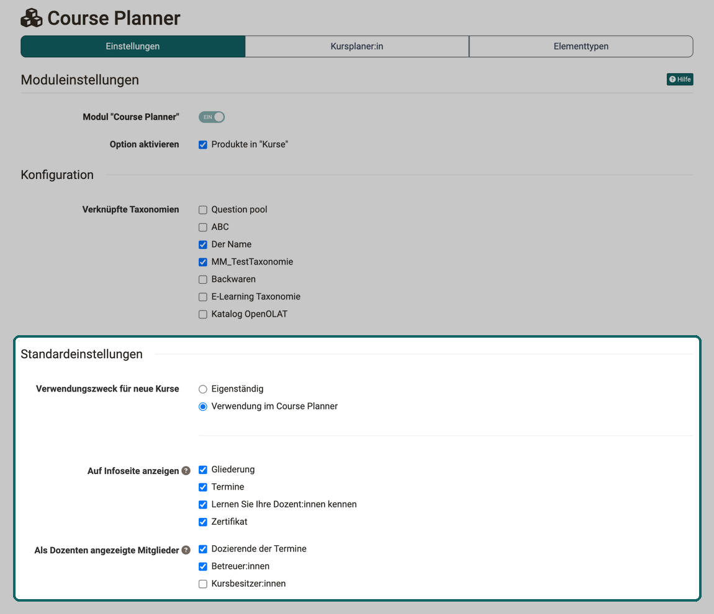
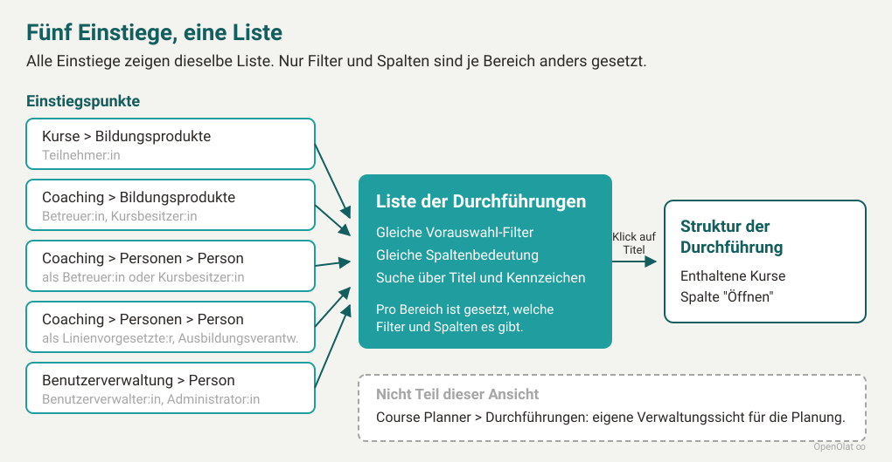
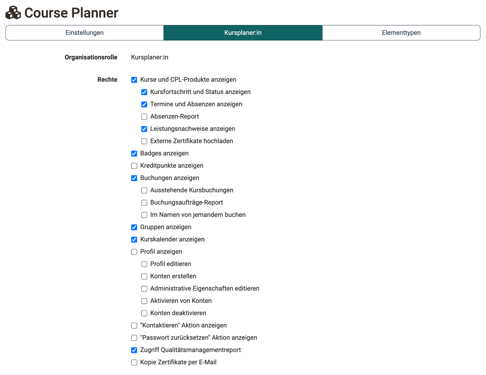
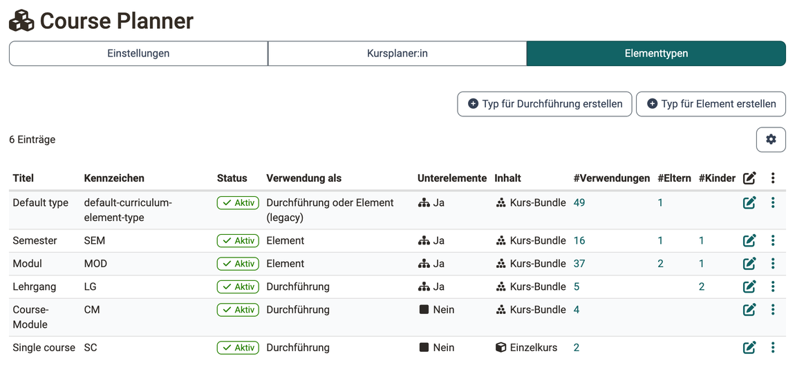
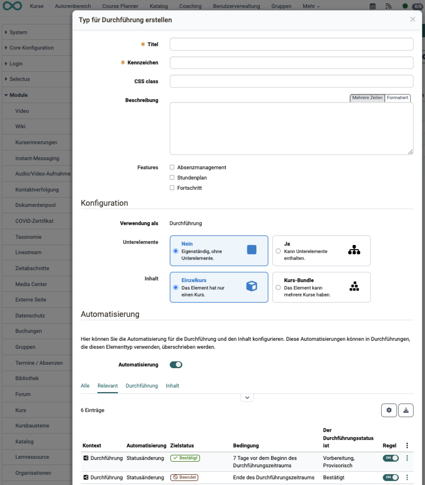
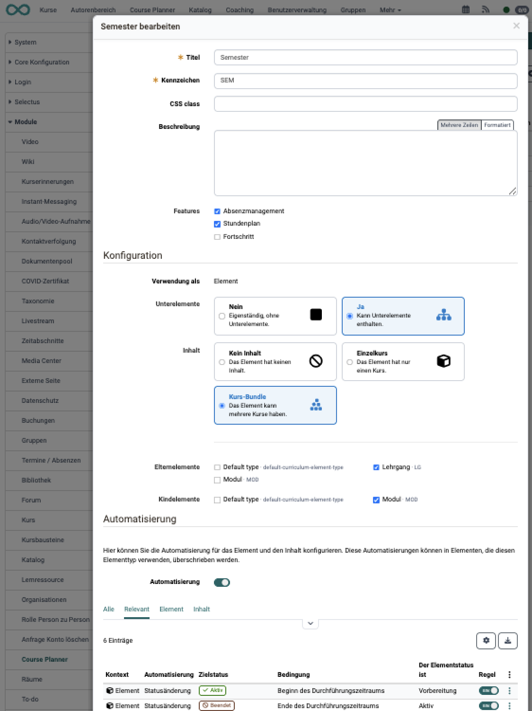

# Modul Course Planner {: #module_course_planner}

## Aktivierung des Course Planners {: #activation}

Das Modul Course Planner ist optional an Stelle des Moduls Curriculum in OpenOlat verfügbar und muss in der Administration aktiviert werden.

!!! tip "Hosting-Kunden von frentix"
	 Wenden Sie sich für die Aktivierung bitte an [contact@frentix.com](mailto:contact@frentix.com).   Nach der Aktivierung können die Produkte zusätzlich im Bereich «Kurse» angezeigt werden, siehe [Produkte in "Kurse"](#product_in_my_courses).

[Zum Seitenanfang ^](#module_course_planner)

---

## Tab Einstellungen {: #tab_course_planner}

Im Tab "Einstellungen" schalten Administrator:innen den Course Planner ein und legen fest, mit welchen Voreinstellungen neue Kurse und Durchführungen starten. Sie finden ihn in der System-Administration unter: `Administration > Module > Course Planner`. Neben "Einstellungen" erscheinen die Tabs "Kursplaner:in" und "Elementtypen", sobald das Modul eingeschaltet ist.

{ class="shadow lightbox" title="Tab Einstellungen im Modul Course Planner · 2026.10.09" }

Fünf Einstiege öffnen dieselbe Liste der Produkte und Durchführungen:

* `Kurse > Bildungsprodukte` für Teilnehmer:innen
* `Coaching > Bildungsprodukte` für Betreuer:innen und Kursbesitzer:innen
* `Coaching > Personen > "Person" > Bildungsprodukte` als Betreuer:in oder Kursbesitzer:in
* derselbe Weg `Coaching > Personen > "Person" > Bildungsprodukte` als Linienvorgesetzte:r oder Ausbildungsverantwortliche:r
* `Benutzerverwaltung > "Person" > Bildungsprodukte` für Benutzerverwalter:innen, Rollenverwalter:innen, Administrator:innen und Principals

Den ersten Einstieg, `Kurse > Bildungsprodukte`, schaltet die Option [Produkte in "Kurse"](#product_in_my_courses) ein oder aus.

{ class="shadow lightbox" title="Einstiege in die Liste der Durchführungen" }

### Moduleinstellungen {: #module_settings}

#### Modul "Course Planner" {: #enable_course_planner }

Dieser Schalter schaltet das gesamte Modul ein oder aus. Ist er ausgeschaltet, blendet OpenOlat die übrigen Einstellungen dieses Tabs und die Tabs "Kursplaner:in" und "Elementtypen" aus.

#### Produkte in "Kurse" {: #product_in_my_courses }

Alle Teilnehmer:innen finden in der Hauptnavigation den Bereich "Kurse". Ist die Option «Produkte in "Kurse"» unter "Option aktivieren" gewählt, zeigt dieser Bereich den Teilnehmer:innen auch ihre Produkte.

### Konfiguration {: #configuration_section}

#### Verknüpfte Taxonomien {: #linked_taxonomies }

Von den im Modul "Taxonomie" erstellten Taxonomien können hier diejenigen ausgewählt werden, die auch im Course Planner verfügbar sein sollen.

!!! tip "Tipp"

    Die hier gewählten Taxonomien sollten die gleichen sein, wie die im Katalog verwendeten. Nur dann kann im Katalog auch nach diesen Taxonomien gesucht werden.

### Standardeinstellungen [:octicons-tag-16:{ title="ab Release 21.1 (OO-9756)" }](https://track.frentix.com/issue/OO-9756){:target="_blank"} {: #default_settings}

Wer viele Kurse und Durchführungen anlegt, legt hier einmal fest, womit sie starten, statt jede einzeln nachzuziehen. Die Standardwerte gelten für Kurse und Durchführungen, die nach der Änderung neu angelegt werden.

#### Verwendungszweck für neue Kurse {: #default_purpose_new_courses }

Kurse können für eigenständige Verwendung oder zur Einbindung in ein Produkt vorgesehen werden. Als Administrator:in legen Sie hier fest, welche Verwendung standardmässig voreingestellt ist.

* **Eigenständig**: Ein eigenständiger Kurs besitzt eine Mitgliederverwaltung. Der Zugang kann mit der Angebotsart "Privat" durch Eintragung als Mitglied (z.B. durch Kursbesitzer:innen), durch Vergabe eines Zugangscodes oder über eine Veröffentlichung im Katalog erfolgen.
* **Verwendung im Course Planner**: Wird der Kurs in ein Produkt eingebunden, werden die Mitgliedschaften durch den Course Planner vergeben und verwaltet. Der Kurs benötigt dann keine zweite, eigenständige Mitgliederverwaltung.

!!! tip "Tipp"

    Wird der Course Planner umfassend eingesetzt, bietet es sich an, den Verwendungszweck für neue Kurse in der System-Administration unter `Administration > Module > Course Planner` auf "Verwendung im Course Planner" einzustellen.

#### Auf Infoseite anzeigen {: #default_display_on_info_page}

Hier legen Sie fest, welche Abschnitte die Infoseite einer neuen Durchführung zeigt: "Gliederung", "Termine", "Lernen Sie Ihre Dozent:innen kennen" und "Zertifikat". Ab Werk sind alle vier Optionen gewählt. Für "Kreditpunkte" gibt es keinen Standardwert, die Option wird an jeder Durchführung einzeln gewählt.

"Lernen Sie Ihre Dozent:innen kennen" gilt für neue Durchführungen als gewählt, solange unter "Als Dozenten angezeigte Mitglieder" mindestens eine Rolle gewählt ist. Sollen neue Durchführungen ohne diesen Abschnitt starten, wählen Sie dort keine Rolle.

#### Als Dozenten angezeigte Mitglieder {: #default_taught_by}

Hier legen Sie fest, welche Rollen eine neue Durchführung im Abschnitt "Lernen Sie Ihre Dozent:innen kennen" zeigt: "Dozierende der Termine", "Betreuer:innen" oder "Kursbesitzer:innen". Dieselben Rollen sind vorgewählt, wenn jemand an einer bestehenden Durchführung "Lernen Sie Ihre Dozent:innen kennen" neu auswählt. Ab Werk sind "Dozierende der Termine" und "Betreuer:innen" gewählt.

!!! info "Standardwerte für die Infoseite wirken nur auf neue Durchführungen"

    Die beiden Standardwerte für die Infoseite gelten für Durchführungen und Elemente, die nach der Änderung angelegt werden. Bestehende Durchführungen behalten ihre eigene Einstellung, und eine Kopie übernimmt die Einstellung der Vorlage. Kurse übernehmen diese Werte nicht, ihre Standardwerte für die Infoseite legen Sie im [Modul Kurs](Modules_Course.de.md#default_settings) fest.

Wie die Anzeigeeinstellungen einer einzelnen Durchführung geändert werden, beschreibt [Course Planner: Durchführungen](../../manual_user/area_modules/Course_Planner_Implementations.de.md#tab_settings_infos).

[Zum Seitenanfang ^](#module_course_planner)

---

## Tab Kursplaner:in {: #tab_course_planner_role}

Im Tab "Kursplaner:in" stehen die Rechte der Organisationsrolle Kursplaner:in. Der Tab zeigt oben die "Organisationsrolle" mit dem festen Wert "Kursplaner:in", darunter die Liste der Rechte. Er erscheint, sobald das Modul eingeschaltet ist.

{ class="shadow lightbox" title="Tab Kursplaner:in im Modul Course Planner · 2026.10.09" }

#### Rechte {: #user_overview }

Die Liste führt die Bereiche, eingerückt darunter ihre einzelnen Angaben. Zwei Rechte bestimmen, welche Spalten der [Report Buchungsaufträge](../../manual_user/area_modules/Reports_BookingOrders.de.md) im Course Planner enthält:

- **Kursfortschritt und Status anzeigen**: die Spalten von "Punkte" bis "Letzter Besuch", darunter "Erfolgsstatus", "Fortschritt" und "Zertifikat".
- **Termine und Absenzen anzeigen**: die Spalten "Einheiten", "Anwesend", "Unentschuldigt", "Entschuldigt" und "Dispensiert".

Ist eines der beiden Rechte nicht gewählt, fehlen seine Spalten in allen Reports der Kategorie Buchungsaufträge.

[Zum Seitenanfang ^](#module_course_planner)

---
## Tab Elementtypen {: #tab_element_types}

### Übersicht der Elementtypen [:octicons-tag-16:{ title="ab Release 21.0 (OO-8924)" }](https://track.frentix.com/issue/OO-8924){:target="_blank"} {: #element_types_overview}

Elementtypen definieren, welche Elemente ein Produkt enthalten kann und geben diesen Elementen eine Bedeutung. Beim Anlegen der Elementtypen kann eine hierarchische Struktur abgebildet werden. Ein Beispiel für ein hierarchisches Produkt: Ein Lehrgang enthält Semester, ein Semester enthält Module, ein Modul enthält Kurse.

Die Übersichtstabelle zeigt alle angelegten Elementtypen. Ein Elementtyp wird über das :fontawesome-regular-pen-to-square:-Symbol bearbeitet. Über den 3-Punkte-Link kann der Typ kopiert oder gelöscht werden.

**Tabellenspalten:**

| Spalte | Bedeutung |
|---|---|
| Titel | Der Name des Elementtyps |
| Kennzeichen | Der eindeutige Wert, der den Elementtyp von gleichnamigen Typen unterscheidet |
| Status | Ob der Typ für neue Elemente zur Auswahl steht: «Aktiv» oder «Inaktiv» |
| Verwendung als | Funktion des Elementtyps im Produkt: «Durchführung», «Element» oder «Durchführung oder Element (legacy)» |
| Unterelemente | Ob Elemente dieses Typs Unterelemente enthalten können |
| Inhalt | Welchen Kursinhalt Elemente dieses Typs tragen: «Kein Inhalt», «Einzelkurs» oder «Kurs-Bundle» |
| #Verwendungen | Anzahl der im System vorhandenen Elemente dieses Typs |
| #Eltern | Anzahl übergeordneter Elementtypen, die diesen Typ als Kindelement zulassen |
| #Kinder | Anzahl der Elementtypen, die als Kindelemente dieses Typs definiert sind |

{ class="shadow lightbox" title="Tab Elementtypen im Modul Course Planner · 2026.10.09" }

[Zum Seitenanfang ^](#module_course_planner)

---

### Elementtyp erstellen und bearbeiten {: #create_element_types}

Zwei Buttons legen neue Elementtypen an: «Typ für Durchführung erstellen» und «Typ für Element erstellen». Die Wahl des Buttons bestimmt die Verwendung des Typs und lässt sich im Dialog nicht mehr ändern. Einen bestehenden Typ öffnen Sie über das :fontawesome-regular-pen-to-square:-Symbol.

{ class="shadow lightbox" title="Dialog Typ für Durchführung erstellen" }

#### Titel (Pflichtfeld) {: #element_type_title }

Der Name des Elementtyps, der bei der Auswahl beim Anlegen eines Elements angezeigt wird.

#### Kennzeichen (Pflichtfeld) {: #element_type_identifier }

Ein eindeutiger Wert, der Elemente mit gleichem Titel unterscheidet. Erscheint bei der Erstellung eines neuen Curriculum-Elements als Auswahloption.

#### Beschreibung {: #element_type_description }

Erklärender Text zum Elementtyp.

#### Features {: #element_type_features }

* **Absenzmanagement**: Kursplaner:innen erhalten auf Elementen dieses Typs den Tab «Absenzen» und können die Absenzen aller Teilnehmer:innen einsehen. Voraussetzung: Modul Absenzenverwaltung ist aktiviert.
* **Stundenplan**: Vereint alle Kurskalender-Termine der dem Produkt-Element zugeordneten Kurse.
* **Fortschritt**: Zeigt den Lernfortschritt in Lernpfadkursen als Kreisdiagramm. Bei mehreren Unterelementen wird der Durchschnitt der Unterelemente berechnet.

!!! note "CSS class"
	Über das Feld "CSS class" hinterlegen Sie ein eigenes Layout für Elemente dieses Typs. Bei Interesse an eigenen Layouts wenden Sie sich an frentix: [contact@frentix.com](mailto:contact@frentix.com).

Im Abschnitt «Konfiguration» legen Sie die Struktur fest:

### Konfiguration {: #configuration }

#### Verwendung als {: #for_use_as }

Zeigt die Funktion von Elementen dieses Typs im Produkt. Der Wert ergibt sich aus dem gewählten Button und ist nicht editierbar:

* **Durchführung**: Elemente dieses Typs sind Durchführungen (das oberste Elternelement). Sie verfügen über einen Durchführungszeitraum und sind der Ausgangspunkt für Automatisierungsregeln.
* **Element**: Elemente dieses Typs sind Unterelemente unterhalb einer Durchführung und haben keinen eigenen Durchführungszeitraum.
* **Durchführung oder Element (legacy)**: Elemente dieses Typs können sowohl als Durchführung als auch als Unterelement verwendet werden. Diesen Wert tragen bestehende Produktstrukturen; für neue Typen steht er nicht zur Wahl.

#### Unterelemente {: #subelements }

* **Nein**: Elemente dieses Typs stehen eigenständig, ohne Unterelemente.
* **Ja**: Elemente dieses Typs können Unterelemente enthalten.

#### Inhalt {: #content }

* **Kein Inhalt**: Das Element trägt keinen Kurs. Es ist ein reines Strukturelement, vergleichbar mit dem Kursbaustein «Struktur».
* **Einzelkurs**: Das Element hat genau einen Kurs.
* **Kurs-Bundle**: Das Element kann mehrere Kurse haben.

#### Elternelemente und Kindelemente {: #parent_and_child_elements }

Bei einem bestehenden Typ bestimmen Sie hier, unter welchen Typen er eingesetzt werden darf und welche Typen ihm untergeordnet werden können. So entsteht die Hierarchie eines Produkts.

#### Status {: #status }

* **Aktiv**: Der Typ steht beim Anlegen neuer Elemente zur Auswahl.
* **Inaktiv**: Der Typ ist ausgeblendet und steht für neue Elemente nicht mehr zur Auswahl. Bestehende Elemente dieses Typs bleiben erhalten.

[Zum Seitenanfang ^](#module_course_planner)

---

### Automatisierungsregeln je Elementtyp [:octicons-tag-16:{ title="ab Release 21.0 (OO-9452)" }](https://track.frentix.com/issue/OO-9452){:target="_blank"} {: #automation_rules}

Für jeden Elementtyp lassen sich Automatisierungsregeln hinterlegen. Diese Regeln gelten als Vorlage für alle Elemente dieses Typs: Elemente können die Vorlage übernehmen oder individuell überschreiben (siehe [Automatisierung in den Einstellungen einer Durchführung](../../manual_user/area_modules/Course_Planner_Implementations.de.md#tab_settings_automation)).

**Automatisierungsregeln konfigurieren**

Öffnen Sie den gewünschten Elementtyp über das :fontawesome-regular-pen-to-square:-Symbol und wechseln Sie zum Tab «Automatisierung». Über «Automatisierungsregel hinzufügen» fügen Sie neue Regeln hinzu.

{ class="shadow lightbox" title="Tab Automatisierung eines Elementtyps" }

Jede Automatisierungsregel enthält:

* **Auslöser**:
  * **Bei Statuswechsel**: Die Aktion wird ausgelöst, sobald der Durchführungs- oder Elementstatus einen definierten Wert annimmt.
  * **Zeitgesteuert**: Die Aktion wird relativ zum Beginn oder Ende des Durchführungszeitraums ausgelöst. Dabei legen Sie das Bezugsdatum (Beginn oder Ende) sowie einen optionalen Versatz (Anzahl Tage/Wochen/Monate vor oder nach dem Bezugsdatum) fest.
* **Aktion**: Was automatisch ausgeführt wird, z. B. Kurs aus Vorlage erstellen (Instanziierung) oder Kursstatus setzen.

[Zum Seitenanfang ^](#module_course_planner)

---

## Daten in den Course Planner importieren [:octicons-tag-16:{ title="ab Release 20.3.0 (OO-9083)" }](https://track.frentix.com/issue/OO-9083){:target="_blank"} {: #import}

Wer einen Course Planner mit vielen Produkten und Durchführungen aufbaut oder in grosser Zahl aktualisiert, muss sie nicht einzeln erfassen: Kursplaner:innen und Administrator:innen lesen Produkte, Durchführungen, Benutzer:innen und Mitgliedschaften mit dem Import-Assistenten aus einer Excel-Datei ein. Der Import ist keine Einstellung der System-Administration. Den Assistenten starten Sie auf der Startseite des Course Planners über das Mehr-Menü (⋮) oben rechts mit dem Eintrag «Importieren».

Wie der Assistent die Datei Schritt für Schritt prüft und was er anlegt oder ändert, beschreibt im Benutzerhandbuch die Seite [Course Planner: Import / Export](../../manual_user/area_modules/Course_Planner_Import_Export.de.md). Alle Fehler- und Warnungsmeldungen sowie die Feldregeln der Excel-Datei listet die [Course Planner: Import/Export - Referenz](../../manual_user/area_modules/Course_Planner_Import_Export_Reference.de.md).

[Zum Seitenanfang ^](#module_course_planner)

---

## Weiterführende Informationen {: #further_information}

**Auf dieser Seite erwähnt** 
[Modul Kurs >](Modules_Course.de.md) 
[Course Planner: Durchführungen >](../../manual_user/area_modules/Course_Planner_Implementations.de.md) 
[Course Planner: Import / Export >](../../manual_user/area_modules/Course_Planner_Import_Export.de.md) 
[Course Planner: Import/Export - Referenz >](../../manual_user/area_modules/Course_Planner_Import_Export_Reference.de.md)

**Weiterführend** 
[Wie kann ich mit dem Course Planner Kursdurchführungen planen und durchführen? >](../../manual_how-to/course_planner_courses/course_planner_courses.de.md) 
[Wie kann ich mit dem Course Planner einen Bildungsgang planen und durchführen? >](../../manual_how-to/course_planner_curriculum/course_planner_curriculum.de.md) 
[Course Planner: Übersicht >](../../manual_user/area_modules/Course_Planner.de.md) 
[Course Planner: Produkte >](../../manual_user/area_modules/Course_Planner_Products.de.md) 
[Course Planner: Termine >](../../manual_user/area_modules/Course_Planner_Events.de.md) 
[Course Planner: Reports >](../../manual_user/area_modules/Course_Planner_Reports.de.md)

[Zum Seitenanfang ^](#module_course_planner)

