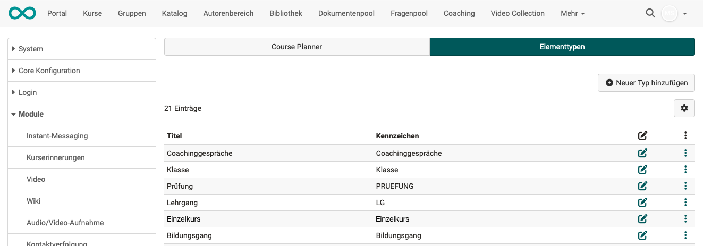
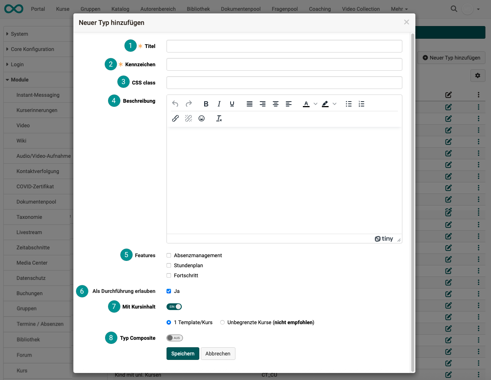

# Modul Course Planner {: #module_course_planner}

## Aktivierung des Course Planners {: #activation}

Das Modul Course Planner ist ab Release 20 optional an Stelle des Moduls Curriculum in OpenOlat verfügbar und muss in der Administration aktiviert werden. 

!!! tip "Aktivierung"

	Kunden von frentix kontaktieren für die Aktivierung bitte [contact@frentix.com.](mailto:contact@frentix.com.) Nach der Aktivierung kann zusätzlich die Anzeige des persönlichen Curriculums (= "Lehrgänge") im Bereich "Kurse" aktiviert werden.  
		
	:material-alert: **Nicht Hosting-Kunde von frentix?** Fragen Sie Ihren Systembetreiber!
 
### Tab Course Planner

{ class="shadow lightbox" }

 **Course Planner einschalten** 
Mit dieser Checkbox wird das gesamte Modul aktiviert.

 **Curriculum in "Meine Kurse"** 
Alle Teilnehmer:innen finden in der Hauptnavigation in der Kopfzeile den Menü-Eintrag "Kurse". Unter diesem Menüpunkt können den Teilnehmer:innen ebenfalls Curricula angezeigt werden. 

 **Benutzer:innen Übersicht** 
Hier bestimmen Sie als Administrator:in, welche Optionen die Rollen.

* Course Planner
* Education Manager und
* Linienvorgesetzter

angezeigt bekommen. Was also z.B. eine mit dem Course Planner arbeitende Person von den Benutzer:innen sehen darf. 

 **Verknüpfte Taxonomien** 
Von den im Modul "Taxonomie" erstellten Taxonomien können hier diejenigen ausgewählt werden, die auch im Course Planner verfügbar sein sollen.

**Hinweis:** 
Die hier gewählten Taxonomien sollten die gleichen sein, wie die im Katalog verwendeten. Nur dann kann im Katalog auch nach diesen Taxonomien gesucht werden.

 **Standardmässiger Verwendungszweck für neue Kurse** 

Kurse können für eigenständige Verwendung oder zur Einbindung in ein Curriculum/Produkt vorgesehen werden. Als Administrator:in legen Sie hier fest, welche Verwendung standardmässig voreingestellt ist.

**Eigenständig**: Ein eigenständiger Kurs besitzt eine Mitgliederverwaltung. Der Zugang kann mit der Buchungsmethode "Privat" durch Eintragung als Mitglied (z.B. durch Kursbesitzer:innen), durch Vergabe eines Zugangscodes oder über eine Veröffentlichung im Katalog erfolgen. 

**Einbindung in Curriculum/Produkt**: Wird der Kurs in ein Curriculum/Produkt eingebunden, werden die Mitgliedschaften durch den Course Planner vergeben und verwaltet. Der Kurs benötigt dann keine zweite, eigenständige Mitgliederverwaltung.

[Zum Seitenanfang ^](#module_course_planner)
  
---
## Tab Elementtypen

### Definieren von Element-Typen {: #define_element_types}

Element-Typen definieren, welche Elemente ein Curriculum enthalten kann und
geben diesen Elementen eine nähere Bedeutung. Beim Anlegen der Element-Typen kann eine hierarchische Struktur abgebildet werden, dies ist aber nicht zwingend. Ein Beispiel für ein hierarchisches Curriculum ist `Lehrgang → Semester → Modul → Kurs`.

Ein Element kann ein reines Strukturelement sein ("Mit Kursinhalt" ausgeschaltet, 
vergleichbar mit Kursbaustein "Struktur".)

Für ein Element mit einem oder mehreren Kursen als Inhalt muss "Mit Kursinhalt" eingeschaltet sein.
(Siehe Element-Typ erstellen, Punkt 7.)

In der Tabelle werden die bereits angelegten Element-Typen angezeigt. Eine Bearbeitung der Daten ist über das
:fontawesome-regular-pen-to-square:-Symbol möglich. Über den 3-Punkte-Link kann der jeweilige Typ kopiert oder gelöscht werden.

{ class="shadow lightbox" }

[Zum Seitenanfang ^](#module_course_planner)
  
---

### Element-Typ erstellen {: #create_element_types}

Über den Button "Neuen Typ hinzufügen" können weitere Element-Typen angelegt werden. 

{ class="shadow lightbox" }

 **Titel** 
Es ist zwingend ein Titel anzugeben.

 **Kennzeichen** 
Das Kennzeichen ist ebenfalls ein Pflichtfeld. (Es wird als Identifier zur Unterscheidung bei Elementen mit gleichem Titel verwendet.) Der hier eingegebene Text erscheint bei der Erstellung eines neuen Curriculum-Elements als Auswahloption.  (Course Planner > Curriculum/Produkt > Tab Durchführung > Button Erstellen)

 **CSS class** 
Es ist an dieser Stelle möglich, per CSS-Klasse ein nur für diesen Element-Typ geltendes Layout zu hinterlegen. Bei Interesse an spezifischen Layouts melden Sie sich bitte bei frentix.

 **Beschreibung** 
Erklären Sie hier mit einem Beschreibungstext Ihren Elementtyp.

 **Features** 
Mit aktiviertem **Absenzenmanagement** haben Sie in der Rolle als Course Planner das Tab "Absenz" auf deiesem Element und können für alle Teilnehmer:innen dieses Elements die Absenzen einsehen. (Voraussetzung ist, dass das Modul "Absenzenverwaltung" aktiviert ist.)

Ebenfalls kann für diesen Element-Typ die Anzeige des **Stundenplans**
aktiviert werden. Dieser vereint alle Kurskalender-Termine der zu diesem
Curriculum-Element zugeordneten Kurse.

Wird **Fortschritt** selektiert, wird der Fortschritt in Lernpfadkursen als Kreisdiagramm angezeigt. 
Besteht das Element aus mehreren Unterelementen, wird der Fortschritt aus dem Durchschnitt der Unterelemente (nur Lernpfadkurse) berechnet. (In herkömmlichen Kursen steht die Fortschrittsanzeige nicht zur Verfügung.)

 **Als Durchführung erlauben** 
Mit dieser Angabe bestimmen Sie, welches Element ein Eltern-Element sein darf.
Eine Durchführung ("Durchführungs-Element") ist das oberste Eltern-Element.

 **Mit Kursinhalt** 
Wie oben beschrieben, kann ein Element ein reines Strukturelement sein, vergleichbar mit Kursbaustein "Struktur" ("Mit Kursinhalt" ausgeschaltet).

Für ein Element mit einem oder mehreren Kursen als Inhalt muss "Mit Kursinhalt" eingeschaltet sein.

 **Typ Composite** 
Nach der Aktivierung können bereits bestehende Element-Typen dem neuen Typ zusätzlich als Sub-
Typen untergeordnet werden.

[Zum Seitenanfang ^](#module_course_planner)
  
---

## Weitere Informationen

[Wie kann ich mit dem Course Planner Kursdurchführungen planen und durchführen? >](../../manual_how-to/course_planner_courses/course_planner_courses.de.md) 
[Wie kann ich mit dem Course Planner einen Bildungsgang planen und durchführen? >](../../manual_how-to/course_planner_curriculum/course_planner_curriculum.de.md) 
[Course Planner: Übersicht >](../../manual_user/area_modules/Course_Planner.de.md) 
[Course Planner: Curricula/Produkte >](../../manual_user/area_modules/Course_Planner_Products.de.md) 
[Course Planner: Durchführungen >](../../manual_user/area_modules/Course_Planner_Implementations.de.md) 
[Course Planner: Termine >](../../manual_user/area_modules/Course_Planner_Events.de.md) 
[Course Planner: Reports >](../../manual_user/area_modules/Course_Planner_Reports.de.md) 

[Zum Seitenanfang ^](#module_course_planner)

