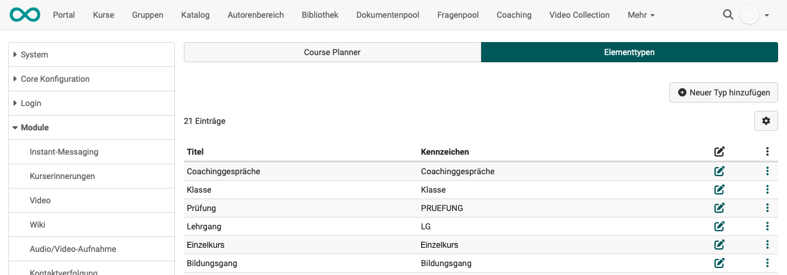
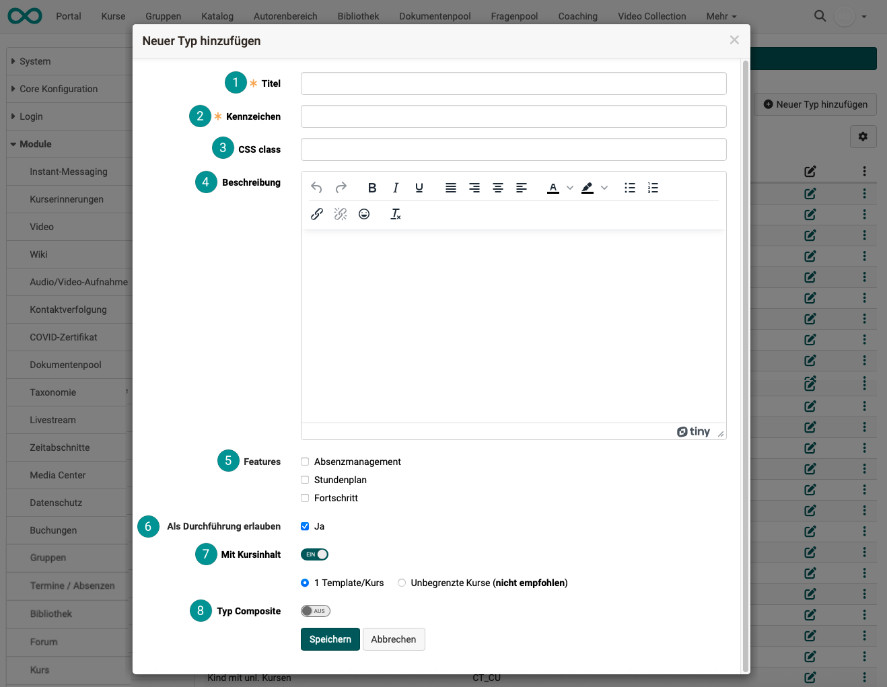

# Module Course Planner {: #module_course_planner}

## Activation of the Course Planner {: #activation}

From Release 20, the Course Planner module is optionally available in OpenOlat instead of the Curriculum module and must be activated in Administration. 

!!! tip "Activation"

    frentix customers please contact [contact@frentix.com.](mailto:contact@frentix.com.) After activation, the display of the personal curriculum (= "Courses") can also be activated in the "Courses" area.  

    :material-alert: **Not a hosting client of frentix?** Ask your system operator!

### Tab Course Planner

{ class="shadow lightbox" }

 **Turn on Course Planner** 
This checkbox activates the entire module.

 **Product in "My courses"** 
All participants will find the menu item "Courses" in the header of the main navigation bar. Curricula can also be displayed to participants under this menu item. 

 **User overview** 
Hier bestimmen Sie als Administrator:in, welche Optionen die Rollen.

* Course Planner
* Education Manager and
* Line manager

are displayed. For example, what a person working with the Course Planner is allowed to see of the users.

 **Linked taxonomies** 
From the taxonomies created in the "Taxonomy" module, you can select those that should also be available in the Course Planner.

**Note:** 
The taxonomies selected here should be the same as those used in the catalog. Only then can these taxonomies be searched for in the catalog.

 **Standard purpose for new courses** 

Courses can be intended for stand-alone use or for integration into a product. As an administrator, you specify here which use is preset by default.

**Independent**: An independent course has a member administration. Access can be gained using the "Private" offer type by registering as a member (e.g. by course owners), by assigning an access code or by publication in the catalog. 

**Integration into product**: If the course is integrated into a product, memberships are assigned and managed by the Course Planner. The course then does not require a second, independent membership administration.

!!! tip "Note"

	If Course Planner is used extensively, it is advisable to set the default purpose for new courses in System administration > Course Planner settings to “Integration into product”.

[To the top of the page ^](#module_course_planner)

---

## Tab "Element types"

### Define element types {: #define_element_types}

Element types define which elements a product can contain and give these elements a more detailed meaning. A hierarchical structure can be mapped when creating the element types, but this is not mandatory. An example of a hierarchical product is `Training program → Semester → Module → Course`.

An element can be a pure structure element ("With course content" switched off, comparable to course element "Structure").

For an element with one or more courses as content, "With course content" must be switched on. (See Create element type, point 7.)

The element types that have already been created are displayed in the table. The data can be edited using the :fontawesome-regular-pen-to-square: symbol. The respective type can be copied or deleted via the 3-dot link.

{ class="shadow lightbox" }

[To the top of the page ^](#module_course_planner)

---

### Create element types {: #create_element_types}

Additional element types can be created using the "Add new type" button. 

{ class="shadow lightbox" }

 **Title** 
A title must be specified.

 **Kennzeichen** 
The indicator is also a mandatory field. (It is used as an identifier to differentiate between elements with the same title). The text entered here appears as a selection option when a new curriculum element is created.  (Course Planner > Curricula/Products > Tab "Implementations" > Button "Create")

 **CSS class** 
At this point, it is possible to define a layout that only applies to this element type using a CSS class. If you are interested in specific layouts, please contact frentix.

 **Description** 
Explain your element type here with a descriptive text.

 **Features** 
If **Absence management** is activated, you have the "Absences" tab on this element in the role of Course Planner and can view the absences for all participants in this element. (Prerequisite is that the "Absence management" module is activated).

The **Schedule** can also be activated for this element type. This combines all course calendar dates for the courses assigned to this product element.

If **Progress** is selected, the progress in learning path courses is displayed as a pie chart. 
If the element consists of several sub-elements, the progress is calculated from the average of the sub-elements (learning path courses only). (The progress indicator is not available in conventional courses).

 **Allow as implemetation** 
With this specification, you determine which element may be a parent element.
An implementation ("implementation element") is the top parent element.

 **With course content** 
As described above, an element can be a pure structure element, comparable to the course element "Structure" ("With course content" switched off).

For an element with one or more courses as content, “With course content” must be switched on.

 **Typ Composite** 
After activation, existing element types can also be subordinated to the new type as sub-types.

[To the top of the page ^](#module_course_planner)
  
---

## Further information

[How can I plan and run courses with the Course Planner? >](../../manual_how-to/course_planner_courses/course_planner_courses.md) 
[How can I plan and run a course with the Course Planner? >](../../manual_how-to/course_planner_curriculum/course_planner_curriculum.md) 
[Course Planner: Overview >](../../manual_user/area_modules/Course_Planner.md) 
[Course Planner: Products >](../../manual_user/area_modules/Course_Planner_Products.md) 
[Course Planner: Implementations >](../../manual_user/area_modules/Course_Planner_Implementations.md) 
[Course Planner: Events >](../../manual_user/area_modules/Course_Planner_Events.md) 
[Course Planner: Reports >](../../manual_user/area_modules/Course_Planner_Reports.md) 

[To the top of the page ^](#module_course_planner)

