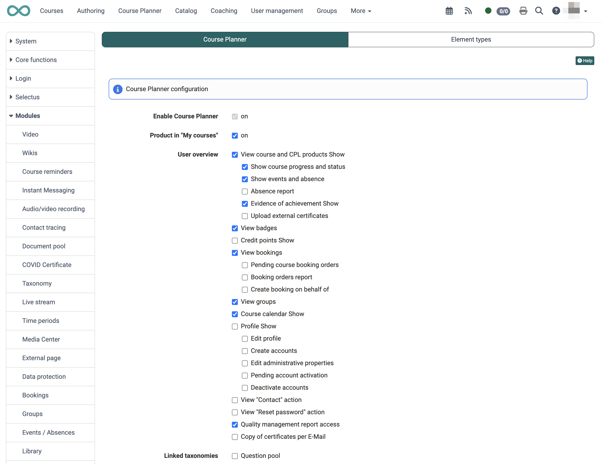
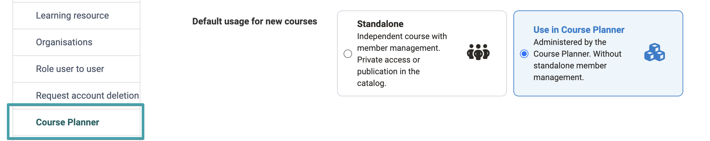
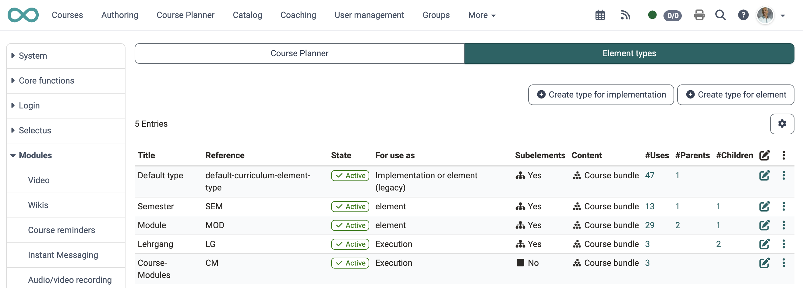
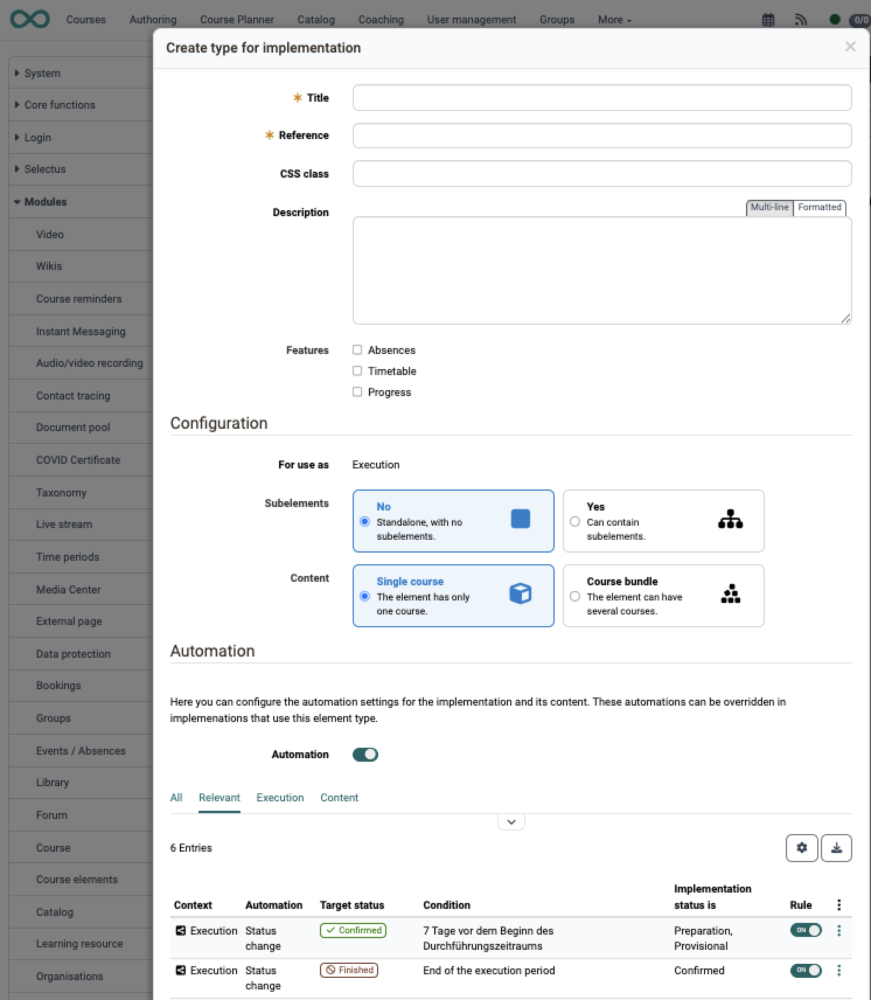
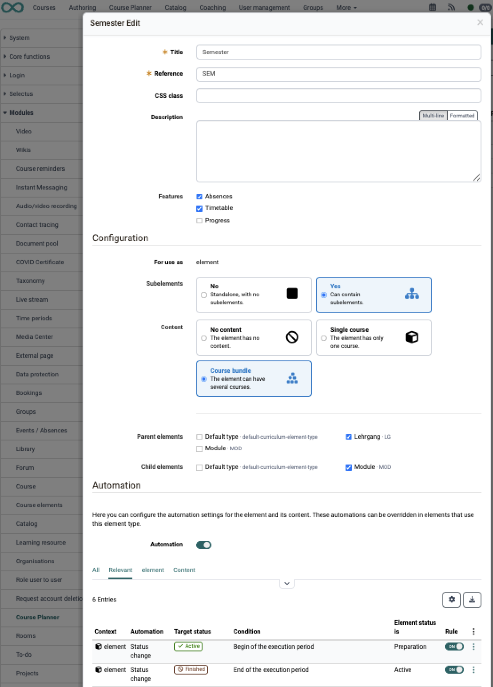

# Module Course Planner {: #module_course_planner}

## Activation of the Course Planner {: #activation}

The Course Planner module is optionally available in OpenOlat instead of the Curriculum module and must be activated in Administration.

!!! tip "frentix hosting customers"
    For activation, please contact [contact@frentix.com](mailto:contact@frentix.com).   After activation, the display of the personal curriculum ("Courses") in the "Courses" area can also be enabled.

### Tab Course Planner {: #tab_course_planner}

{ class="shadow lightbox" }

**Turn on Course Planner** 
This checkbox activates the entire module.

**Product in "My courses"** 
All participants will find the menu item "Courses" in the header of the main navigation bar. Products can also be displayed to participants under this menu item.

**User overview** 
As an administrator you determine here which options the roles Course planner, Education manager and Line manager are shown. In other words, what a person working with the Course Planner is allowed to see of the participants. Individual entries can be released separately for each area, for example course progress and status, events and absences, evidence of achievement, badges, bookings or access to the quality management report.

**Linked taxonomies** 
From the taxonomies created in the "Taxonomy" module, you can select those that should also be available in the Course Planner.

**Note:** 
The taxonomies selected here should be the same as those used in the catalog. Only then can these taxonomies be searched for in the catalog.

**Standard purpose for new courses** 
Courses can be intended for stand-alone use or for integration into a product. As an administrator, you specify here which use is preset by default.

* **Standalone**: An independent course has a member administration. Access can be gained using the "Private" offer type by registering as a member (e.g. by course owners), by assigning an access code or by publication in the catalog.
* **Use in Course Planner**: If the course is integrated into a product, memberships are assigned and managed by the Course Planner. The course then does not require a second, independent membership administration.

{ class="shadow lightbox" }

!!! tip "Tip"

	If Course Planner is used extensively, it is advisable to set the default purpose for new courses under `System administration > Course Planner settings` to "Integration into product".

[To the top of the page ^](#module_course_planner)

---

## Tab "Element types" {: #tab_element_types}

### Element type overview [:octicons-tag-16:{ title="from Release 21.0 (OO-8924)" }](https://track.frentix.com/issue/OO-8924){:target="_blank"} {: #element_types_overview}

Element types define which elements a product can contain and give these elements a meaning. A hierarchical structure can be mapped when creating the element types. An example of a hierarchical product is `Training program > Semester > Module > Course`.

The overview table shows all element types that have been created. An element type is edited via the :fontawesome-regular-pen-to-square: symbol. The type can be copied or deleted via the 3-dot link.

**Table columns:**

| Column | Meaning |
|---|---|
| Title | The name of the element type |
| Reference | The unique identifier of the element type |
| State | Whether the type is available for selection for new elements: "Active" or "Inactive" |
| For use as | Function of the element type in the product: "Implementation", "Element" or "Implementation or element (legacy)" |
| Subelements | Whether elements of this type can contain subelements |
| Content | Which course content elements of this type carry: "No content", "Single course" or "Course bundle" |
| #Uses | Number of elements of this type present in the system |
| #Parents | Number of superordinate element types that allow this type as a child element |
| #Children | Number of element types defined as child elements of this type |

{ class="shadow lightbox" }

[To the top of the page ^](#module_course_planner)

---

### Create and edit element types {: #create_element_types}

Two buttons create new element types: **"Create type for implementation"** and **"Create type for element"**. The button you choose determines the use of the type and cannot be changed in the dialog. An existing type is opened via the :fontawesome-regular-pen-to-square: symbol.

{ class="shadow lightbox" }

**Title** (mandatory field) 
The name of the element type that is shown in the selection when an element is created.

**Reference** (mandatory field) 
A unique identifier used to distinguish between elements with the same title. Appears as a selection option when a new curriculum element is created.

**Description** 
Explanatory text for the element type.

**Features** 
* **Absences**: Course planners get the "Absences" tab on elements of this type and can view the absences of all participants. Prerequisite: the Absence management module is activated.
* **Timetable**: Combines all course calendar dates of the courses assigned to the product element.
* **Progress**: Shows the learning progress in learning path courses as a pie chart. With several sub-elements, the average of the sub-elements is calculated.

!!! note "CSS class"
	Here you can define a type-specific layout via a CSS class. If you are interested in specific layouts, please contact frentix: [contact@frentix.com](mailto:contact@frentix.com).

In the **Configuration** section you define the structure:

**For use as** 
Shows the function of elements of this type in the product. The value results from the button you chose and cannot be edited:

* **Implementation**: Elements of this type are implementations (the topmost parent element). They have an implementation period and are the starting point for automation rules.
* **Element**: Elements of this type are sub-elements below an implementation and have no implementation period of their own.
* **Implementation or element (legacy)**: Elements of this type can be used both as an implementation and as a sub-element. This mode is used for backward compatibility with existing product structures and is not available for new types.

**Subelements** 
* **No**: Elements of this type stand alone, with no subelements.
* **Yes**: Elements of this type can contain subelements.

**Content** 
* **No content**: The element carries no course. It is a pure structure element, comparable to the course element "Structure".
* **Single course**: The element has exactly one course.
* **Course bundle**: The element can have several courses.

**Parent elements** and **Child elements** 
For an existing type you determine here under which types it may be used and which types can be subordinated to it. This is how the hierarchy of a product is built.

**State** 
* **Active**: The type is available for selection when creating new elements.
* **Inactive**: The type is hidden and is no longer available for selection for new elements. Existing elements of this type are retained.

[To the top of the page ^](#module_course_planner)

---

### Automation rules per element type [:octicons-tag-16:{ title="from Release 21.0 (OO-9452)" }](https://track.frentix.com/issue/OO-9452){:target="_blank"} {: #automation_rules}

Automation rules can be defined for each element type. These rules serve as a template for all elements of this type: elements can adopt the template or override it individually (see [Automation in the settings of an implementation](../../manual_user/area_modules/Course_Planner_Implementations.md#tab_settings_automation)).

**Configuring automation rules**

Open the desired element type via the :fontawesome-regular-pen-to-square: symbol and switch to the **"Automation"** tab. Use **"Add automation rule"** to add new rules.

{ class="shadow lightbox" }

Each automation rule contains:

* **Trigger type**:
  * **On status change**: The action is triggered as soon as the implementation or element status reaches a defined value.
  * **Time-controlled**: The action is triggered relative to the start or end of the implementation period. You define the reference date (start or end) and an optional offset (number of days/weeks/months before or after the reference date).
* **Action**: What is executed automatically, e.g. create course from template (instantiation) or set course status.

[To the top of the page ^](#module_course_planner)

---

## Further information {: #further_information}

[How can I plan and run courses with the Course Planner? >](../../manual_how-to/course_planner_courses/course_planner_courses.md) 
[How can I plan and run a course with the Course Planner? >](../../manual_how-to/course_planner_curriculum/course_planner_curriculum.md) 
[Course Planner: Overview >](../../manual_user/area_modules/Course_Planner.md) 
[Course Planner: Products >](../../manual_user/area_modules/Course_Planner_Products.md) 
[Course Planner: Implementations >](../../manual_user/area_modules/Course_Planner_Implementations.md) 
[Course Planner: Events >](../../manual_user/area_modules/Course_Planner_Events.md) 
[Course Planner: Reports >](../../manual_user/area_modules/Course_Planner_Reports.md) 

[To the top of the page ^](#module_course_planner)

