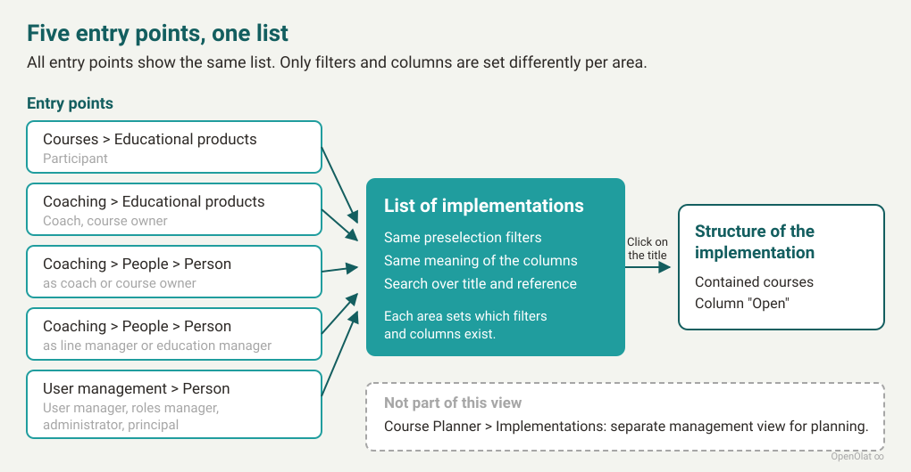
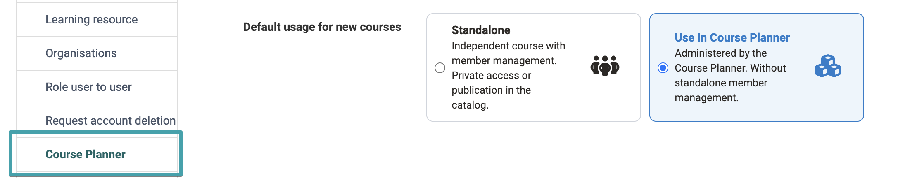
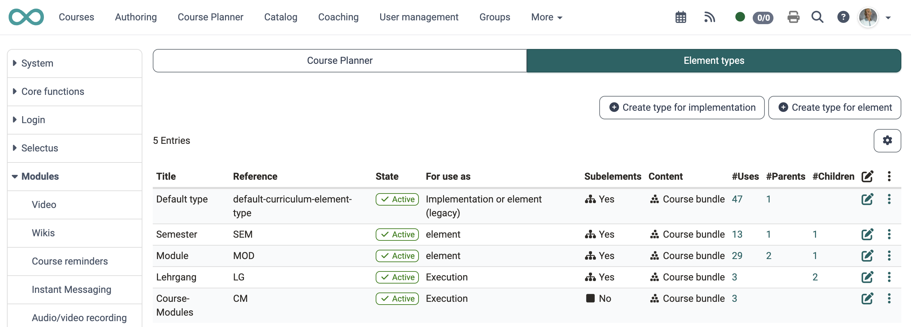
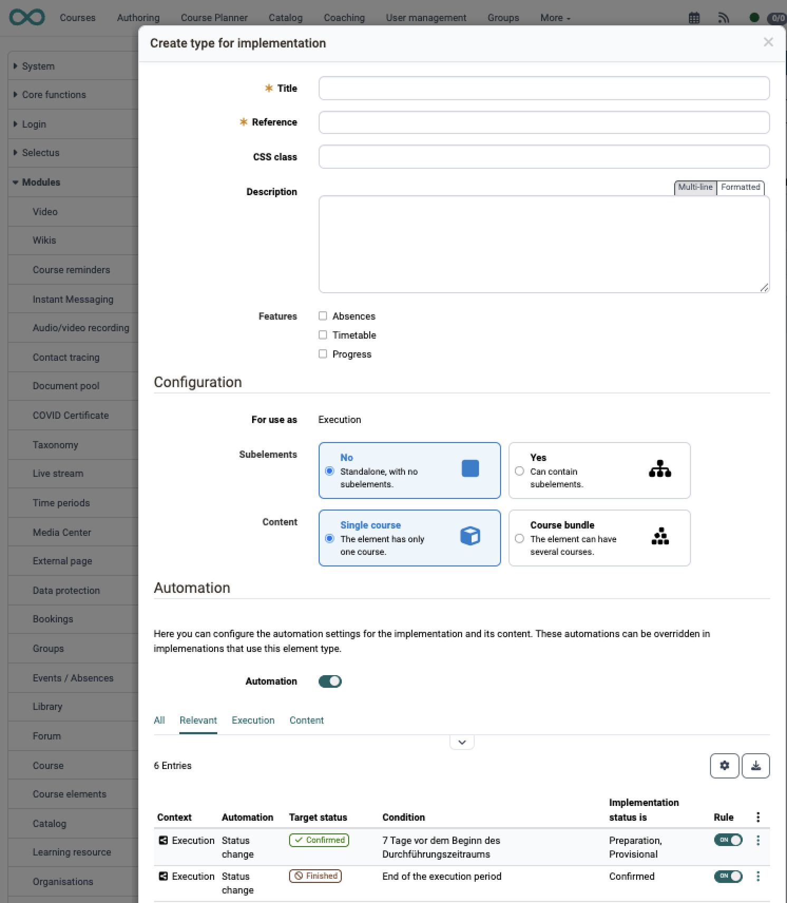
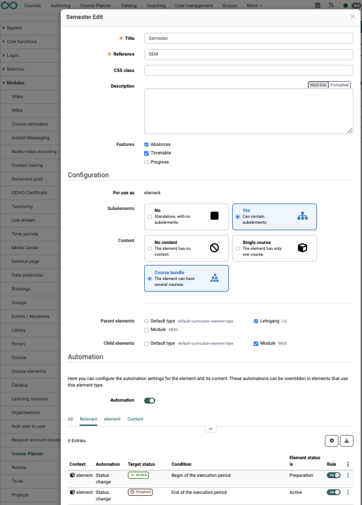

# Module Course Planner {: #module_course_planner}

## Activation of the Course Planner {: #activation}

The Course Planner module is optionally available in OpenOlat instead of the Curriculum module and must be activated in Administration.

!!! tip "frentix hosting customers"
    For activation, please contact [contact@frentix.com](mailto:contact@frentix.com).   After activation, the products can also be displayed in the "Courses" area, see [Products in "Courses"](#product_in_my_courses).

[To the top of the page ^](#module_course_planner)

---

## Tab Settings {: #tab_course_planner}

In the "Settings" tab, administrators switch on the Course Planner and define the presets with which new courses and implementations start. You find it in the system administration under: `Administration > Modules > Course Planner`. Next to "Settings", the tabs "Course planner" and "Element types" appear as soon as the module is switched on.

Five entry points open the same list of products and implementations:

* `Courses > Educational products` for participants
* `Coaching > Educational products` for coaches and course owners
* `Coaching > People > "Person" > Educational products` as a coach or a course owner
* the same path `Coaching > People > "Person" > Educational products` as a line manager or an education manager
* `User management > "Person" > Educational products` for user managers, roles managers, administrators and principals

The option [Products in "Courses"](#product_in_my_courses) turns the first entry point, `Courses > Educational products`, on or off.

{ class="shadow lightbox" title="Entry points to the list of implementations" }

### Module settings {: #module_settings}

#### Module "Course Planner" {: #enable_course_planner }

This switch turns the entire module on or off. If it is switched off, OpenOlat hides the other settings of this tab and the tabs "Course planner" and "Element types".

#### Products in "Courses" {: #product_in_my_courses }

All participants find the "Courses" area in the main navigation. If the option «Products in "Courses"» is selected under "Enable option", this area also shows the participants their products.

### Configuration {: #configuration_section}

#### Linked taxonomies {: #linked_taxonomies }

From the taxonomies created in the "Taxonomy" module, you can select those that should also be available in the Course Planner.

!!! tip "Tip"

    The taxonomies selected here should be the same as those used in the catalog. Only then can these taxonomies be searched for in the catalog.

### Default settings [:octicons-tag-16:{ title="from Release 21.1 (OO-9756)" }](https://track.frentix.com/issue/OO-9756){:target="_blank"} {: #default_settings}

If you create many courses and implementations, you define here once what they start with, instead of adjusting each one individually. The default values apply to courses and implementations that are newly created after the change.

#### Usage for new courses {: #default_purpose_new_courses }

Courses can be intended for stand-alone use or for integration into a product. As an administrator, you specify here which use is preset by default.

* **Standalone**: An independent course has a member administration. Access can be gained using the "Private" offer type by registering as a member (e.g. by course owners), by assigning an access code or by publication in the catalog.
* **Use in Course Planner**: If the course is integrated into a product, memberships are assigned and managed by the Course Planner. The course then does not require a second, independent membership administration.

{ class="shadow lightbox" title="Course Planner tab in the system administration" }

!!! tip "Tip"

    If Course Planner is used extensively, it is advisable to set the usage for new courses in the system administration under `Administration > Modules > Course Planner` to "Use in Course Planner".

#### Display on info page {: #default_display_on_info_page}

Here you define which sections the info page of a new implementation shows: "Outline", "Events", "Meet your teachers" and "Certificate". By default, all four options are selected. There is no default value for "Credit points", the option is selected for each implementation individually.

"Meet your teachers" counts as selected for new implementations as long as at least one role is selected under "Members displayed as teacher". If new implementations are to start without this section, select no role there.

#### Members displayed as teacher {: #default_taught_by}

Here you define which roles a new implementation shows in the "Meet your teachers" section: "Teachers in events", "Coaches" or "Course owners". The same roles are preselected when someone selects "Meet your teachers" again in an existing implementation. By default, "Teachers in events" and "Coaches" are selected.

!!! info "Default values for the info page only affect new implementations"

    The two default values for the info page apply to implementations and elements that are created after the change. Existing implementations keep their own setting, and a copy adopts the setting of the original. Courses do not adopt these values, you define their default values for the info page in the [Module Course](Modules_Course.md#default_settings).

How the display settings of an individual implementation are changed is described in [Course Planner: Implementations](../../manual_user/area_modules/Course_Planner_Implementations.md#tab_settings_infos).

[To the top of the page ^](#module_course_planner)

---

## Tab Course planner {: #tab_course_planner_role}

The "Course planner" tab contains the rights of the organisation role course planner. At the top, the tab shows the "Organisation role" with the fixed value "Course planner", below it the list of rights. It appears as soon as the module is switched on.

#### Rights {: #user_overview }

Individual entries can be released separately for each area, for example course progress and status, events and absences, evidence of achievement, badges, bookings or access to the quality management report.

[To the top of the page ^](#module_course_planner)

---

## Tab Element types {: #tab_element_types}

### Element type overview [:octicons-tag-16:{ title="from Release 21.0 (OO-8924)" }](https://track.frentix.com/issue/OO-8924){:target="_blank"} {: #element_types_overview}

Element types define which elements a product can contain and give these elements a meaning. A hierarchical structure can be mapped when creating the element types. An example of a hierarchical product: a training program contains semesters, a semester contains modules, a module contains courses.

The overview table shows all element types that have been created. An element type is edited via the :fontawesome-regular-pen-to-square: symbol. The type can be copied or deleted via the 3-dot link.

**Table columns:**

| Column | Meaning |
|---|---|
| Title | The name of the element type |
| Reference | The unique value that distinguishes the element type from types with the same name |
| State | Whether the type is available for selection for new elements: "Active" or "Inactive" |
| For use as | Function of the element type in the product: "Implementation", "Element" or "Implementation or element (legacy)" |
| Subelements | Whether elements of this type can contain subelements |
| Content | Which course content elements of this type carry: "No content", "Single course" or "Course bundle" |
| #Uses | Number of elements of this type present in the system |
| #Parents | Number of superordinate element types that allow this type as a child element |
| #Children | Number of element types defined as child elements of this type |

{ class="shadow lightbox" title="Element types tab in the system administration" }

[To the top of the page ^](#module_course_planner)

---

### Create and edit element types {: #create_element_types}

Two buttons create new element types: "Create type for implementation" and "Create type for element". The button you choose determines the use of the type and cannot be changed in the dialog. An existing type is opened via the :fontawesome-regular-pen-to-square: symbol.

{ class="shadow lightbox" title="Dialog Create type for implementation" }

#### Title (mandatory field) {: #element_type_title }

The name of the element type that is shown in the selection when an element is created.

#### Reference (mandatory field) {: #element_type_identifier }

A unique value that distinguishes elements with the same title. Appears as a selection option when a new curriculum element is created.

#### Description {: #element_type_description }

Explanatory text for the element type.

#### Features {: #element_type_features }

* **Absences**: Course planners get the "Absences" tab on elements of this type and can view the absences of all participants. Prerequisite: the Absence management module is activated.
* **Timetable**: Combines all course calendar dates of the courses assigned to the product element.
* **Progress**: Shows the learning progress in learning path courses as a pie chart. With several subelements, the average of the subelements is calculated.

!!! note "CSS class"
	Use the "CSS class" field to define your own layout for elements of this type. If you are interested in your own layouts, please contact frentix: [contact@frentix.com](mailto:contact@frentix.com).

In the "Configuration" section you define the structure:

### Configuration {: #configuration }

#### For use as {: #for_use_as }

Shows the function of elements of this type in the product. The value results from the button you chose and cannot be edited:

* **Implementation**: Elements of this type are implementations (the topmost parent element). They have an implementation period and are the starting point for automation rules.
* **Element**: Elements of this type are subelements below an implementation and have no implementation period of their own.
* **Implementation or element (legacy)**: Elements of this type can be used both as an implementation and as a subelement. Existing product structures carry this value; it is not available for new types.

#### Subelements {: #subelements }

* **No**: Elements of this type stand alone, with no subelements.
* **Yes**: Elements of this type can contain subelements.

#### Content {: #content }

* **No content**: The element carries no course. It is a pure structure element, comparable to the course element "Structure".
* **Single course**: The element has exactly one course.
* **Course bundle**: The element can have several courses.

#### Parent elements and Child elements {: #parent_and_child_elements }

For an existing type you determine here under which types it may be used and which types can be subordinated to it. This is how the hierarchy of a product is built.

#### State {: #status }

* **Active**: The type is available for selection when creating new elements.
* **Inactive**: The type is hidden and is no longer available for selection for new elements. Existing elements of this type are retained.

[To the top of the page ^](#module_course_planner)

---

### Automation rules per element type [:octicons-tag-16:{ title="from Release 21.0 (OO-9452)" }](https://track.frentix.com/issue/OO-9452){:target="_blank"} {: #automation_rules}

Automation rules can be defined for each element type. These rules serve as a template for all elements of this type: elements can adopt the template or override it individually (see [Automation in the settings of an implementation](../../manual_user/area_modules/Course_Planner_Implementations.md#tab_settings_automation)).

**Configuring automation rules**

Open the desired element type via the :fontawesome-regular-pen-to-square: symbol and switch to the "Automation" tab. Use "Add automation rule" to add new rules.

{ class="shadow lightbox" title="Automation tab of an element type" }

Each automation rule contains:

* **Trigger**:
  * **On status change**: The action is triggered as soon as the implementation or element status reaches a defined value.
  * **Time-controlled**: The action is triggered relative to the start or end of the implementation period. You define the reference date (start or end) and an optional offset (number of days/weeks/months before or after the reference date).
* **Action**: What is executed automatically, e.g. create course from template (instantiation) or set course status.

[To the top of the page ^](#module_course_planner)

---

## Importing data into the Course Planner [:octicons-tag-16:{ title="from Release 20.3.0 (OO-9083)" }](https://track.frentix.com/issue/OO-9083){:target="_blank"} {: #import}

Anyone who sets up a Course Planner with many products and implementations or updates them in large numbers does not have to record them one by one: course planners and administrators read products, implementations, users and memberships from an Excel file with the import wizard. The import is not a setting of the system administration. You start the wizard on the Course Planner start page via the more menu (⋮) at the top right with the entry "Import".

How the wizard checks the file step by step and what it creates or changes is described in the user manual on the page [Course Planner: Import / Export](../../manual_user/area_modules/Course_Planner_Import_Export.md). All error and warning messages as well as the field rules of the Excel file are listed in the [Course Planner: Import/Export - Reference](../../manual_user/area_modules/Course_Planner_Import_Export_Reference.md).

[To the top of the page ^](#module_course_planner)

---

## Further information {: #further_information}

**Mentioned on this page** 
[Module Course >](Modules_Course.md) 
[Course Planner: Implementations >](../../manual_user/area_modules/Course_Planner_Implementations.md) 
[Course Planner: Import / Export >](../../manual_user/area_modules/Course_Planner_Import_Export.md) 
[Course Planner: Import/Export - Reference >](../../manual_user/area_modules/Course_Planner_Import_Export_Reference.md)

**Further reading** 
[How can I plan and run courses with the Course Planner? >](../../manual_how-to/course_planner_courses/course_planner_courses.md) 
[How can I plan and run a course with the Course Planner? >](../../manual_how-to/course_planner_curriculum/course_planner_curriculum.md) 
[Course Planner: Overview >](../../manual_user/area_modules/Course_Planner.md) 
[Course Planner: Products >](../../manual_user/area_modules/Course_Planner_Products.md) 
[Course Planner: Events >](../../manual_user/area_modules/Course_Planner_Events.md) 
[Course Planner: Reports >](../../manual_user/area_modules/Course_Planner_Reports.md)

[To the top of the page ^](#module_course_planner)

