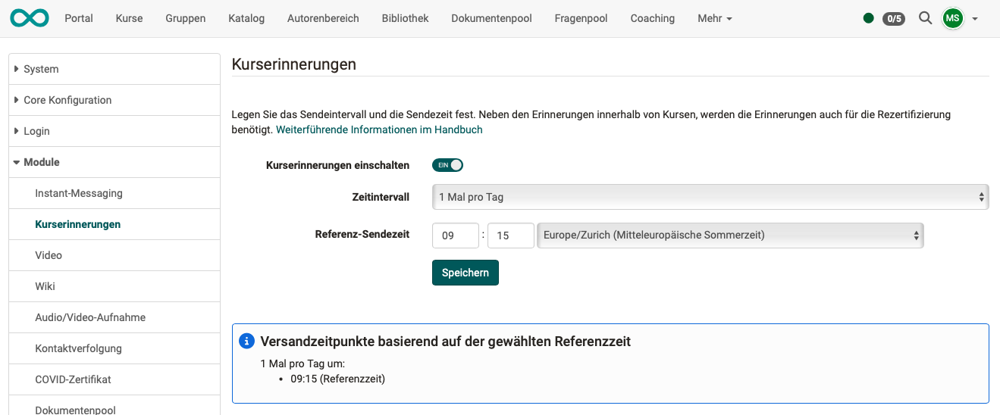
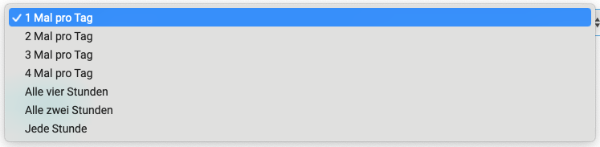

# Modul Kurserinnerungen {: #reminders}

In der Administration kann eingestellt werden, ob und wann in den Kursen erstellte Erinnerungen automatisch verschickt werden.

{ class="shadow lightbox" }  

Es können folgende Zeitintervalle für den automatischen Versand eingestellt werden:

{ class="shadow lightbox" }  

!!! note „Hinweis“

    Wenn die Kurserinnerungen in der Administration deaktiviert sind, kann der automatische Versand in den Kursen nicht übersteuert werden.

[zum Seitenanfang ^](#reminders)
