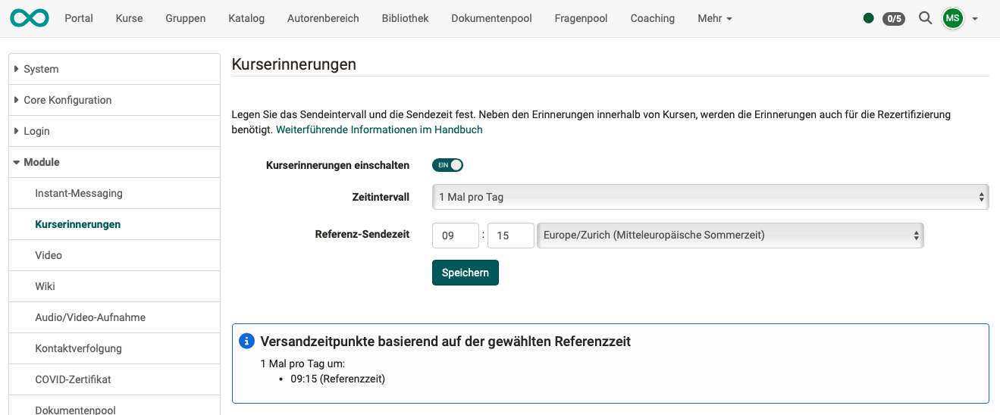
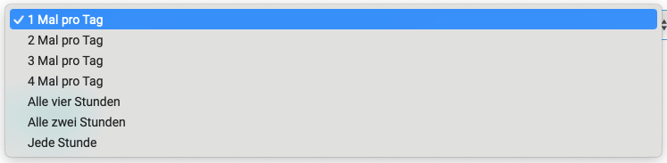

# Modul Kurserinnerungen {: #reminders}

Unter `Administration > Module > Kurserinnerungen` kann eingestellt werden, ob und wann in den Kursen erstellte Erinnerungen automatisch verschickt werden.

{ class="shadow lightbox" }  

Es können folgende Zeitintervalle für den automatischen Versand eingestellt werden:

* 1 Mal pro Tag
* 2 Mal pro Tag
* 3 Mal pro Tag
* 4 Mal pro Tag
* Alle vier Stunden
* Alle zwei Stunden
* Jede Stunde

{ class="shadow lightbox" }  

!!! note "Hinweis"

    Ist die Option "Kurserinnerungen einschalten" deaktiviert, kann der automatische Versand in den Kursen nicht übersteuert werden.

[zum Seitenanfang ^](#reminders)
