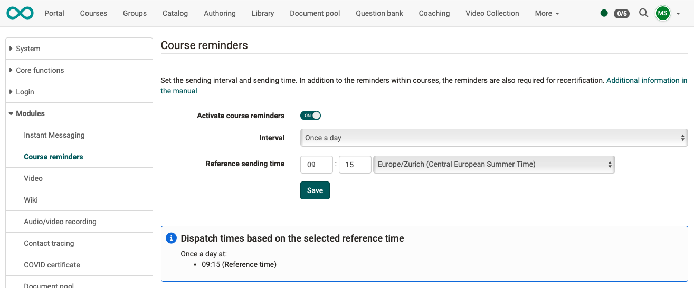
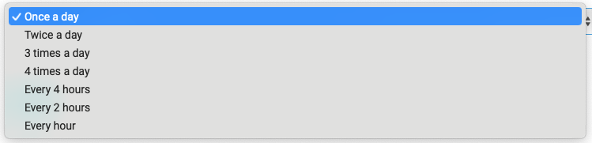

# Module Course Reminders {: #reminders}

In the administration, you can set whether and when reminders created in the courses are sent automatically.

{ class="shadow lightbox" }  

The following time intervals can be set for automatic dispatch:

{ class="shadow lightbox" }  

!!! note „Note“

    If the course reminders are deactivated in the administration, the automatic sending in the courses cannot be overridden.

[To the top of the page ^](#reminders)
