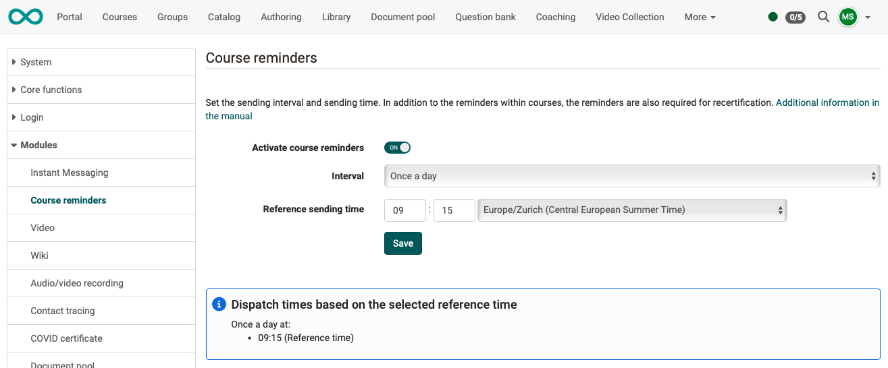
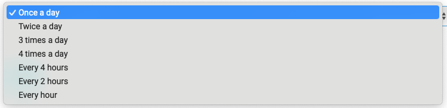

# Module Course Reminders {: #reminders}

Under `Administration > Modules > Course reminders` you can set whether and when reminders created in the courses are sent automatically.

{ class="shadow lightbox" }  

The following time intervals can be set for automatic dispatch:

* Once a day
* Twice a day
* 3 times a day
* 4 times a day
* Every 4 hours
* Every 2 hours
* Every hour

{ class="shadow lightbox" }  

!!! note "Note"

    If the option "Activate course reminders" is deactivated, the automatic sending in the courses cannot be overridden.

[To the top of the page ^](#reminders)
