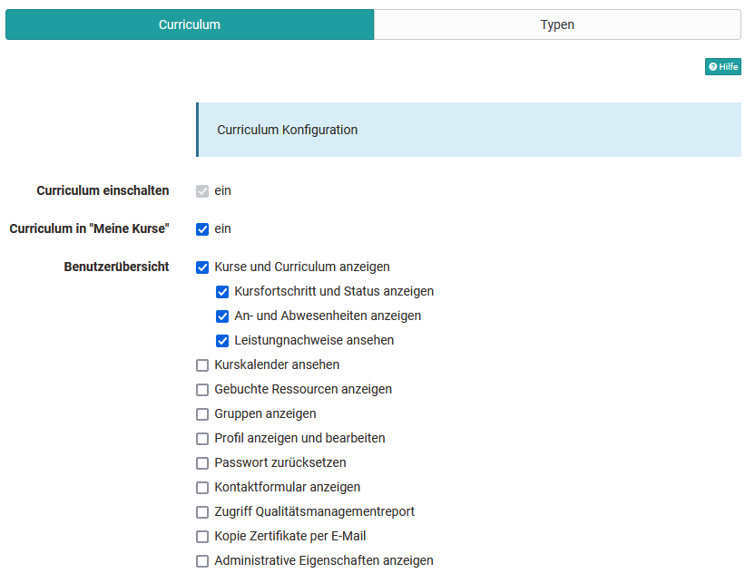
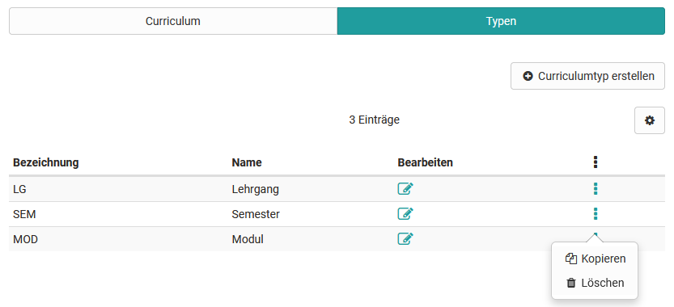
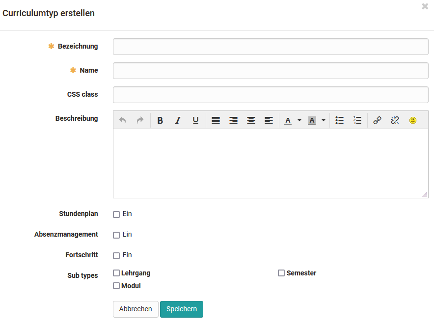

# Modul Curriculum (bis Release 19)

## Aktivierung des Curriculums

Das Modul Curriculum ist optional in OpenOlat verfügbar und muss in der
Administration aktiviert werden. 

!!! tip "Aktivierung"
	Kunden von frentix kontaktieren für die Aktivierung bitte
	[contact@frentix.com.](mailto:contact@frentix.com.) Nach der Aktivierung kann zusätzlich die Anzeige des persönlichen Curriculums (= "Lehrgänge") im Bereich "Kurse" aktiviert werden.  
		
	:material-alert: **Nicht Hosting-Kunde von frentix?** Fragen Sie Ihren Systembetreiber!
 

{ class="shadow lightbox" }

  

## Definieren von Curriculum-Typen

Curriculum-Typen definieren, welche Elemente ein Curriculum enthalten kann und
geben diesen Elementen eine nähere Bedeutung. Beim Anlegen der Curriculum-
Typen kann eine hierarchische Struktur abgebildet werden, dies ist aber nicht
zwingend. Ein Beispiel für ein hierarchisches Curriculum ist `Lehrgang → Semester → Modul → Kurs`.

In der Tabelle werden die bereits angelegten Curriculum-Typen angezeigt. Eine
Bearbeitung der Daten ist über das
:fontawesome-regular-pen-to-square:-Symbol
möglich. Über den 3-Punkte Link  kann der jeweilige Typ kopiert oder gelöscht
werden.

{ class="shadow lightbox" }

  

## Curriculum Typ erstellen

Über den Link "Curriculumtyp erstellen" können weitere Curriculum-Typen
angelegt werden. Neben der Bezeichnung und dem Namen kann eine Beschreibung
eingetragen werden. Es ist an dieser Stelle ausserdem möglich, per CSS-Klasse
ein nur für diesen Curriculum-Typ geltendes Layout zu hinterlegen. Bei
Interesse an spezifischen Layouts melden Sie sich bitte bei frentix.

Ebenfalls kann für diesen Curriculum-Typ die Anzeige des Stundenplans
aktiviert werden. Dieser vereint alle Kurskalender-Termine der zu diesem
Curriculum-Element zugeordneten Kurse.

Bereits bestehende Curriculum-Typen können dem neuen Typ ausserdem als Sub-
Typen untergeordnet werden.

{ class="shadow lightbox" }

  

