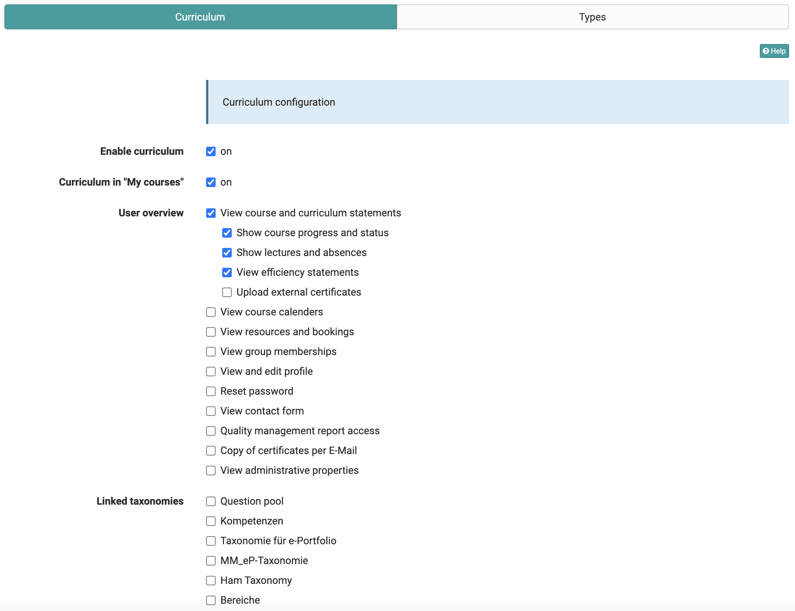
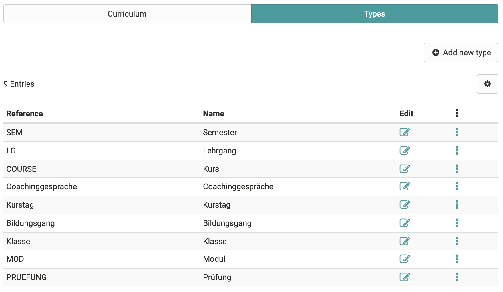
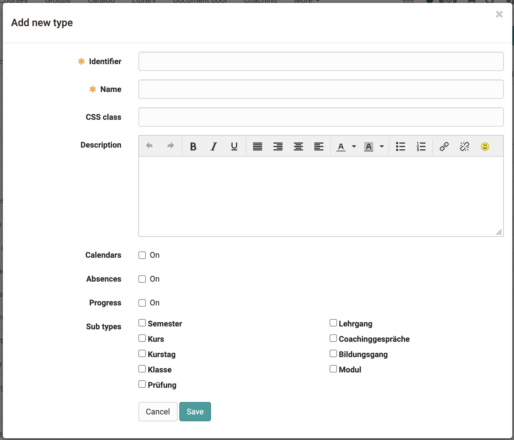

# Modules: Curriculum

## Activation of the Curriculum

The Curriculum module is optionally available in OpenOlat and must be
activated in the administration. Customers of frentix please contact
[contact@frentix.com](mailto:contact@frentix.com) for this. After activation,
the display of the personal curriculum (= "Courses") can additionally be
activated in the "Courses" area.

## Defining curriculum types

Curriculum types define which elements a curriculum can contain and give a
more detailed meaning to these elements. When creating curriculum types, a
hierarchical structure can be mapped, but this is not mandatory. An example of
a hierarchical curriculum is Course → Semester → Module → Course.

In the table the already created curriculum types are displayed. Editing the
data is possible via the
-symbol.
The respective type can be copied or deleted via the 3-dot link.

## Creating a curriculum type

The link "Create curriculum type" can be used to create additional curriculum
types. In addition to the designation and the name, a description can be
entered. It is also possible to create a layout that is only valid for this
curriculum type using a CSS class. If you are interested in specific layouts,
please contact frentix.

Also for this curriculum type the display of the timetable can be activated.
It combines all course calendar dates of the courses assigned to this
curriculum element.

Existing curriculum types can be subordinated to the new type as sub-types.

