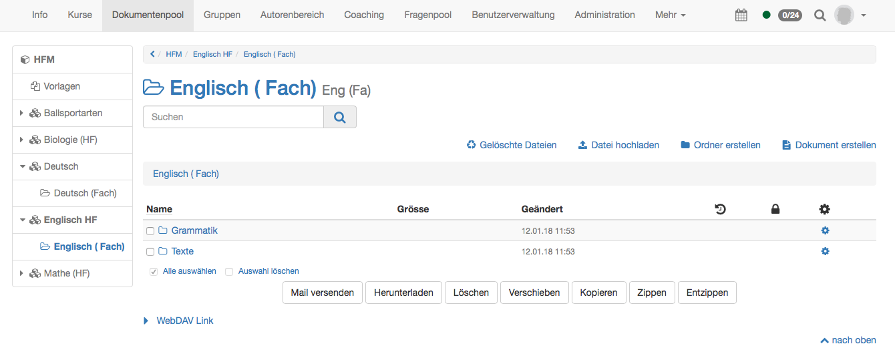
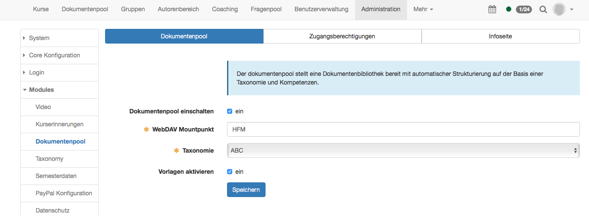
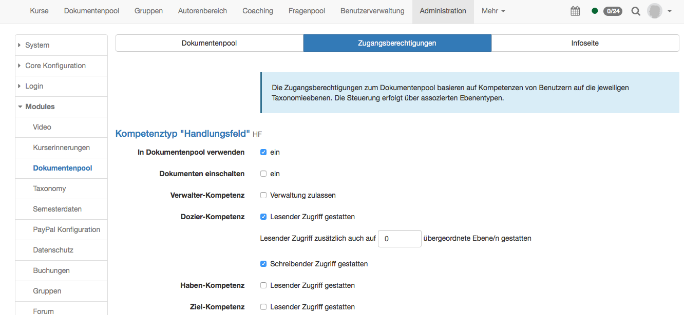
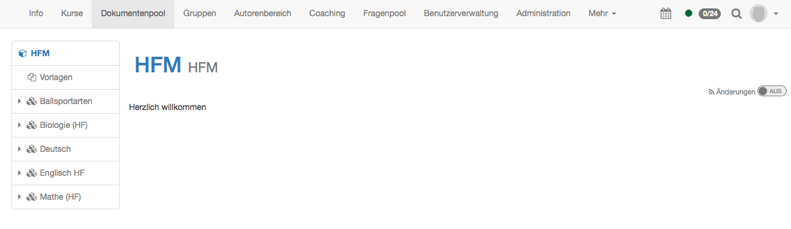

# Modules: Dokumentenpool

Was ist der Dokumentenpool?

Der Dokumentenpool ist eine taxonomiebasierte Dokumentenverwaltung, welche
kompetenzbasiert freigeschaltet werden kann. Es kann so beispielsweise die
Ressourcenverwaltung für Lehrmaterialien basierend auf der Dozierkompetenz
abgebildet werden.

Der Dokumentenpool kann für alle OpenOlat-Benutzer freigeschaltet werden, also
auch für Lernende.

Die Dokumente aus dem Dokumentenpool stehen nur im Dokumentenpool zur
Verfügung und können nicht in einen Kurs eingebunden werden.

Weitere Informationen finden Sie im Kapitel
[Taxonomie](Modules%EF%B9%95+Taxonomie.html).

Der Dokumentenpool kann als Site in der Hauptnavigation oben eingeschaltet
werden.

## Tab Dokumentenpool

Im Tab "Dokumentenpool" kann der Dokumentenpool eingeschaltet werden. In der
Navigation wird er jedoch erst sichtbar, wenn die Site entsprechend
freigeschaltet ist.

Hier kann anschliessend ein Anzeigename für den WebDAV Zugriff definiert
werden. Dann muss die Taxonomie ausgewählt werden. Den Inhalt der Taxonomie
definieren Sie unter Modules → Taxonomy.

Zudem können Vorlagen aktiviert werden. Die Vorlagen werden dann im
Dokumentenpool direkt unter der Hauptnavigation angezeigt. Dort können
Systemadministratoren Dokumente hochladen und allen zur Verfügung stellen,
unabhängig von ihren Zugriffsrechten im Dokumentpool.

## Tab Zugangsberechtigung

Hier können nun die Rechte für die einzelnen Ebenentypen aus der Taxonomie
definiert werden. Damit hier ein Kompetenztyp erscheint, muss er also zuerst
unter Modules → Taxonomy im Tab Ebenentypen erfasst werden.

  

  * **In Dokumentenpool verwenden:** Mit dieser Option wird definiert, ob dieser Kompetenztyp im Dokumentpool auftaucht.
  *  **Dokumenten einschalten** : Nur wenn diese Option aktiviert ist, können auf dieser Ebene Dokumente hochgeladen werden. Ansonsten wird diese Ebene als Struktur ohne Ordnerinhalte abgebildet. 
  *  **Verwalter-Kompetenz:** zulassen oder nicht  

  *  **Dozier-Kompetenz** : In der Dozier-Kompetenz können die Zugriffsrechte auf die einzelnen Ebenen im Dokumentenpool definiert werden. Als erstes wird ausgewählt, ob die Personen mit der Dozier-Kompetenz lesenden Zugriff auf diese Ebene erhalten. Wenn ja, können diese Benutzer die Inhalte auf dieser Ebene lesen. Ausserdem kann definiert werden, ob der lesende Zugriff auch auf die anderen Elemente auf derselben Hierarchieebene gestattet sein soll. Dafür wird statt 0, 1 eingetragen.  
Wenn zusätzlich noch "Schreibender Zugriff gestatten" aktiviert wird, können
diese Benutzer auch Dokumente hochladen.  

  *  **Haben-Kompetenz** : lesenden Zugriff gestatten oder nicht  

  *  **Ziel-Kompetenz:** lesenden Zugriff gestatten oder nicht  

  

Diese Einstellungen müssen nun für alle definierten Kompetenztypen wiederholt
werden.

Zudem muss den Benutzern die entsprechende Kompetenz zugewiesen werden. Dies
geschieht entweder über die Synchronisation von einem externen
Benutzerverwaltungssystem oder direkt im OpenOlat. Im OpenOlat ist dies
entweder in der Benutzerverwaltung oder in der Administration → Modules →
Taxonomy möglich.

  

Ferner können hier Einstellungen für die Kompetenztypen "Handlungsfeld" und
"Fach" vorgenommen werden.

## Tab Infoseite

Zum Schluss kann eine Infoseite gestaltet werden. Diese erscheint auf der
obersten Ebene des Dokumentenpools. Es empfiehlt sich, hier beispielsweise
eine Anleitung zum Gebrauch des Dokumentenpools zu hinterlegen.

