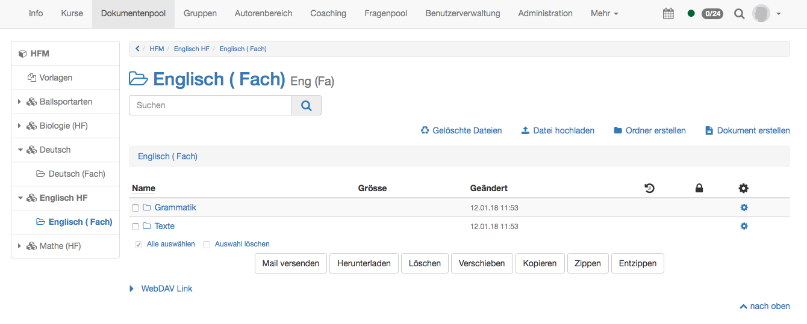
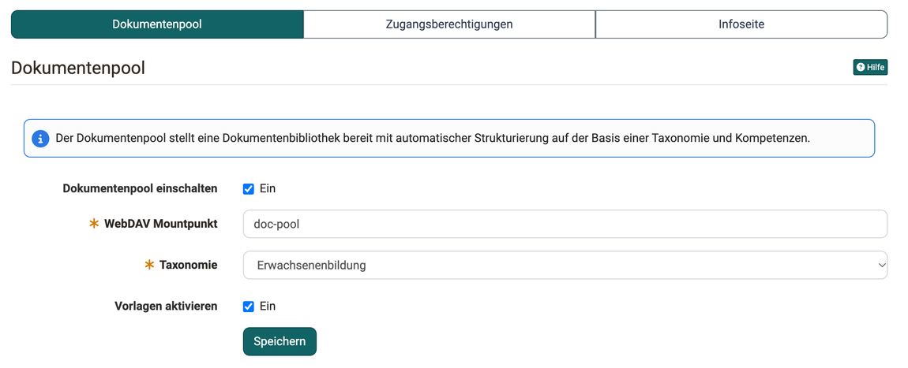
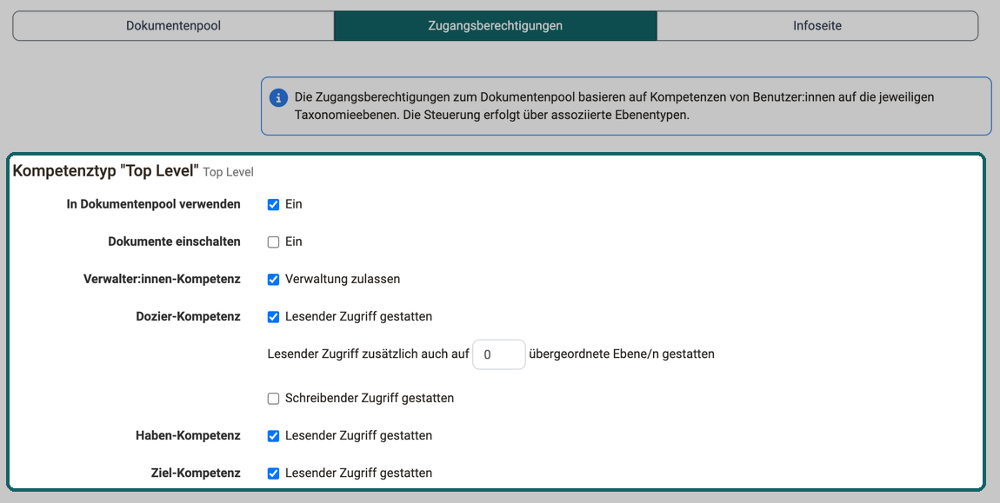
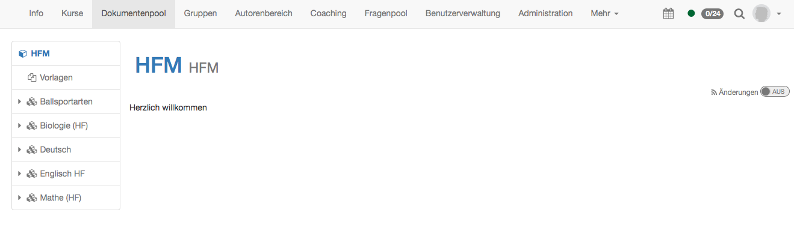

# Modul Dokumentenpool {: #module_document_pool}

!!! info "Was ist der Dokumentenpool?"

    Der Dokumentenpool ist eine Dokumentenbibliothek, die sich aus einer Taxonomie
    aufbaut. Die Freigabe erfolgt über Kompetenzen. So bilden Sie zum Beispiel die
    Ablage von Lehrmaterialien über die Kompetenz Unterrichten (Dozier-Kompetenz) ab.

    Der Dokumentenpool kann für alle OpenOlat-Benutzer:innen freigeschaltet werden, also
    auch für Lernende.

    Die Dokumente aus dem Dokumentenpool stehen nur im Dokumentenpool zur
    Verfügung und können nicht in einen Kurs eingebunden werden.

    Weitere Informationen finden Sie im Kapitel
    [Taxonomie](Modules_Taxonomy.de.md).

Administrator:innen konfigurieren den Dokumentenpool in der System-Administration unter: 
`Administration > Module > Dokumentenpool`

Der Dokumentenpool erscheint als eigener [Bereich](../../manual_user/area_modules/index.de.md) in der Hauptnavigation.

{ class="shadow lightbox" title="Bereich Dokumentenpool in der Hauptnavigation" }

## Tab Dokumentenpool [:octicons-tag-16:{ title="ab Release 12.2 (OO-3055)" }](https://track.frentix.com/issue/OO-3055) {: #tab_document_pool}

Im Tab "Dokumentenpool" kann der Dokumentenpool eingeschaltet werden. In der
Hauptnavigation wird er jedoch erst sichtbar, wenn zusätzlich der Bereich "Dokumentenpool" aktiviert ist. Das geschieht in der System-Administration unter: 
`Administration > Customizing > Bereiche`

Hier kann anschliessend der WebDAV Mountpunkt definiert
werden. Dann muss die Taxonomie ausgewählt werden. Den Inhalt der Taxonomie
definieren Sie in der System-Administration unter `Administration > Module > Taxonomie`.

Zudem können Vorlagen aktiviert werden. Die Vorlagen werden dann im
Dokumentenpool als oberster Eintrag der Navigation links angezeigt. Dort können
Administrator:innen Dokumente hochladen und allen zur Verfügung stellen,
unabhängig von ihren Zugriffsrechten im Dokumentenpool.

{ class="shadow lightbox" title="Tab Dokumentenpool in der System-Administration · 2026.10.09" }

## Tab Zugangsberechtigungen {: #tab_permissions}

Hier können nun die Rechte für die einzelnen Ebenentypen aus der Taxonomie
definiert werden. Damit hier ein Kompetenztyp erscheint, muss er also zuerst
in der System-Administration unter `Administration > Module > Taxonomie` im Tab "Ebenentypen" erfasst werden.

  * **In Dokumentenpool verwenden:** Mit dieser Option wird definiert, ob dieser Kompetenztyp im Dokumentenpool auftaucht.
  * **Dokumente einschalten:** Nur wenn diese Option aktiviert ist, können auf dieser Ebene Dokumente hochgeladen werden. Ansonsten wird diese Ebene als Struktur ohne Ordnerinhalte abgebildet.
  * **Verwalter:innen-Kompetenz:** Verwaltung zulassen oder nicht
  * **Kompetenz Unterrichten (Dozier-Kompetenz):** In der Kompetenz Unterrichten können die Zugriffsrechte auf die einzelnen Ebenen im Dokumentenpool definiert werden. Als erstes wird ausgewählt, ob die Personen mit der Kompetenz Unterrichten lesenden Zugriff auf diese Ebene erhalten. Wenn ja, können diese Benutzer:innen die Inhalte auf dieser Ebene lesen. Ausserdem kann mit einer Zahl definiert werden, auf wie viele übergeordnete Taxonomieebenen der lesende Zugriff zusätzlich gestattet werden soll. 
    Wenn zusätzlich noch "Schreibender Zugriff gestatten" aktiviert wird, können diese Benutzer:innen auch Dokumente hochladen.
  * **Haben-Kompetenz:** lesenden Zugriff gestatten oder nicht
  * **Ziel-Kompetenz:** lesenden Zugriff gestatten oder nicht

Diese Einstellungen müssen nun für alle definierten Kompetenztypen wiederholt
werden.

Zudem muss den Benutzer:innen die entsprechende Kompetenz zugewiesen werden. Dies
geschieht entweder über die Synchronisation aus einem externen
System oder direkt im OpenOlat. Im OpenOlat ist dies
entweder in der Benutzerverwaltung oder in der System-Administration unter `Administration > Module > Taxonomie` möglich.

Welche Kompetenztypen hier erscheinen, hängt von den Ebenentypen Ihrer Taxonomie
ab, zum Beispiel "Handlungsfeld" und "Fach".

{ class="shadow lightbox" title="Tab Zugangsberechtigungen in der System-Administration · 2026.10.09" }

## Tab Infoseite [:octicons-tag-16:{ title="ab Release 12.3 (OO-3227)" }](https://track.frentix.com/issue/OO-3227) {: #tab_info_page}

Zum Schluss kann eine Infoseite gestaltet werden. Diese erscheint auf der
obersten Ebene des Dokumentenpools. Es empfiehlt sich, hier beispielsweise
eine Anleitung zum Gebrauch des Dokumentenpools zu hinterlegen.

{ class="shadow lightbox" title="Infoseite des Bereichs Dokumentenpool" }

## Weiterführende Informationen {: #further_information}

**Auf dieser Seite erwähnt** 
[Modul Taxonomie >](Modules_Taxonomy.de.md) 
[Bereiche und Module >](../../manual_user/area_modules/index.de.md)

**Weiterführend** 
[Customizing: Übersicht >](Customizing.de.md)

[Zum Seitenanfang ^](#module_document_pool)
