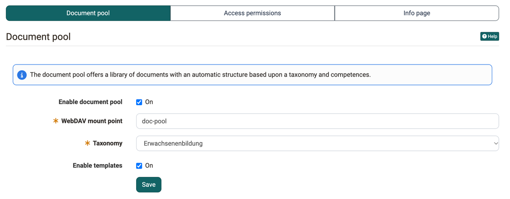
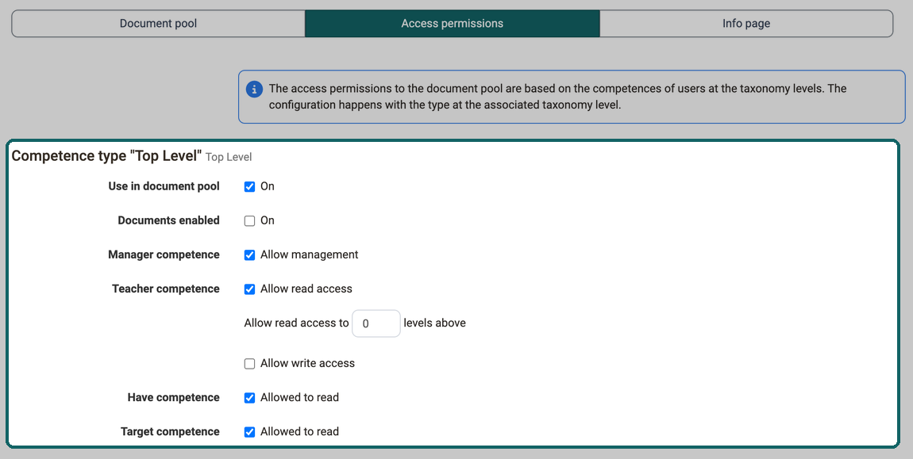

# Module Document Pool {: #module_document_pool}

!!! info "What is the document pool?"

    The document pool is a library of documents that is built from a taxonomy.
    Access is granted through competences. For example, you can map the storage
    of learning material through the Teach competence (Teacher competence).

    The document pool can be activated for all OpenOlat users, also for learners.

    The documents in the document pool are only available in the document pool and
    cannot be added into a course.

    Further information can be found in the chapter [taxonomy](../administration/Modules_Taxonomy.md).

Administrators configure the document pool in the system administration under: 
`Administration > Modules > Document pool`

The document pool appears as a separate [site](../../manual_user/area_modules/index.md) in the main navigation.

{ class="shadow lightbox" title="Site Document pool in the main navigation" }

## Tab Document pool [:octicons-tag-16:{ title="from Release 12.2 (OO-3055)" }](https://track.frentix.com/issue/OO-3055) {: #tab_document_pool}

In the tab "Document pool" the document pool can be activated. In the main
navigation it only becomes visible if the site "Document pool" is also activated. This is done in the system administration under: 
`Administration > Customizing > Sites`

Afterward the WebDAV mount point can be defined here. Then a
taxonomy must be chosen. The content of the taxonomy is defined in the system administration under `Administration > Modules > Taxonomy`.

Additionally templates can be activated. The templates are shown in the
document pool as the top entry of the navigation on the left. There
administrators can upload documents and make them available to everybody,
independent of their access rights in the document pool.

{ class="shadow lightbox" title="Tab Document pool in the system administration · 2026.10.09" }

## Tab Access permissions {: #tab_permissions}

Here the rights of the single level types of the taxonomy can be defined. In
order that a competence type appears it must have been created in the system administration under
`Administration > Modules > Taxonomy` in the tab "Level types".

* **Use in document pool:** With this option it is defined if this competence type appears in the document pool.
* **Documents enabled:** Only if this option is activated documents can be uploaded on this level. Otherwise this level is only shown as structure without folder content.
* **Manager competence:** Allow management or not
* **Teach competence (Teacher competence):** The Teach competence defines the access rights for the individual levels in the document pool. First it is selected whether users with the Teach competence get read access to this level. If yes, these users can read the content of this level. In addition, a number defines how many levels above should also get read access. 
    If "Allow write access" is also enabled, these users can also upload documents.
* **Have competence:** Allowed to read or not
* **Target competence:** Allowed to read or not

These settings need to be repeated for all defined competence types.

Additionally the corresponding competence need to be added to the users. This
happens either by the synchronization from an external system or
directly in OpenOlat. In OpenOlat this can be done either in the user
management or in the system administration under `Administration > Modules > Taxonomy`.

Which competence types appear here depends on the level types of your taxonomy, for example "Handlungsfeld" and "Fach".

{ class="shadow lightbox" title="Tab Access permissions in the system administration · 2026.10.09" }

## Tab Info page [:octicons-tag-16:{ title="from Release 12.3 (OO-3227)" }](https://track.frentix.com/issue/OO-3227) {: #tab_info_page}

Finally an info page can be designed. It appears on the top level of the
document pool. It is recommended to add here a user manual for the usage of
the document pool.

{ class="shadow lightbox" title="Info page of the site Document pool" }

## Further information {: #further_information}

**Mentioned on this page** 
[Module Taxonomy >](Modules_Taxonomy.md) 
[Sites and modules >](../../manual_user/area_modules/index.md)

**Further reading** 
[Customizing: Overview >](Customizing.md)

[To the top of the page ^](#module_document_pool)
