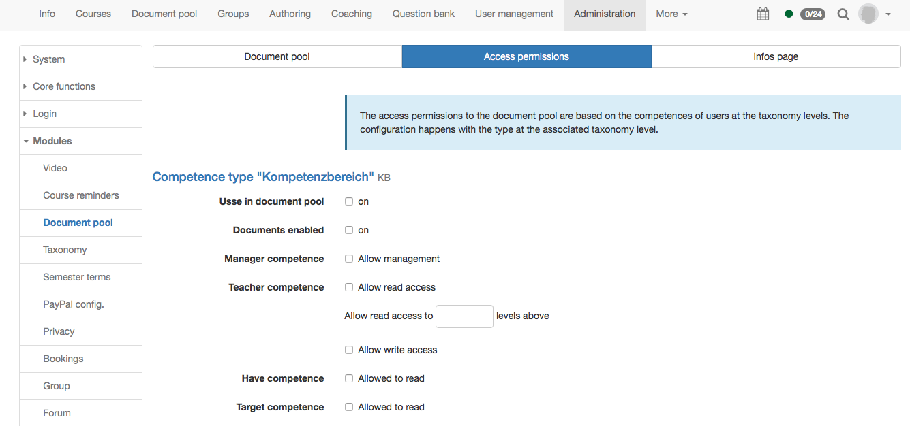

# Module Document Pool

!!! info "What is the document pool?"

	The document pool is a taxonomy based document management which can be
	unlocked competence based. For example the resource management of learning
	material based on the teach competence can be built.

	The document pool can be activated for all OpenOlat users, also for learners.

	The documents in the document pool are only available in the document pool and
	cannot be added into a course.

	Further information can be found in the chapter [taxonomy](../administration/Modules_Taxonomy.md).

The document pool can be added as a site in the main navigation on top.

{ class="shadow lightbox" }

## Tab Document pool

In the tab "Document pool" the document pool can be activated. In the main
navigation it becomes only visible if the corresponding site is activated.

Afterward the name shown for the WebDAV access can be defined here. Then a
taxonomy must be chosen. The content of the taxonomy is defined in Modules →
Taxonomy.

Additionally templates can be activated. The templates are shown in the
document pool directly below the main navigation. There only system
administrators can upload file. They are available for everybody, independent
of the access rights in the document pool.

{ class="shadow lightbox" }

## Tab Access permission

Here the rights of the single level types of the taxonomy can be defined. In
order that a competence type appears it must have been created in Modules →
Taxonomy in the tab level types.

* **Use in document pool**: With this options it is defined if this competence type appears in the document pool.
* **Documents enabled**: Only if this option is activated files can be uploaded on this level. Otherwise this level is only shown as structure without folder content.
* **Manager competence**: Allow or not.
* **Teacher competence**: In the teacher competence the access rights of the single levels of the document pool can be defined. First it is selected if a user with teach competence has read access to this level. If yes, the users can read the content of this level. Furthermore it can be defined if the read access is also valid on the other elements of the same hierarchical level. Therefore 1 instead of 0 need to be inserted.  
If additionally "Allow write access" is selected, the users can also upload
documents.
* **Have competence**: Allow readers-only access or not.
* **Target competence**: Allow readers-only access or not.

These settings need to be repeated for all defined competence types.

Additionally the corresponding competence need to be added to the users. This
happens either by the synchronization of an external management system or
directly in OpenOlat. In OpenOlat this can be done either in the user
management or in `Administration → Modules → Taxonomy`.

Settings can also be made here for the "Field of action" and "Subject" competence types.

{ class="shadow lightbox" }

## Tab Info page

Finally an info page can be designed. It appears on the top level of the
document pool. It is recommended to add here a user manual for the usage of
the document pool.

{ class="shadow lightbox" }
