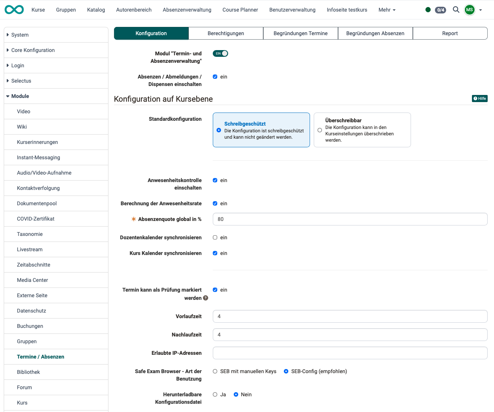
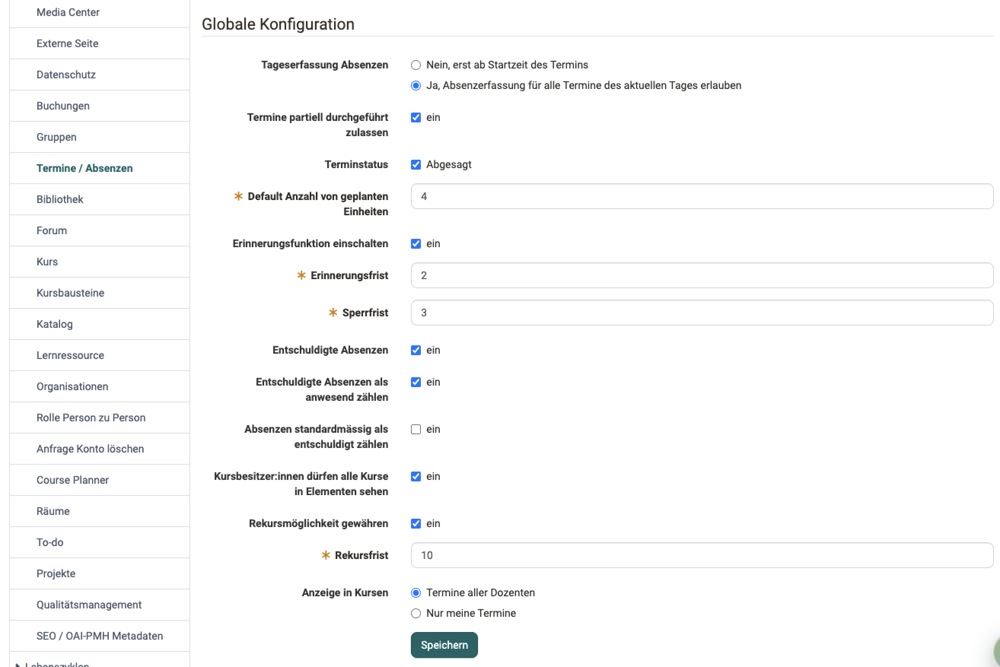
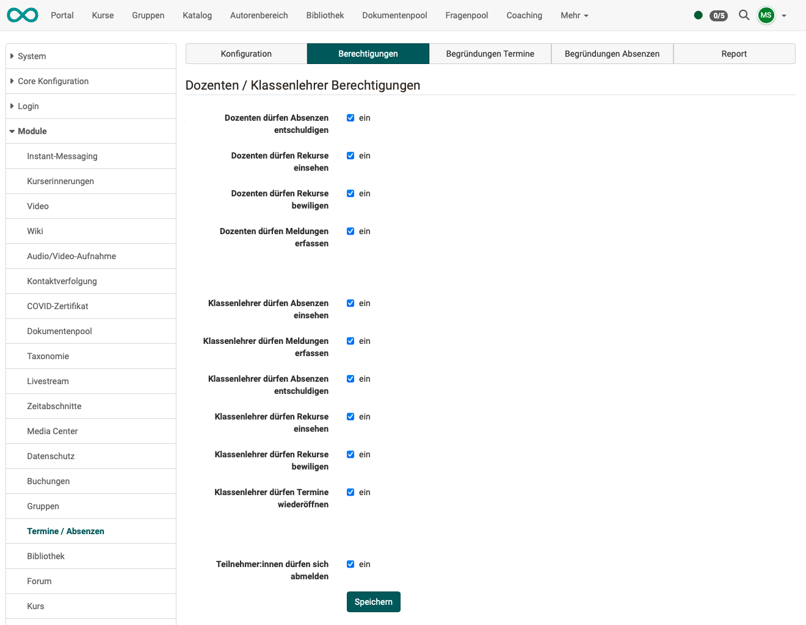

# Modul Termine und Absenzen {: #module_events_and_absences}

Bevor das Modul "Termine und Absenzen" genutzt werden kann, muss es in der Administration aktiviert werden.

!!! tip "Aktivierung"

    Kunden von frentix kontaktieren für die Aktivierung bitte [contact@frentix.com](mailto:contact@frentix.com). Sobald das Modul "Termine und Absenzen" aktiviert ist, können diverse zusätzliche Einstellungen für die systemweite Konfiguration vorgenommen werden. Bei Systemen mit dem fx-Release werden diese Anpassung durch frentix vorgenommen.

    **Nicht Hosting-Kunde von frentix?** Fragen Sie Ihren Systembetreiber!

[Zum Seitenanfang ^](#module_events_and_absences)

---

## Tab Konfiguration

{ class="shadow lightbox" }

**Modul Termin- und Absenzenverwaltung**: Generelle Aktivierung („Hauptschalter“)

**Absenzen / Abmeldungen / Dispensen einschalten**: Bewirkt, dass Betreuende unter `Coaching > Termine` das Tab "Meldungen" angezeigt bekommen.

### Konfiguration auf Kursebene

**Standardkonfiguration**: Die Standard-Konfiguration, welche in der Administration gesetzt wird, kann auf Kursebene
überschrieben werden. Dies gilt nicht für die "Globale Konfiguration".

**Anwesenheitskontrolle einschalten**: Nur wenn diese Optionen eingeschaltet ist, kann ich eine Anwesenheitskontrolle durchführen und sehe die Teilnehmenden und die Checkboxen.

**Berechnung der Anwesenheitsrate**: Wenn diese Option eingeschaltet ist, wird eine Prozentquote der Anwesenheit berechnet.

**Absenzenquote global in %**: Diese Quote gibt an, wie viel Prozent Anwesenheit gefordert ist, um die Bedingungen eines Kurses zu erfüllen.

**Dozentenkalender synchronisieren**: Dozierende (Kursbetreuer) bekommen Einträge in ihrem persönlichen Kalender (nicht im Kurskalender) für diejenigen Lektionenblöcke, bei welchen sie als Dozierende zugewiesen sind (Für Px-Kunden muss diese Funktion ausgeschaltet sein).

**Kurs Kalender synchronisieren**: Durch diese Option werden die erfassten Lektionenblöcke gleich direkt im Kurskalender angezeigt für alle Teilnehmer, Dozenten und Kursbesitzer.

**Termin kann als Prüfung markiert werden**: Erst mit dieser Option erscheinen die Felder "Vorlaufzeit", "Nachlaufzeit" und "Erlaubte IP-Adressen".

**Safe Exam Browser - Art der Benutzung**: Legt fest, wie der Safe Exam Browser abgesichert wird, wenn ein Termin als Prüfung markiert wird.

Prüfungsmodi, die nicht aus einem Termin entstehen, sind von dieser Einstellung unabhängig. Dort wird die Variante pro Prüfungsmodus über "Typ von Anwendung" gewählt: 
`Kurs > Administration > Prüfungsverwaltung`

Für den Weg über Termine gilt: **Kursbesitzende** schalten die Termin- und Absenzenverwaltung im Kurs ein unter `Kurs > Administration > Einstellungen > Durchführung` und legen die Termine an unter `Kurs > Administration > Termine und Absenzen`. Nach dem Abspeichern kann ein Termin über das 3-Punkte-Menü als Prüfung markiert werden.

!!! note "Siehe Detailbeschreibung zum 3-Punkte-Menü"

    [Konfiguration Termin- und Absenzenverwaltung im Kurs](../../manual_user/learningresources/Course_Settings_Execution.de.md#config_event_and_absence_management)

??? info "Was Betreuende dürfen"

    Betreuende finden keinen Eintrag in der Kurs-Administration, sondern das Werkzeug "Termine" in der Kurs-Werkzeugleiste. Sie erfassen dort Anwesenheiten und Absenzen und können ihre Termine ebenfalls als Prüfung markieren. Diese Sicht beschreibt das Benutzerhandbuch: [Toolbar: Termine, Aufruf als Betreuer:in](../../manual_user/learningresources/Toolbar_Events.de.md#call_as_coach)

    Ihre Rechte werden systemweit vergeben, nicht pro Kurs: Tab "Berechtigungen" dieser Seite legt fest, ob Dozierende Absenzen entschuldigen, Meldungen erfassen oder Rekurse einsehen und bewilligen dürfen. Ein kursspezifisches Recht für Termine und Absenzen gibt es nicht.

    Im Kurs steuern Besitzende, wer einem Termin als Dozent:in zugewiesen ist: [Dozenten/Dozentinnen verwalten](../../manual_user/learningresources/Events_and_absences.de.md#manage_teachers). Betreuende sehen ihre eigenen Termine; die Einstellung "Anzeige in Kursen" in der Globalen Konfiguration legt fest, ob zusätzlich die Termine der anderen Dozierenden angezeigt werden können.

??? info "SEB-Config (empfohlen): Vorlagen aus der System-Administration"

    Die [Konfigurationsvorlagen](e-Assessment_AssessmentMgmt.de.md) werden systemweit gepflegt unter: 
    `Administration > e-Assessment > Prüfungsverwaltung`, Tab "Safe Exam Browser Konfiguration"

    Beim Markieren eines Termins als Prüfung ist die als Standard markierte Vorlage vorausgewählt, die Auswahl erfolgt pro Prüfung. Zusätzlich erscheint das Feld "Herunterladbare Konfigurationsdatei".

??? info "SEB mit manuellen Keys: Vorgabewerte aus System- und Kurs-Administration"

    Der systemweite Vorgabewert wird direkt unter dieser Einstellung im Feld "Safe Exam Browser Key" erfasst.

    Kursweit lässt er sich überschreiben unter: 
    `Kurs > Administration > Einstellungen > Durchführung`, Feld ["Safe Exam Browser Key"](../../manual_user/learningresources/Course_Settings_Execution.de.md#config_event_and_absence_management)

**Herunterladbare Konfigurationsdatei**: Diese Option erscheint bei der Variante "SEB-Config (empfohlen)". Wird der SEB eingerichtet, kann optional die Konfigurationsdatei heruntergeladen werden, die z.B. an Prüfungsteilnehmer:innen verteilt werden kann. (Dies ist wichtig, wenn für die Prüfung eigene Geräte der Teilnehmer:innen verwendet werden (BYOD).)

### Globale Konfiguration

{ class="shadow lightbox" }

**Tageserfassung Absenzen**: ja oder nein

**Termine partiell durchgeführt zulassen**: Beim Abschliessen eines Termins kann unter "Effektive Einheiten" die Anzahl Einheiten ausgewählt werden, welche tatsächlich durchgeführt worden sind. Die Anwesenheitsquote wird dadurch auch nur partiell berechnet.

**Terminstatus**: Wenn diese Option gewählt wird, können ganze Termine abgesagt werden. Dieser Termin zahlt dann nicht zur Anwesenheitsquote.

**Erinnerungsfunktion einschalten**: Hiermit wird die Erinnerungsfunktion aktiviert. Anschliessend sind die Erinnerungs- und die Sperrfrist zu definieren.

**Erinnerungsfrist**: Hier wird die Erinnerungsfrist in Anzahl Tagen eingetragen. Nachdem diese Anzahl Tage erreicht worden ist, wird der/die Dozent:in daran erinnert, die Anwesenheitskontrolle durchzuführen. Ein Tag entspricht 24 Stunden und die Zählung beginnt beim eingetragenen Ende des Termins.

**Sperrfrist**: Wiederum wird die Anzahl Tage eingetragen. Nachdem diese Frist abgelaufen ist, wird der Status des Termins automatisch auf erledigt gesetzt. Die bereits eingetragene Anwesenheitskontrolle wird gespeichert. Falls nichts eingetragen ist, werden alle Teilnehmenden als anwesend gespeichert. Die Sperrfristzählung beginnt am Folgetag, nachdem der Termin die Endzeit erreicht hat und läuft bis am Ende des Tages.

**Entschuldigte Absenzen**: Diese Option erlaubt Absenzen zu entschuldigen. Wenn diese Option nicht aktiviert ist, gelten alle Absenzen als unentschuldigt.

**Entschuldigte Absenzen als anwesend zählen**: Mit dieser Option werden die Absenzen, welche entschuldigt sind, für die Berechnung der Absenzenquote als anwesend gerechnet.

**Absenzen standardmässig als entschuldigt zählen**: Grundsätzlich gelten eingetragene Absenzen als unentschuldigt. Diese Option setzt alle eingetragenen Absenzen automatisch auf entschuldigt. Falls dies nicht zutrifft, muss die Absenz manuell auf unentschuldigt gesetzt werden.

**Rekursmöglichkeit gewähren**: Wenn die Rekursfrist aktiviert ist, bekommen die Kursteilnehmenden die Möglichkeit, für eine eingetragenen Absenz Rekurs einzureichen. Dies kann beispielsweise notwendig sein, wenn eine Absenz im Nachhinein als entschuldigt anerkannt wird oder wenn der Dozierende eine Absenz falsch eingetragen hat.

**Rekursfrist**: Die Rekursfrist beginnt, sobald der Termin erledigt ist. Entweder hat der Dozent den Termin manuell auf erledigt gesetzt oder die Sperrfrist ist abgelaufen und der Termin wurde automatisch auf erledigt gesetzt. Die Zählung der Tage beginnt am Folgetag, nachdem der Status des Termins auf erledigt gesetzt worden ist. Anschliessend werden ganze Tage gezählt, Rekursfristschluss ist jeweils am Ende des Tages.

**Anzeige in Kursen**: Termine aller Dozenten oder nur eigene.

[Zum Seitenanfang ^](#module_events_and_absences)

---

## Tab Berechtigungen

In diesem Tab werden die Berechtigungen für Dozenten / Klassenlehrer hinsichtlich der Termine und Absenzen festgelegt.

{ class="shadow lightbox" }

[Zum Seitenanfang ^](#module_events_and_absences)

---

## Tab Begründungen Termine

Termine können automatisch oder manuell beendet werden. Wird ein Termin z.B. früher beendet, soll dafür ein Grund angegeben werden. Der **Grund für einen abweichenden Terminabschluss** kann aus einer Liste ausgewählt werden.

Die zur Auswahl stehenden Begriffe und Beschreibungen für diese Begründungen können hier durch Administrator:innen definiert werden.

Werden hier keine Begründungen hinterlegt, erscheint die Begründungsauswahl beim Schliessen des Termins nicht.

[Zum Seitenanfang ^](#module_events_and_absences)

---

## Tab Begründungen Absenzen

In der Kursadministration können Besitzer:innen/Betreuer:innen Absenzen erfassen.
Für die Begründung der Absenzen kann dabei aus verschiedenen Begriffen ausgewählt werden, wie z.B. "Krankheit", "Unfall", "Dozent:in krank", u.ä.

Diese dort angebotene Auswahl an Begriffen und Beschreibungen kann hier definiert werden.

[Zum Seitenanfang ^](#module_events_and_absences)

---

## Tab Report

Hier können Reports für bestimmte Zeiträume angezeigt werden. Es kann nach dem Status der Termine /Absenzen vorselektiert werden:

- Offen
- Erledigt
- Autoerledigt
- Wiedergeöffnet

Alle Reports können auch als Excel-Datei heruntergeladen werden.

[Zum Seitenanfang ^](#module_events_and_absences)
