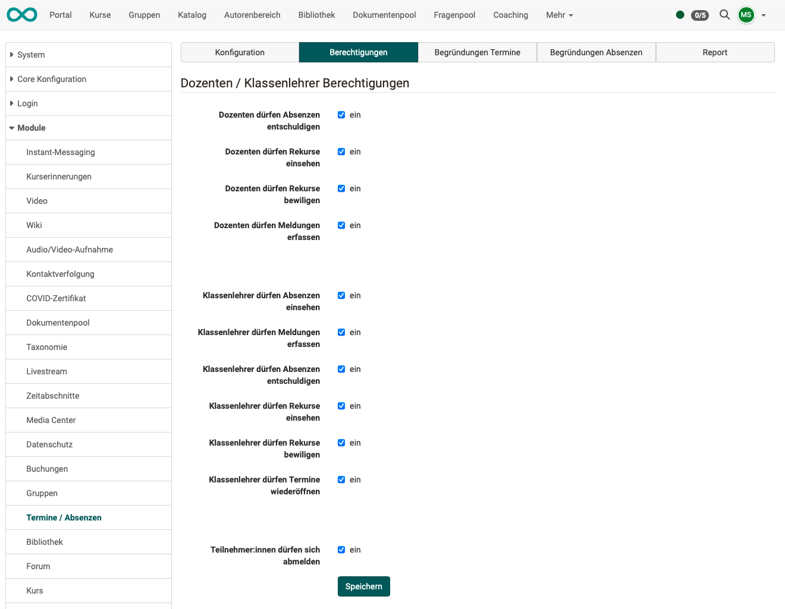

# Modul Termine und Absenzen {: #module_events_and_absences}

Bevor das Modul "Termine und Absenzen" genutzt werden kann, muss es in der Administration aktiviert werden.

!!! tip "Aktivierung"
	Kunden von frentix kontaktieren für die Aktivierung bitte
	[contact@frentix.com.](mailto:contact@frentix.com.) Sobald das Modul "Termine und Absenzen" aktiviert ist, können diverse zusätzliche Einstellungen für die systemweite Konfiguration vorgenommen werden. Bei Systemen mit dem fx-Release werden diese Anpassung durch frentix vorgenommen.  
		
	:material-alert: **Nicht Hosting-Kunde von frentix?** Fragen Sie Ihren Systembetreiber!

[Zum Seitenanfang ^](#module_events_and_absences)
  
---

## Tab Konfiguration

{ class="shadow lightbox" }  

### Konfiguration - auf Kursebene übersteuerbar

 **Termin- und Absenzenverwaltung einschalten**

 **Absenzen / Abmeldungen / Dispensen einschalten**

 **Überschreiben der Standard-Konfiguration zulassen**: Die Standard-Konfiguration, welche in der Administration gesetzt wird, kann auf Kursebene
überschrieben werden. Dies gilt nicht für die "Globale Konfiguration".

 **Anwesenheitskontrolle einschalten**: Nur wenn diese Optionen eingeschaltet
ist, kann ich eine Anwesenheitskontrolle durchführen und sehe die
Teilnehmenden und die Checkboxen.

 **Berechnung der Anwesenheitsrate**: Wenn diese Option eingeschaltet ist,
wird eine Prozentquote der Anwesenheit berechnet.

 **Absenzenquote global in %**: Diese Quote gibt an, wie viel Prozent
Anwesenheit gefordert ist, um die Bedingungen eines Kurses zu erfüllen.

 **Dozentenkalender synchronisieren**: Dozierende (Kursbetreuer) bekommen
Einträge in ihrem persönlichen Kalender (nicht im Kurskalender) für diejenigen
Lektionenblöcke, bei welchen sie als Dozierende zugewiesen sind (Für Px-Kunden
muss diese Funktion ausgeschaltet sein).

 **Kurskalender synchronisieren**: Durch diese Option werden die erfassten
Lektionenblöcke gleich direkt im Kurskalender angezeigt für alle Teilnehmer,
Dozenten und Kursbesitzer.

 **Prüfungsmodus für Lektionen erlauben**

 **Vorlaufzeit**

 **Nachlaufzeit**

 **Erlaubte IP-Adressen**

 **Safe Exam Browser - Art der Benutzung**

 **Herunterladbare Konfigurationsdatei**

### Globale Konfiguration

 **Tageserfassung Absenzen**: ja oder nein

 **Termine partiell durchgeführt zulassen**: Beim Abschliessen eines Lektionenblocks kann unter "Effektive Lektionen" die Anzahl Lektionen
ausgewählt werden, welche tatsächlich durchgeführt worden sind. Die
Anwesenheitsquote wird dadurch auch nur partiell berechnet.

 **Terminstatus** : Wenn diese Option gewählt wird, können ganze
Termine abgesagt werden. Dieser Termin zahlt dann nicht zur Anwesenheitsquote.

 **Default Anzahl von geplanten Einheiten**

 **Erinnerungsfunktion einschalten**: Hiermit wird die Erinnerungsfunktion
aktiviert. Anschliessend sind die Erinnerungs- und die Sperrfrist zu
definieren.

 **Erinnerungsfrist**: Hier wird die Erinnerungsfrist in Anzahl Tagen eingetragen. Nachdem diese Anzahl Tage erreicht worden ist, wird der/die Dozent:in daran erinnert, die Anwesenheitskontrolle durchzuführen. Ein Tag entspricht 24 Stunden und die Zählung beginnt beim eingetragenen Ende des Termins.

 **Sperrfrist**: Wiederum wird die Anzahl Tage eingetragen. Nachdem diese Frist abgelaufen ist, wird der Status des Termins automatisch auf erledigt gesetzt. Die bereits eingetragene Anwesenheitskontrolle wird gespeichert. Falls nichts eingetragen ist, werden alle Teilnehmenden als anwesend gespeichert. Die Sperrfristzählung beginnt am Folgetag, nachdem der Termin die Endzeit erreicht hat und läuft bis am Ende des Tages.

 **Entschuldigte Absenzen**: Diese Option erlaubt Absenzen zu entschuldigen. Wenn diese Option nicht aktiviert ist, gelten alle Absenzen als unentschuldigt.

 **Entschuldigte Absenzen als anwesend zählen**: Mit dieser Option werden die Absenzen, welche entschuldigt sind, für die Berechnung der Absenzenquote als anwesend gerechnet.

 **Absenzen standardmässig als entschuldigt zählen**: Grundsätzlich gelten
eingetragene Absenzen als unentschuldigt. Diese Option setzt alle
eingetragenen Absenzen automatisch auf entschuldigt. Falls dies nicht
zutrifft, muss die Absenz manuell auf unentschuldigt gesetzt werden.

 **Kursbesitzer dürfen alle Kurse in Elementen sehen**

 **Rekursmöglichkeit gewähren**: Wenn die Rekursfrist aktiviert ist, bekommen
die Kursteilnehmenden die Möglichkeit, für eine eingetragenen Absenz Rekurs
einzureichen. Dies kann beispielsweise notwendig sein, wenn eine Absenz im
Nachhinein als entschuldigt anerkannt wird oder wenn der Dozierende eine
Absenz falsch eingetragen hat.

 **Rekursfrist**: Die Rekursfrist beginnt, sobald der Termin erledigt ist. Entweder hat der Dozent den Termin manuell auf erledigt gesetzt oder die Sperrfrist ist abgelaufen und der Termin wurde automatisch auf erledigt gesetzt. Die Zählung der Tage beginnt am Folgetag, nachdem der Status des Termins auf erledigt gesetzt worden ist. Anschliessend werden ganze
Tage gezählt, Rekursfristschluss ist jeweils am Ende des Tages.

 **Anzeige in Kursen**: Termine aller Dozenten oder nur eigene

[Zum Seitenanfang ^](#module_events_and_absences)
  
---

## Tab Berechtigungen

In diesem Tab werden die Berechtigungen für Dozenten / Klassenlehrer hinsichtlich der Termine und Absenzen festgelegt.

{ class="shadow lightbox" }  

[Zum Seitenanfang ^](#module_events_and_absences)
  
---

## Tab Begründungen Termine

Termine können automatisch oder manuell beendet werden. Wird ein Termin z.B. früher beendet, soll dafür ein Grund angegeben werden. Der **Grund für einen abweichenden Terminabschluss** kann aus einer Liste ausgewählt werden.

Die zur Auswahl stehenden Begriffe und Beschreibungen für diese Begründungen können hier durch Administrator:innen definiert werden.

Werden hier keine Begründungen hinterlegt, erscheint die Begründungsauswahl beim Schliessen des Termins
nicht.

[Zum Seitenanfang ^](#module_events_and_absences)
  
---

## Tab Begründungen Absenzen

In der Kursadministration können Besitzer:innen/Betreuer:innen Absenzen erfassen. 
Für die Begründung der Absenzen kann dabei aus verschiedenen Begriffen ausgewählt werden, wie z.B. "Krankheit", "Unfall", "Dozent:in krank", u.ä.

Diese dort angebotene Auswahl an Begriffen und Beschreibungen kann hier definiert werden.  

[Zum Seitenanfang ^](#module_events_and_absences)
  
---

## Tab Report

Hier können Reports für bestimmte Zeiträume angezeigt werden. Es kann nach dem Status der Termine /Absenzen vorselektiert werden:

- Offen
- Erledigt
- Autoerledigt
- Wiedergeöffnet

Alle Reports können auch als Excel-Datei heruntergeladen werden.

[Zum Seitenanfang ^](#module_events_and_absences)
  
