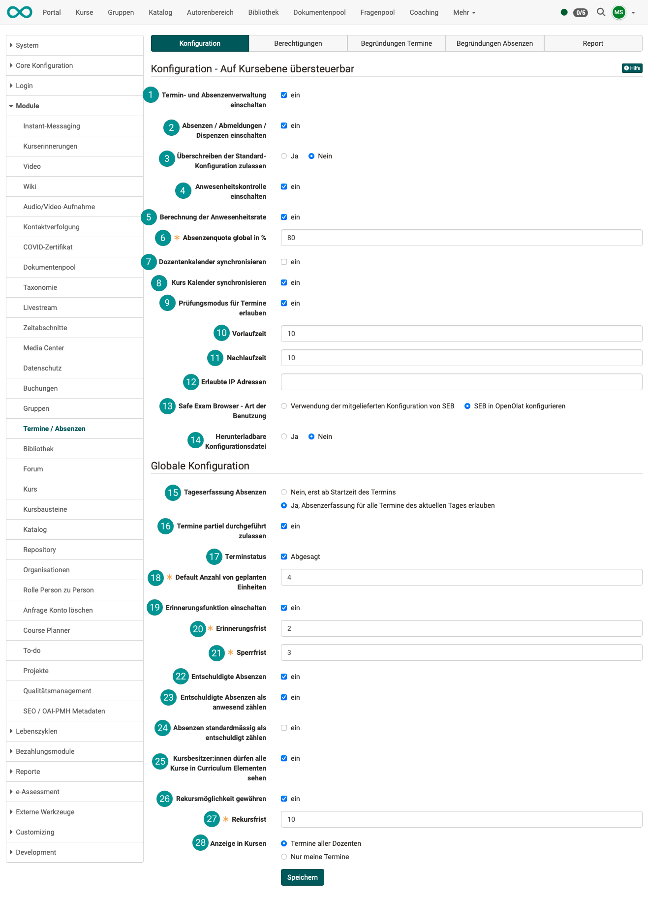
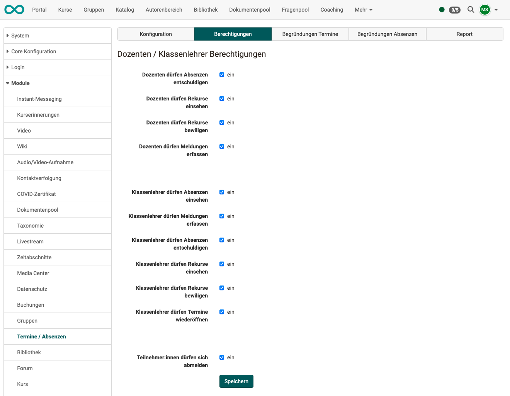

# Module Events and Absences {: #module_events_and_absences}

Before the lectures and absence management can be used it need to be activated
in the administration. 

!!! tip "Activation"
	Customers of frentix please contact
	[contact@frentix.com](mailto:contact@frentix.com) for this. As soon as the 
	lectures and absence management is activated some additional settings can be done for the systemwide configuration. For systems with a fx-release these adaptations are done by frentix.  

	:material-alert: **Not a frentix hosting-client?** Please ask your local system operator!

[To the top of the page ^](#module_events_and_absences)
  
---

## Tab Configuration

{ class="shadow lightbox" }  

### Configuration - overridable on course level 

 **Switch on appointment and absence management**

 **Switch on absences / cancelations / dispensations**

 **Allow overwriting of the default configuration**: The default configuration, which is set in the administration, can be overwritten at course level. This does not apply to the "Global configuration".

 **Switch on presence control**: I can only check attendance and see the participants and the checkboxes if this option is activated.

 **Calculation of the attendance rate**: If this option is activated, an attendance percentage is calculated.

 **Global absentee rate in %**: This quota indicates the percentage of attendance required to fulfill the conditions of a course.

 **Synchronize lecturer calendar**: Lecturers (course supervisors) receive entries in their personal calendar (not in the course calendar) for those lesson blocks for which they are assigned as lecturers (this function must be switched off for Px customers).

 **Synchronize course calendar**: This option allows the lesson blocks entered to be displayed directly in the course calendar for all participants, instructors and course owners.

 **Allow test mode for lessons**

 **Lead time**

 **Follow-up time**

 **Allowed IP addresses**

 **Safe Exam Browser - Type of use**

 **Downloadable configuration file**

  
---

### Globale configuration

 **Daily recording absences**: yes or no

 **Allow holding partial lectures**: When completing a lesson block, the number of lessons that have actually been completed can be selected under “Effective lessons”. This means that the attendance rate is only partially calculated.

 **Lectures status**: If this option is selected lecture blocks can be cancelled. Thus this lecture block does not count for the attendance quote.

 **Default number of planned units**

 **Switch on reminder function**: This activates the reminder function. The reminder and blocking period must then be defined.

 **Reminder period**: The reminder period is entered here in number of days. Once this number of days has been reached, the lecturer is reminded to check attendance. One day corresponds to 24 hours and counting begins at the end of the date entered.

 **Blocking period**: Again, the number of days is entered. After this period has expired, the status of the appointment is automatically set to completed. The attendance check already entered is saved. If nothing is entered, all participants are saved as present. The blocking period count begins on the day after the appointment has reached the end time and runs until the end of the day.

 **Excused absences**: This option allows absences to be excused. If this option is not activated, all absences are considered unexcused.

 **Excused absences count as present**: With this option, absences that are excused are counted as present for the calculation of the absentee rate.

 **Count absences as excused by default**:
In principle, registered absences are considered unexcused. This option automatically sets all entered absences to excused. If this is not the case, the absence must be manually set to unexcused.

 **Course owners may view all courses in elements**

 **Grant recourse**: If the appeal period is activated, course participants are given the opportunity to submit an appeal for a registered absence. This may be necessary, for example, if an absence is subsequently recognized as excused or if the lecturer has entered an absence incorrectly.

 The appeal period begins as soon as the appointment is completed. Either the lecturer has manually set the deadline to completed or the blocking period has expired and the deadline has been automatically set to completed. The counting of days begins on the following day after the status of the appointment has been set to completed. Whole days are then counted and the deadline for appeals is at the end of each day.

 **Display in courses**: Dates of all lecturers or only your own.

[To the top of the page ^](#module_events_and_absences)
  
---

## Tab Authorizations

In this tab, the authorizations for lecturers / class teachers are defined with regard to dates and absences.

{ class="shadow lightbox" }  

[To the top of the page ^](#module_events_and_absences)
  
---

## Tab Reasons Dates 
  
Appointments can be ended automatically or manually. If an appointment is ended earlier, for example, a reason should be given. The **reason for ending an appointment differently** can be selected from a list.

The available terms and descriptions for these justifications can be defined here by administrators.

If no reasons are entered here, the reason selection does not appear when the appointment is closed.

[To the top of the page ^](#module_events_and_absences)
  
---

## Tab Reasons for absences

Owners/coaches can enter absences in the course administration. 
Various terms can be selected for the reason for the absences, such as "illness", "accident", "lecturer ill", etc.

The selection of terms and descriptions offered there can be defined here.

[To the top of the page ^](#module_events_and_absences)
  
---

## Tab Report

Reports for specific time periods can be displayed here. You can preselect according to the status of the appointments/absences:

- Open
- Finished
- Auto finished
- Reopened

All reports can also be downloaded as Excel files.

[To the top of the page ^](#module_events_and_absences)

