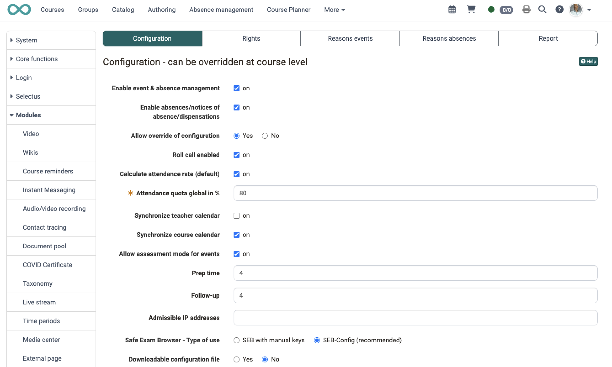
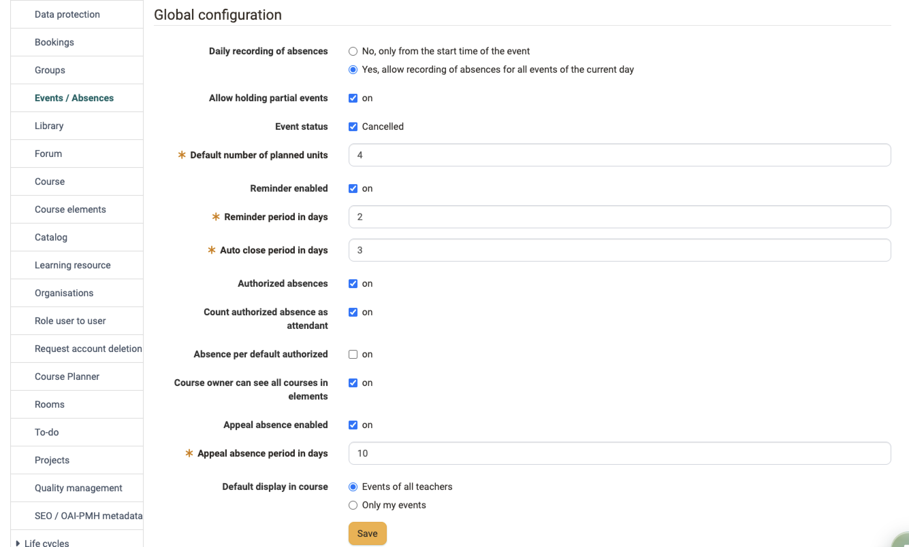
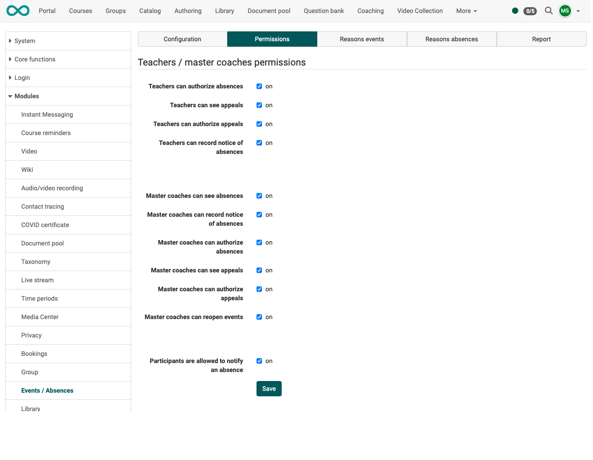

# Module Events and Absences {: #module_events_and_absences}

Before the event and absence management can be used it need to be activated in the administration.

!!! tip "Activation"

    Customers of frentix please contact [contact@frentix.com](mailto:contact@frentix.com) for this. As soon as the event and absence management is activated some additional settings can be done for the systemwide configuration. For systems with a fx-release these adaptations are done by frentix.

    **Not a frentix hosting-client?** Please ask your local system operator!

[To the top of the page ^](#module_events_and_absences)

---

## Tab Configuration

### Configuration - can be overridden at course level

{ class="shadow lightbox" }

**Enable event & absence management**: General activation ("main switch")

**Enable absences/notices of absence/dispensations**: Causes coaches to see the "Notifications" tab under `Coaching > Events`.

**Allow override of configuration**: The default configuration, which is set in the administration, can be overwritten at course level. This does not apply to the "Global configuration".

**Roll call enabled**: Attendance can only be checked, and the participants and the checkboxes only appear, if this option is activated.

**Calculate attendance rate (default)**: If this option is activated, an attendance percentage is calculated.

**Attendance quota global in %**: This quota indicates the percentage of attendance required to fulfill the conditions of a course.

**Synchronize teacher calendar**: Teachers (course coaches) receive entries in their personal calendar (not in the course calendar) for those lesson blocks for which they are assigned as teachers (this function must be switched off for Px customers).

**Synchronize course calendar**: This option allows the lesson blocks entered to be displayed directly in the course calendar for all participants, teachers and course owners.

**Allow assessment mode for events**: Only with this option do the fields "Prep time", "Follow-up" and "Admissible IP addresses" appear.

**Safe Exam Browser - Type of use**: Defines how the Safe Exam Browser is secured when an event is marked as an exam.

Assessment modes that do not originate from an event are independent of this setting. There, the variant is chosen per assessment mode via "Type of use": 
`Course > Administration > Assessment management`

For the route via events: **course owners** enable the event and absence management in the course under `Course > Administration > Settings > Execution` and create the events under `Course > Administration > Events and Absences`. Once saved, an event can be marked as an exam via the 3-dot menu.

!!! note "See detailed description of the 3-dot menu"

    [Configuring event and absence management in the course](../../manual_user/learningresources/Course_Settings_Execution.md#config_event_and_absence_management)

??? info "What coaches are allowed to do"

    Coaches find no entry in the course administration, but the "Events" tool in the course toolbar. There they record attendance and absences and can mark their events as an exam as well. This view is described in the user manual: [Toolbar: Events, Call as coach](../../manual_user/learningresources/Toolbar_Events.md#call_as_coach)

    Their rights are granted system-wide, not per course: the tab "Permissions" on this page defines whether teachers may authorize absences, record notices or view and approve appeals. There is no course-specific right for events and absences.

    In the course, owners control who is assigned to an event as a teacher: [Manage teachers](../../manual_user/learningresources/Events_and_absences.md#manage_teachers). Coaches see their own events; the setting "Default display in course" in the global configuration defines whether the events of the other teachers can be displayed in addition.

??? info "SEB-Config (recommended): templates from the system administration"

    The [configuration templates](e-Assessment_AssessmentMgmt.md#tab_seb) are maintained system-wide under: 
    `Administration > e-Assessment > Assessment management`, tab "Safe Exam Browser configuration"

    When an event is marked as an exam, the template marked as default is preselected, and the selection is made per exam. In addition, the field "Downloadable configuration file" appears.

??? info "SEB with manual keys: default values from system and course administration"

    The system-wide default value is entered directly below this setting in the field "Safe Exam Browser Keys".

    It can be overridden per course under: 
    `Course > Administration > Settings > Execution`, field ["Safe Exam Browser Keys"](../../manual_user/learningresources/Course_Settings_Execution.md#config_event_and_absence_management)

**Downloadable configuration file**: This option appears with the variant "SEB-Config (recommended)". Once the SEB has been set up, the configuration file can be downloaded as an option and distributed to exam participants, for example. (This is important if participants' own devices are used for the exam (BYOD).)

### Global configuration

{ class="shadow lightbox" }

**Daily recording of absences**: yes or no

**Allow holding partial events**: When completing an event, the number of units that have actually been completed can be selected under "Effective units". This means that the attendance rate is only partially calculated.

**Event status**: If this option is selected, whole events can be cancelled. Such an event does not count for the attendance quota.

**Reminder enabled**: This activates the reminder function. The reminder period and the auto close period must then be defined.

**Reminder period in days**: The reminder period is entered here in number of days. Once this number of days has been reached, the teacher is reminded to check attendance. One day corresponds to 24 hours and counting begins at the end of the event entered.

**Auto close period in days**: Again, the number of days is entered. After this period has expired, the status of the event is automatically set to completed. The attendance check already entered is saved. If nothing is entered, all participants are saved as present. The count begins on the day after the event has reached its end time and runs until the end of the day.

**Authorized absences**: This option allows absences to be authorized. If this option is not activated, all absences are considered unauthorized.

**Count authorized absence as attendant**: With this option, absences that are authorized are counted as present for the calculation of the absence rate.

**Absence per default authorized**: In principle, registered absences are considered unauthorized. This option automatically sets all entered absences to authorized. If this is not the case, the absence must be manually set to unauthorized.

**Appeal absence enabled**: If the appeal period is activated, course participants are given the opportunity to submit an appeal for a registered absence. This may be necessary, for example, if an absence is subsequently recognized as authorized or if the teacher has entered an absence incorrectly.

**Appeal absence period in days**: The appeal period begins as soon as the event is completed. Either the teacher has manually set the event to completed or the auto close period has expired and the event has been set to completed automatically. The counting of days begins on the day after the status of the event has been set to completed. Whole days are then counted and the deadline for appeals is at the end of each day.

**Default display in course**: Events of all teachers or only your own.

[To the top of the page ^](#module_events_and_absences)

---

## Tab Permissions

In this tab, the permissions for teachers / class teachers are defined with regard to events and absences.

{ class="shadow lightbox" }

[To the top of the page ^](#module_events_and_absences)

---

## Tab Reasons events

Events can be ended automatically or manually. If an event is ended earlier, for example, a reason should be given. The **reason for ending an event differently** can be selected from a list.

The available terms and descriptions for these reasons can be defined here by administrators.

If no reasons are entered here, the reason selection does not appear when the event is closed.

[To the top of the page ^](#module_events_and_absences)

---

## Tab Reasons absences

Owners/coaches can enter absences in the course administration.
Various terms can be selected for the reason for the absences, such as "illness", "accident", "teacher ill", etc.

The selection of terms and descriptions offered there can be defined here.

[To the top of the page ^](#module_events_and_absences)

---

## Tab Report

Reports for specific time periods can be displayed here. You can preselect according to the status of the events/absences:

- Open
- Finished
- Auto finished
- Reopened

All reports can also be downloaded as Excel files.

[To the top of the page ^](#module_events_and_absences)
