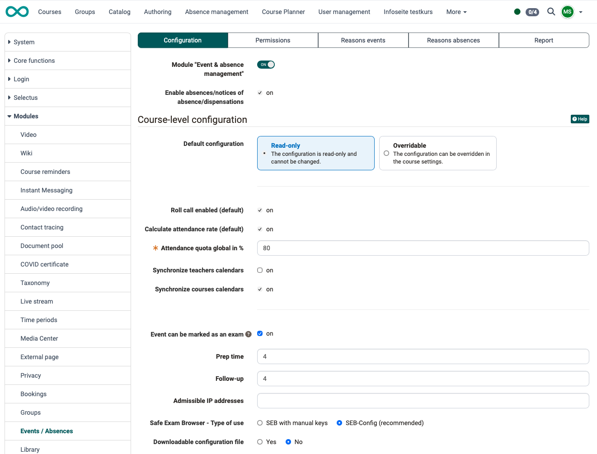

# Module Events and Absences {: #module_events_and_absences}

Before the event and absence management can be used it need to be activated in the system administration. **Administrators** find the configuration under: 
`Administration > Modules > Events / Absences`

!!! tip "Activation"

    Customers of frentix please contact [contact@frentix.com](mailto:contact@frentix.com) for this. As soon as the event and absence management is activated some additional settings can be done for the systemwide configuration. For systems with a fx-release these adaptations are done by frentix.

    **Not a frentix hosting-client?** Please ask your local system operator!

[To the top of the page ^](#module_events_and_absences)

---

## Tab Configuration [:octicons-tag-16:{ title="from Release 12.0 (OO-2636)" }](https://track.frentix.com/issue/OO-2636)

{ class="shadow lightbox" }

The two topmost options apply to the whole system. They are placed outside the section "Course-level configuration".

**Module "Event & absence management"**: The main switch of the module. If it is set to "off", all further options of this tab are hidden and courses cannot enable the event and absence management.

**Enable absences/notices of absence/dispensations**: Causes coaches to see the "Notifications" tab under `Coaching > Events`.

### Course-level configuration [:octicons-tag-16:{ title="from Release 20.3.8 / 21.0.2 (OO-9676)" }](https://track.frentix.com/issue/OO-9676)

This section sets the default values for all courses. The option "Default configuration" defines whether course owners may change these values per course.

#### Default configuration {: #default_configuration }

The selection is made with two selection cards:

- **Read-only**: "The configuration is read-only and cannot be changed." Courses take over the default values set here and cannot change them.
- **Overridable**: "The configuration can be overridden in the course settings." Course owners may adapt the default values per course under `Course > Administration > Settings > Execution`.

The selection only applies to the following options of this section. The values of the "Global configuration" are not affected and always apply system-wide.

#### Roll call enabled (default) {: #roll_call_enabled }

Attendance can only be checked with this option. Teachers then see the participants and the checkboxes.

#### Calculate attendance rate (default) {: #attendance_rate_calculation }

If this option is activated, an attendance percentage is calculated.

#### Attendance quota global in % {: #global_absence_rate }

This quota indicates the percentage of attendance required to fulfill the conditions of a course.

#### Synchronize teachers calendars {: #teacher_calendar_sync }

Teachers (course coaches) receive entries in their personal calendar (not in the course calendar) for those lesson blocks for which they are assigned as teachers (this function must be switched off for Px customers).

#### Synchronize courses calendars {: #course_calendar_sync }

This option allows the lesson blocks entered to be displayed directly in the course calendar for all participants, teachers and course owners.

#### Event can be marked as an exam {: #event_as_exam }

The help icon next to the option shows the text "If this option is enabled, the event can be marked as an 'Exam'. A marked event is executed in assessment mode, optionally with SEB."

The option itself only appears if the assessment mode is enabled system-wide. You find the switch "Enable assessment mode" in the system administration under: 
`Administration > e-Assessment > Assessment management`

The following fields "Prep time", "Follow-up", "Admissible IP addresses", "Safe Exam Browser - Type of use" and "Downloadable configuration file" appear if "Default configuration" is set to "Overridable" or if "Event can be marked as an exam" is enabled. They are all hidden only if "Default configuration" is set to "Read-only" and the option is switched off.

#### Safe Exam Browser - Type of use {: #seb_type_of_use }

Defines how the Safe Exam Browser is secured when an event is marked as an exam.

Assessment modes that do not originate from an event are independent of this setting. There, the variant is chosen per assessment mode via "Type of use": 
`Course > Administration > Assessment management`

For the route via events: **course owners** enable the event and absence management in the course under `Course > Administration > Settings > Execution` and create the events under `Course > Administration > Events and Absences`. Once saved, an event can be marked as an exam via the 3-dot menu. The user manual describes the course settings in detail: [Configuring event and absence management in the course](../../manual_user/learningresources/Course_Settings_Execution.md#config_event_and_absence_management)

??? info "What coaches are allowed to do"

    Coaches find no entry in the course administration, but the "Events" tool in the course toolbar. There they record attendance and absences and can mark their events as an exam as well. This view is described in the user manual: [Toolbar: Events, Call as coach](../../manual_user/learningresources/Toolbar_Events.md#call_as_coach)

    Their rights are granted system-wide, not per course: the tab "Permissions" on this page defines whether teachers may authorize absences, record notices or view and approve appeals. There is no course-specific right for events and absences.

    In the course, owners control who is assigned to an event as a teacher: [Manage teachers](../../manual_user/learningresources/Events_and_absences.md#manage_teachers). Coaches see their own events; the setting "Default display in course" in the global configuration defines whether the events of the other teachers can be displayed in addition.

??? info "SEB-Config (recommended): templates from the system administration"

    The [configuration templates](e-Assessment_AssessmentMgmt.md#tab_seb) are maintained in the system administration under: 
    `Administration > e-Assessment > Assessment management`, tab "Safe Exam Browser configuration"

    When an event is marked as an exam, the template marked as default is preselected, and the selection is made per exam. In addition, the field "Downloadable configuration file" appears.

??? info "SEB with manual keys: default values from system and course administration"

    The system-wide default value is entered directly below this setting in the field "Safe Exam Browser Keys".

    It can be overridden per course under: 
    `Course > Administration > Settings > Execution`, field ["Safe Exam Browser Keys"](../../manual_user/learningresources/Course_Settings_Execution.md#config_event_and_absence_management)

#### Downloadable configuration file {: #seb_downloadable_config }

This option appears with the variant "SEB-Config (recommended)". Once the SEB has been set up, the configuration file can be downloaded as an option and distributed to exam participants, for example. (This is important if participants' own devices are used for the exam (BYOD).)

### Global configuration

{ class="shadow lightbox" }

These values apply to all courses. Courses cannot override them.

#### Daily recording of absences {: #daily_absence_recording }

Defines from when teachers may record absences. "No, only from the start time of the event" releases the event only at its start time. "Yes, allow absence recording for all events of the current day" releases all events of the current day.

#### Allow holding partial events {: #partially_done }

When completing an event, the number of units that have actually been completed can be selected under "Effective units". This means that the attendance rate is only partially calculated.

#### Event status {: #event_status }

If this option is selected, whole events can be cancelled. Such an event does not count for the attendance quota.

#### Default number of planned units {: #default_planned_lectures }

The number of units a new event receives by default. 12 is the maximum number of units per day.

#### Reminder enabled {: #reminder_enabled }

This activates the reminder function. The reminder period and the auto close period must then be defined.

#### Reminder period in days {: #reminder_period }

The reminder period is entered here in number of days. Once this number of days has been reached, the teacher is reminded to check attendance. One day corresponds to 24 hours and counting begins at the end of the event entered.

#### Auto close period in days {: #auto_close_period }

Again, the number of days is entered. After this period has expired, the status of the event is automatically set to completed. The attendance check already entered is saved. If nothing is entered, all participants are saved as present. The count begins on the day after the event has reached its end time and runs until the end of the day.

#### Authorized absences {: #authorized_absences }

This option allows absences to be authorized. If this option is not activated, all absences are considered unauthorized.

#### Count authorized absence as attendant {: #authorized_absences_as_attendance }

With this option, absences that are authorized are counted as present for the calculation of the absence rate.

#### Absence per default authorized {: #absences_default_authorized }

In principle, registered absences are considered unauthorized. This option automatically sets all entered absences to authorized. If this is not the case, the absence must be manually set to unauthorized.

#### Course owner can see all courses in elements {: #owner_view_all_courses }

Affects the event list of an element in the Course Planner. If the option is switched off, editors only see the courses they are involved in. If it is switched on, they see all courses of the element with events.

#### Appeal absence enabled {: #appeal_enabled }

If the appeal period is activated, participants are given the opportunity to submit an appeal for a registered absence. This may be necessary, for example, if an absence is subsequently recognized as authorized or if the teacher has entered an absence incorrectly.

#### Appeal absence period in days {: #appeal_period }

The appeal period begins as soon as the event is completed. Either the teacher has manually set the event to completed or the auto close period has expired and the event has been set to completed automatically. The counting of days begins on the day after the status of the event has been set to completed. Whole days are then counted and the deadline for appeals is at the end of each day.

#### Default display in course {: #display_in_courses }

Events of all teachers or only your own.

[To the top of the page ^](#module_events_and_absences)

---

## Tab Permissions

In this tab, the permissions for teachers / class teachers are defined with regard to events and absences. These rights are granted system-wide. There is no course-specific right for events and absences.

{ class="shadow lightbox" }

### Teachers / master coaches permissions

#### Teachers can authorize absences {: #teacher_authorize_absence }

Teachers can mark a recorded absence as authorized.

#### Teachers can see appeals {: #teacher_see_appeal }

Teachers see the appeals for their own events.

#### Teachers can authorize appeals {: #teacher_authorize_appeal }

Teachers can accept or reject an appeal.

#### Teachers can record notice of absences {: #teacher_record_notice }

Teachers can record notices of absence, dispensations and absences without notice.

#### Master coaches can see absences {: #mastercoach_see_absence }

Master coaches see the absences of the people they supervise.

#### Master coaches can record notice of absences {: #mastercoach_record_notice }

Master coaches can record notices of absence, dispensations and absences without notice.

#### Master coaches can authorize absences {: #mastercoach_authorize_absence }

Master coaches can mark a recorded absence as authorized.

#### Master coaches can see appeals {: #mastercoach_see_appeal }

Master coaches see the appeals of the people they supervise.

#### Master coaches can authorize appeals {: #mastercoach_authorize_appeal }

Master coaches can accept or reject an appeal.

#### Master coaches can reopen events {: #mastercoach_reopen_events }

Master coaches can reopen a completed event in order to correct the attendance check.

#### Participants are allowed to notify an absence {: #participant_notice }

Participants can notify an absence for an event themselves.

[To the top of the page ^](#module_events_and_absences)

---

## Tab Reasons events

Events can be ended automatically or manually. If an event is ended earlier, for example, a reason should be given. The **reason for ending an event differently** can be selected from a list.

The available terms and descriptions for these reasons can be defined here by administrators.

If no reasons are entered here, the reason selection does not appear when the event is closed.

[To the top of the page ^](#module_events_and_absences)

---

## Tab Reasons absences [:octicons-tag-16:{ title="from Release 14.1 (OO-4155)" }](https://track.frentix.com/issue/OO-4155)

Owners/coaches can enter absences in the course administration.
Various terms can be selected for the reason for the absences, such as "illness", "accident", "teacher ill", etc.

The selection of terms and descriptions offered there can be defined here.

[To the top of the page ^](#module_events_and_absences)

---

## Tab Report

Reports for specific time periods can be displayed here. You can preselect according to the status of the events/absences:

- Open
- Finished
- Auto finished
- Reopened

All reports can also be downloaded as Excel files.

[To the top of the page ^](#module_events_and_absences)

---

## Further information {: #further_information}

**Mentioned on this page** 
[Course Settings - Tab Execution >](../../manual_user/learningresources/Course_Settings_Execution.md) 
[Toolbar: Events >](../../manual_user/learningresources/Toolbar_Events.md) 
[Events and absences >](../../manual_user/learningresources/Events_and_absences.md) 
[Assessment management >](e-Assessment_AssessmentMgmt.md)

**Further reading** 
[Setting up the Safe Exam Browser >](../../manual_how-to/SEB_Admin/SEB_Admin.md) 
[Module Rooms >](Modules_Rooms.md) 
[Personal tools: Absences >](../../manual_user/personal_menu/Absences.md) 
[Absence management >](../../manual_user/area_modules/Absence_Management.md)

[To the top of the page ^](#module_events_and_absences)
