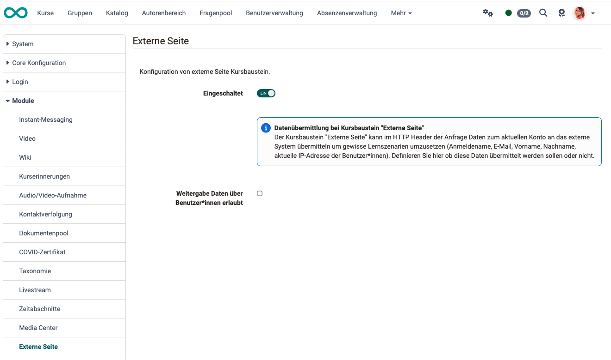

# Modul Externe Seite {: #external_page}

In diesem Modul wird die generelle Verwendung des Kursbausteins "externe Seite" konfiguriert.

{ class="shadow lightbox" }

!!! warning "frentix empfiehlt, Domänen getrennt zu halten"

    Der Kursbaustein "Externe Seite" zeigt Inhalte einer fremden Domäne innerhalb
    Ihrer OpenOlat-Domäne an. Aus modernen Sicherheitsüberlegungen empfiehlt
    frentix, verschiedene Domänen nicht zu vermischen, und rät deshalb vom
    Einsatz dieses Kursbausteins ab.

    Eine Domäne ist die Internetadresse, unter der eine Seite ausgeliefert wird:
    Ihre OpenOlat-Instanz läuft unter einer eigenen Adresse, die eingebundene
    Seite unter einer anderen.

Für externe Anwendungen ist der [Kursbaustein "LTI-Seite"](../../manual_user/learningresources/Course_Element_LTI_Page.de.md) vorgesehen. Soll eine Webseite nur erreichbar sein, genügt die [Linkliste](../../manual_user/learningresources/Course_Element_Link_List.de.md).

## Eingeschaltet (Aktivierung des Moduls) [:octicons-tag-16:{ title="ab Release 20.1 (OO-8783)" }](https://track.frentix.com/issue/OO-8783) {: #activate}

Als Administrator:in entscheiden Sie, ob der Kursbaustein "Externe Seite" den Autor:innen zur Verfügung steht. Bei einer Neuinstallation steht er nicht zur Verfügung. Das Update auf Release 20.1 schaltet ihn in jedem Fall ein, damit bestehende Kurse unverändert weiterlaufen.

Welche Seite eine Autorin oder ein Autor einbindet, entscheidet sie oder er allein. Als Administration bestimmen Sie, ob der Kursbaustein überhaupt zur Verfügung steht.

!!! tip "Bestehende Kursbausteine laufen nach dem Ausschalten weiter"

    Nach dem Ausschalten können Autor:innen keine neuen Kursbausteine "Externe
    Seite" mehr einfügen. Bestehende Kursbausteine lassen sich im Kurseditor
    nicht mehr konfigurieren, bleiben für Teilnehmende aber sichtbar und rufen
    die externe Seite weiter auf. Sollen sie nicht mehr verwendet werden,
    entfernen Sie sie in den betroffenen Kursen.

## Weitergabe von Daten über Benutzer:innen {: #data_transfer}

Der Kursbaustein "Externe Seite" kann im HTTP Header der Anfrage Daten zum aktuellen Konto an das externe System übermitteln um gewisse Lernszenarien umzusetzen (Anmeldename, E-Mail, Vorname, Nachname, aktuelle IP-Adresse der Benutzer:innen). 

Sie bestimmen hier ob diese Daten übermittelt werden sollen oder nicht. Die Einstellung gilt für alle Kurse Ihrer Instanz. frentix empfiehlt, die Weitergabe ausgeschaltet zu lassen.
