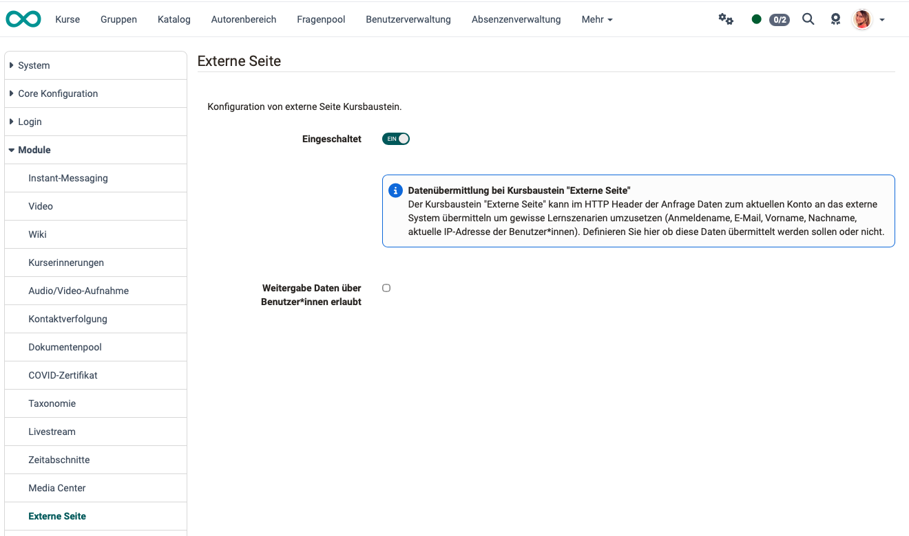

# Module External page {: #external_page}

This module configures the general use of the “External Page” course element.

{ class="shadow" }

## Enabled (module activated) {: #activate}

As an administrator, you decide whether the “External Site” course element is available to authors

## Sharing of user data {: #data_transfer}

The “External Page” course element can transmit data about the current account to the external system via the HTTP header of the request in order to implement certain learning scenarios (username, email, first name, last name, and the user's current IP address).

Here, you can choose whether or not this data should be transmitted.
