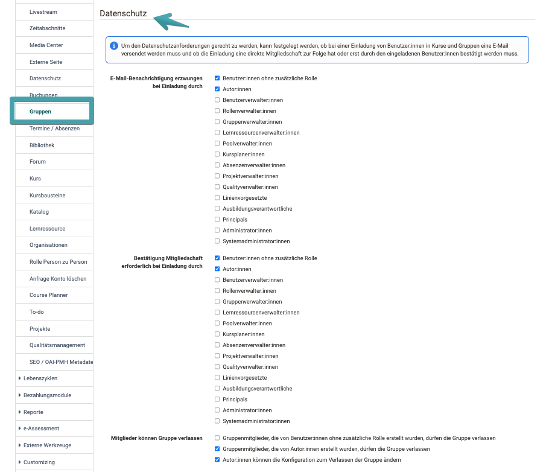
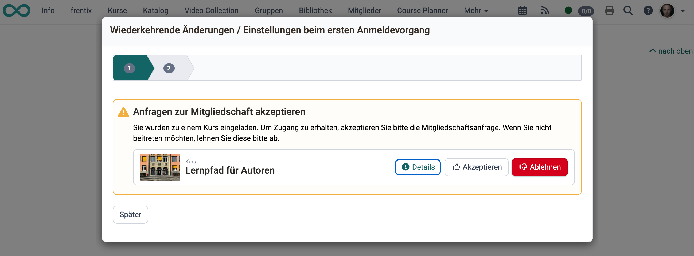

# Modul Gruppen {: #groups}

Im Modul Gruppen legen Administrator:innen systemweit fest, wer Gruppen erstellen darf, welche Rechte Gruppenverwalter:innen und Lernressourcenverwalter:innen im Gruppenkontext erhalten, und wie das Datenschutz-konforme Einladungsverfahren für Gruppen und Kurse konfiguriert wird.

!!! note "Navigation"
    `Administration > Module > Gruppen`

!!! tip "Datenschutz"
    Beachte, dass in diesem Menu datenschutzbezogende Konfigurationen durchgeführt werden können (erzwungene Benachrichtigungen), die insbesondere **auch für Kurse gelten**: [Spring zu Datenschutz](#data_privacy)

## Gruppen erstellen [:octicons-tag-16:{ title="ab Release 8.2 (OO-291)" }](https://track.frentix.com/issue/OO-291){:target="_blank"} {: #create_groups}

Systemadministrator:innen und Gruppenverwalter:innen können immer Gruppen erstellen. Für weitere Rollen ist die Berechtigung hier aktivierbar:

* **Benutzer:innen ohne zusätzliche Rolle**
* **Autor:innen**

[Zum Seitenanfang ^](#groups)

---

## Gruppe: Lernressourcen zuordnen {: #assign_learning_resources}

Kursbesitzer:innen und Gruppenbetreuer:innen können eigene Gruppen in eigene Kurse einbinden. Mit den folgenden Optionen lässt sich dieses Recht auf weitere Rollen ausweiten:

* **Gruppenverwalter:innen können alle Kurse suchen und in Gruppen einbinden**: umfassender Kurszugriff für Gruppenverwalter:innen
* **Lernressourcenverwalter:innen können alle Gruppen suchen und in Kursen einbinden**: umfassender Gruppenzugriff für Lernressourcenverwalter:innen

[Zum Seitenanfang ^](#groups)

---

## Datenschutz [:octicons-tag-16:{ title="ab Release 8.3 (OO-377)" }](https://track.frentix.com/issue/OO-377){:target="_blank"} {: #data_privacy}

Die Datenschutz-Einstellungen gelten für **Kurse und Gruppen gleichermassen**. Sie steuern, wie das System reagiert, wenn Benutzer:innen manuell in einen Kurs oder eine Gruppe eingetragen werden. Bei der Selbsteinschreibung greifen diese Einstellungen nicht.

#### Erzwungene E-Mail-Benachrichtigung bei Einladung [:octicons-tag-16:{ title="ab Release 20.3.1 (OO-9354)" }](https://track.frentix.com/issue/OO-9354){:target="_blank"} {: #mandatory_email}

Legt pro Rolle der **einladenden** Person fest, ob beim manuellen Hinzufügen in einen Kurs oder eine Gruppe zwingend eine E-Mail-Benachrichtigung verschickt wird. Ist die Option für eine Rolle nicht aktiv, ist der E-Mail-Versand optional.

Konfigurierbare Rollen: Benutzer:innen ohne zusätzliche Rolle, Autor:innen, Benutzerverwalter:innen, Rollenverwalter:innen, Gruppenverwalter:innen, Lernressourcenverwalter:innen, Poolverwalter:innen, Kursplaner:innen, Absenzenverwalter:innen, Projektverwalter:innen, Qualityverwalter:innen, Linienvorgesetzte.

{ class="shadow lightbox" }

### Mitgliedschaft akzeptieren oder verlassen{: #accept_membership}

Legt pro Rolle der einladenden Person fest, ob eine neue Mitgliedschaft sofort aktiv wird oder ob die eingeladene Person die Anfrage zuerst annehmen oder ablehnen muss (ausstehende Mitgliedschaft).

Ausstehende Mitgliedschaftsanfragen erscheinen im Kursbereich, im Gruppenbereich und auf der Kurs- oder Bildungsprodukt-Info-Seite als Hinweisbox **"Anfragen zur Mitgliedschaft akzeptieren"**.

!!! note "Hinweis"

    Ausstehende Mitgliedschaften belegen Gruppenplätze. Wenn eine Gruppe 5 Plätze hat und 3 Personen mit ausstehender Einladung vorhanden sind, stehen für die Selbsteinschreibung noch 2 Plätze zur Verfügung.

Konfigurierbare Rollen: Benutzer:innen ohne zusätzliche Rolle, Autor:innen, Benutzerverwalter:innen, Rollenverwalter:innen, Gruppenverwalter:innen, Lernressourcenverwalter:innen, Poolverwalter:innen, Kursplaner:innen, Absenzenverwalter:innen, Projektverwalter:innen, Qualityverwalter:innen, Linienvorgesetzte.

!!! tip **Beispielansicht bei einer entsprechenden Konfiguration für einen Kurs**:
{ class="shadow lightbox" }

##### Mitglieder dürfen Gruppe verlassen {: #leave_group}

Diese Funktion legt fest, ob Mitglieder "ihre" Gruppen selbstständig verlassen dürfen. Die Einstellung wird nach der Rolle der Person definiert, die die Gruppe erstellt hat:

* **Gruppe erstellt von Benutzer:innen ohne zusätzliche Rolle**: Verlassen erlauben oder sperren
* **Gruppe erstellt von Autor:innen**: Verlassen erlauben oder sperren

[Zum Seitenanfang ^](#groups)

---

## Weitere Informationen {: #further_information}

Benutzer-Handbuch: 
[Gruppenmitglied werden >](../../manual_user/groups/Group_Membership.de.md) 
[Gruppe verlassen >](../../manual_user/groups/Leave_a_Group.de.md) 
[Mitgliedschaftsanfragen im Course Planner >](../../manual_user/area_modules/Course_Planner_Implementations.de.md) 

[Zum Seitenanfang ^](#groups)
