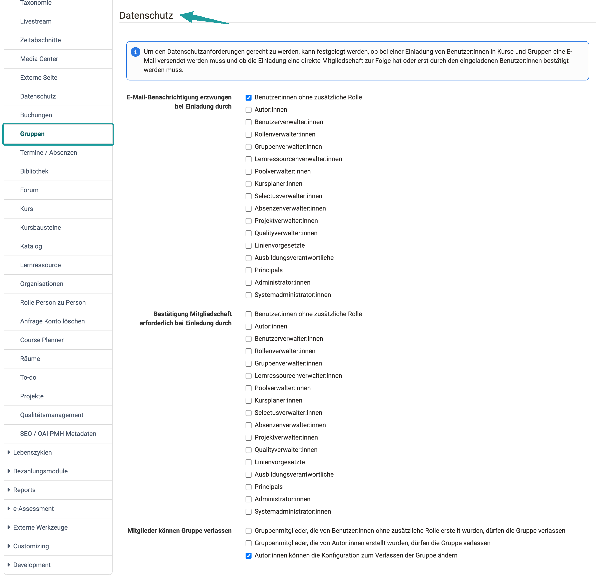
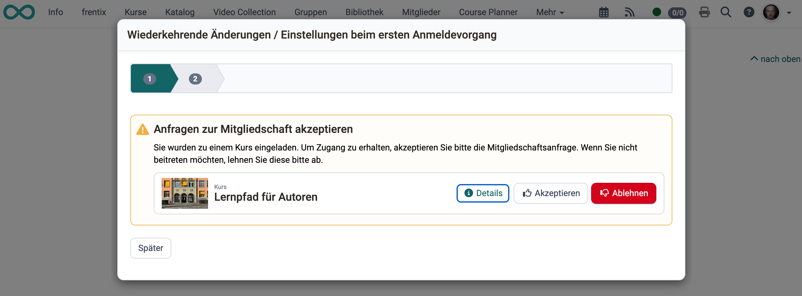

# Modul Gruppen {: #groups}

Im Modul Gruppen legen Administrator:innen systemweit fest, wer Gruppen erstellen darf, welche Rechte Gruppenverwalter:innen und Lernressourcenverwalter:innen im Gruppenkontext erhalten, und welche Datenschutz-Einstellungen beim Hinzufügen von Mitgliedern in Gruppen und Kursen gelten.

!!! note "Navigation"
    `Administration > Module > Gruppen`

!!! tip "Datenschutz"
    Beachten Sie, dass in diesem Menü datenschutzbezogende Konfigurationen durchgeführt werden können (erzwungene Benachrichtigungen), die insbesondere **auch für Kurse gelten**: Siehe [Datenschutz](#data_privacy)

## Gruppen erstellen [:octicons-tag-16:{ title="ab Release 8.2 (OO-291)" }](https://track.frentix.com/issue/OO-291){:target="_blank"} {: #create_groups}

Systemadministrator:innen und Gruppenverwalter:innen können immer Gruppen erstellen. Für weitere Rollen ist die Berechtigung unter "Gruppen erstellen erlauben für" aktivierbar:

* **Benutzer:innen ohne zusätzliche Rolle**
* **Autor:innen**

[Zum Seitenanfang ^](#groups)

---

## Gruppe - Lernressourcen zuordnen {: #assign_learning_resources}

Kursbesitzer:innen und Gruppenbetreuer:innen können eigene Gruppen in eigene Kurse einbinden. Mit den folgenden Optionen lässt sich dieses Recht auf weitere Rollen ausweiten:

* **Gruppenverwalter:innen können alle Kurse suchen und in Gruppen einbinden**: Häkchen "umfassender Kurszugriff erlaubt" setzen.
* **Lernressourcenverwalter:innen können alle Gruppen suchen und in Kursen einbinden**: Häkchen "umfassender Gruppenzugriff erlaubt" setzen.

[Zum Seitenanfang ^](#groups)

---

## Datenschutz [:octicons-tag-16:{ title="ab Release 8.3 (OO-377)" }](https://track.frentix.com/issue/OO-377){:target="_blank"} {: #data_privacy}

Die Datenschutz-Einstellungen gelten für **Kurse und Gruppen gleichermassen**. Sie steuern, wie das System reagiert, wenn Benutzer:innen manuell in einen Kurs oder eine Gruppe eingetragen werden. Schreiben sich Personen selbst ein, greifen diese Einstellungen nicht.

### E-Mail-Benachrichtigung erzwungen bei Einladung durch [:octicons-tag-16:{ title="ab Release 20.3.1 (OO-9354)" }](https://track.frentix.com/issue/OO-9354){:target="_blank"} {: #mandatory_email}

Legt pro Rolle der **einladenden** Person fest, ob beim manuellen Hinzufügen in einen Kurs oder eine Gruppe zwingend eine E-Mail-Benachrichtigung verschickt wird. Ist die Option für eine Rolle nicht aktiv, ist der E-Mail-Versand optional.

Konfigurierbare Rollen: Benutzer:innen ohne zusätzliche Rolle, Autor:innen, Benutzerverwalter:innen, Rollenverwalter:innen, Gruppenverwalter:innen, Lernressourcenverwalter:innen, Poolverwalter:innen, Kursplaner:innen, Selectusverwalter:innen, Absenzenverwalter:innen, Projektverwalter:innen, Qualityverwalter:innen, Linienvorgesetzte, Ausbildungsverantwortliche, Principals, Administrator:innen, Systemadministrator:innen.

{ class="shadow lightbox" }

### Bestätigung Mitgliedschaft erforderlich bei Einladung durch {: #accept_membership}

Legt pro Rolle der einladenden Person fest, ob eine neue Mitgliedschaft sofort aktiv wird oder ob die eingeladene Person die Anfrage zuerst annehmen oder ablehnen muss (ausstehende Mitgliedschaft).

Ausstehende Mitgliedschaftsanfragen erscheinen im Kursbereich, im Gruppenbereich und auf der Kurs- oder Bildungsprodukt-Info-Seite als Hinweisbox **"Anfragen zur Mitgliedschaft akzeptieren"**.

!!! note "Hinweis"

    Ausstehende Mitgliedschaften belegen Plätze in der Gruppe. Wenn eine Gruppe 5 Plätze hat und 3 Personen mit ausstehender Einladung vorhanden sind, stehen für die Einschreibung noch 2 Plätze zur Verfügung.

Konfigurierbare Rollen: Benutzer:innen ohne zusätzliche Rolle, Autor:innen, Benutzerverwalter:innen, Rollenverwalter:innen, Gruppenverwalter:innen, Lernressourcenverwalter:innen, Poolverwalter:innen, Kursplaner:innen, Selectusverwalter:innen, Absenzenverwalter:innen, Projektverwalter:innen, Qualityverwalter:innen, Linienvorgesetzte, Ausbildungsverantwortliche, Principals, Administrator:innen, Systemadministrator:innen.

!!! tip "Beispielansicht bei einer entsprechenden Konfiguration für einen Kurs"

    { class="shadow lightbox" }

### Mitglieder können Gruppe verlassen {: #leave_group}

Diese Funktion legt fest, ob Mitglieder "ihre" Gruppen selbstständig verlassen dürfen. Die beiden ersten Häkchen unterscheiden nach der Rolle der Person, welche die Gruppe erstellt hat:

* **Gruppenmitglieder, die von Benutzer:innen ohne zusätzliche Rolle erstellt wurden, dürfen die Gruppe verlassen**: gilt für alle Gruppen, die eine Person ohne zusätzliche Rolle angelegt hat.
* **Gruppenmitglieder, die von Autor:innen erstellt wurden, dürfen die Gruppe verlassen**: gilt für alle Gruppen, die eine Autorin oder ein Autor angelegt hat.
* **Autor:innen können die Konfiguration zum Verlassen der Gruppe ändern**: Autor:innen dürfen die beiden Vorgaben in ihren eigenen Gruppen übersteuern.

[Zum Seitenanfang ^](#groups)

---

## Weiterführende Informationen {: #further_information}

**Weiterführend** 
[Gruppenmitglied werden >](../../manual_user/groups/Group_Membership.de.md) 
[Gruppe verlassen >](../../manual_user/groups/Leave_a_Group.de.md) 
[Mitgliedschaftsanfragen im Course Planner >](../../manual_user/area_modules/Course_Planner_Implementations.de.md) 
[Modul Lernressource >](Modules_Learning_Resource.de.md)

[Zum Seitenanfang ^](#groups)
