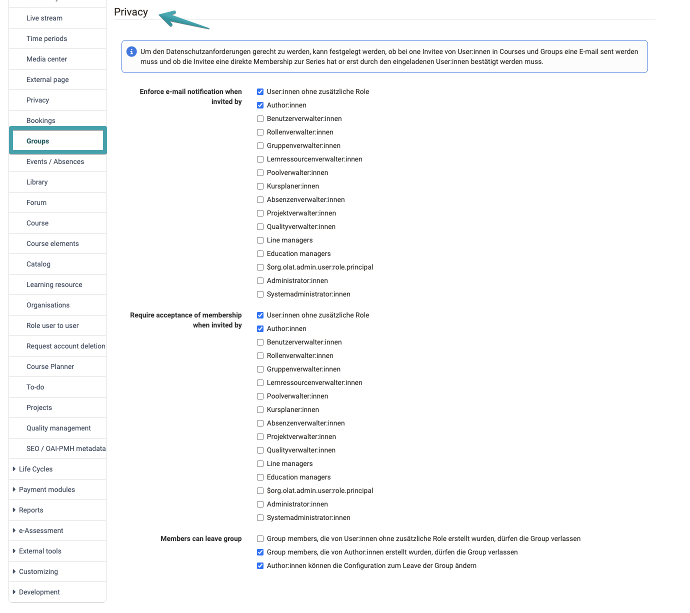
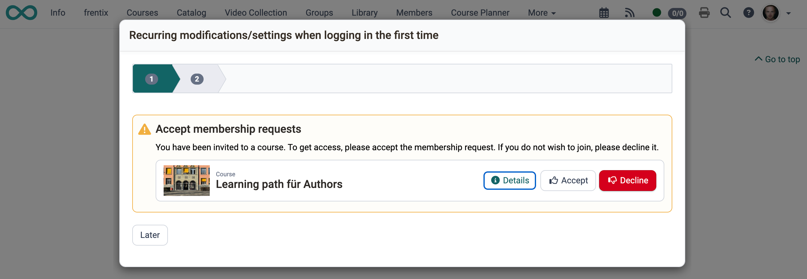

# Module Groups {: #groups}

In the Groups module, administrators define system-wide who is allowed to create groups, which rights group managers and learning resource managers receive in the group context, and how the data-protection-compliant invitation procedure for groups and courses is configured.

!!! note "Navigation"
    `Administration > Modules > Groups`

!!! tip "Data privacy"
    Note that this menu also allows data-protection-related configurations (mandatory notifications) that **also apply to courses**: [Jump to data privacy](#data_privacy)

## Create groups [:octicons-tag-16:{ title="from Release 8.2 (OO-291)" }](https://track.frentix.com/issue/OO-291){:target="_blank"} {: #create_groups}

System administrators and group managers can always create groups. For other roles, this permission can be activated here:

* **Users with no additional role**
* **Authors**

[To the top of the page ^](#groups)

---

## Groups: assign learning resources {: #assign_learning_resources}

Course owners and group coaches can integrate their own groups into their own courses. The following options extend this right to other roles:

* **Group managers can search all courses and integrate them into groups**: comprehensive course access for group managers
* **Learning resource managers can search all groups and integrate them into courses**: comprehensive group access for learning resource managers

[To the top of the page ^](#groups)

---

## Data privacy [:octicons-tag-16:{ title="from Release 8.3 (OO-377)" }](https://track.frentix.com/issue/OO-377){:target="_blank"} {: #data_privacy}

The data privacy settings apply **equally to courses and groups**. They control how the system reacts when users are manually added to a course or group. These settings do not apply for self-registration.

#### Mandatory email notification on invitation [:octicons-tag-16:{ title="from Release 20.3.1 (OO-9354)" }](https://track.frentix.com/issue/OO-9354){:target="_blank"} {: #mandatory_email}

Defines per role of the **inviting** person whether an email notification must be sent when manually adding someone to a course or group. If the option is not active for a role, sending the email is optional.

Configurable roles: Users with no additional role, Authors, User managers, Roles managers, Group managers, Learning resource managers, Question bank managers, Course planners, Absence managers, Project managers, Quality managers, Line managers.

{ class="shadow lightbox" }

### Accept or leave membership {: #accept_membership}

Defines per role of the inviting person whether a new membership becomes active immediately or whether the invited person must first accept or decline the request (pending membership).

Pending membership requests appear in the course area, in the group area, and on the course or educational product info page as the notification box **"Accept membership requests"**.

!!! note "Note"

    Pending memberships occupy group places. If a group has 5 places and 3 people have a pending invitation, only 2 places remain available for self-registration.

Configurable roles: Users with no additional role, Authors, User managers, Roles managers, Group managers, Learning resource managers, Question bank managers, Course planners, Absence managers, Project managers, Quality managers, Line managers.

!!! tip **Example view for a corresponding configuration for a course**:
{ class="shadow lightbox" }

##### Members are allowed to leave the group {: #leave_group}

This function defines whether members are allowed to leave "their" groups on their own. The setting is defined according to the role of the person who created the group:

* **Group created by a user with no additional role**: allow or block leaving
* **Group created by an author**: allow or block leaving

[To the top of the page ^](#groups)

---

## Further information {: #further_information}

User manual: 
[Become a group member >](../../manual_user/groups/Group_Membership.md) 
[Leave a group >](../../manual_user/groups/Leave_a_Group.md) 
[Membership requests in the Course Planner >](../../manual_user/area_modules/Course_Planner_Implementations.md) 

[To the top of the page ^](#groups)
