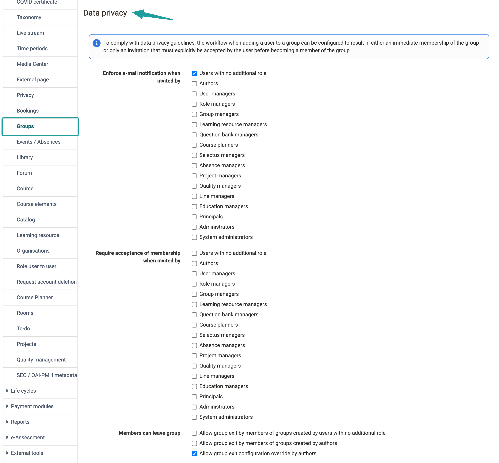
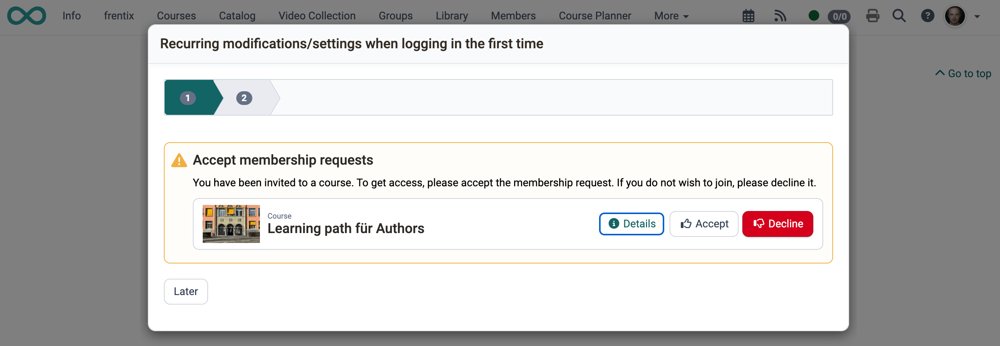

# Module Groups {: #groups}

In the Groups module, administrators define system-wide who is allowed to create groups, which rights group managers and learning resource managers receive in the group context, and which data privacy settings apply when members are added to groups and courses.

!!! note "Navigation"
    `Administration > Modules > Groups`

!!! tip "Data privacy"
    Note that this menu also allows data-protection-related configurations (mandatory notifications) that **also apply to courses**: See [data privacy](#data_privacy)

## Create groups [:octicons-tag-16:{ title="from Release 8.2 (OO-291)" }](https://track.frentix.com/issue/OO-291){:target="_blank"} {: #create_groups}

System administrators and group managers can always create groups. For other roles, this permission can be activated under "May create group":

* **Users with no additional role**
* **Authors**

[To the top of the page ^](#groups)

---

## Group - Resource assignment {: #assign_learning_resources}

Course owners and group coaches can integrate their own groups into their own courses. The following options extend this right to other roles:

* **Group managers can search and assign all courses to groups**: tick "full course referencing right granted".
* **Learning resource managers can search and assign all groups to courses**: tick "full group referencing right granted".

[To the top of the page ^](#groups)

---

## Data privacy [:octicons-tag-16:{ title="from Release 8.3 (OO-377)" }](https://track.frentix.com/issue/OO-377){:target="_blank"} {: #data_privacy}

The data privacy settings apply **equally to courses and groups**. They control how the system reacts when users are manually added to a course or group. If people enrol themselves, these settings do not apply.

### Enforce e-mail notification when invited by [:octicons-tag-16:{ title="from Release 20.3.1 (OO-9354)" }](https://track.frentix.com/issue/OO-9354){:target="_blank"} {: #mandatory_email}

Defines per role of the **inviting** person whether an email notification must be sent when manually adding someone to a course or group. If the option is not active for a role, sending the email is optional.

Configurable roles: Users with no additional role, Authors, User managers, Role managers, Group managers, Learning resource managers, Question bank managers, Course planners, Selectus managers, Absence managers, Project managers, Quality managers, Line managers, Education managers, Principals, Administrators, System administrators.

{ class="shadow lightbox" }

### Require acceptance of membership when invited by {: #accept_membership}

Defines per role of the inviting person whether a new membership becomes active immediately or whether the invited person must first accept or decline the request (pending membership).

Pending membership requests appear in the course area, in the group area, and on the course or educational product info page as the notification box **"Accept membership requests"**.

!!! note "Note"

    Pending memberships occupy places in the group. If a group has 5 places and 3 people have a pending invitation, only 2 places remain available for enrolment.

Configurable roles: Users with no additional role, Authors, User managers, Role managers, Group managers, Learning resource managers, Question bank managers, Course planners, Selectus managers, Absence managers, Project managers, Quality managers, Line managers, Education managers, Principals, Administrators, System administrators.

!!! tip "Example view for a corresponding configuration for a course"

    { class="shadow lightbox" }

### Members can leave group {: #leave_group}

This function defines whether members are allowed to leave "their" groups on their own. The first two checkboxes distinguish by the role of the person who created the group:

* **Allow group exit by members of groups created by users with no additional role**: applies to all groups created by a person with no additional role.
* **Allow group exit by members of groups created by authors**: applies to all groups created by an author.
* **Allow group exit configuration override by authors**: authors may override both defaults in their own groups.

[To the top of the page ^](#groups)

---

## Further information {: #further_information}

**Further reading** 
[Become a group member >](../../manual_user/groups/Group_Membership.md) 
[Leave a group >](../../manual_user/groups/Leave_a_Group.md) 
[Membership requests in the Course Planner >](../../manual_user/area_modules/Course_Planner_Implementations.md) 
[Module Learning resource >](Modules_Learning_Resource.md)

[To the top of the page ^](#groups)
