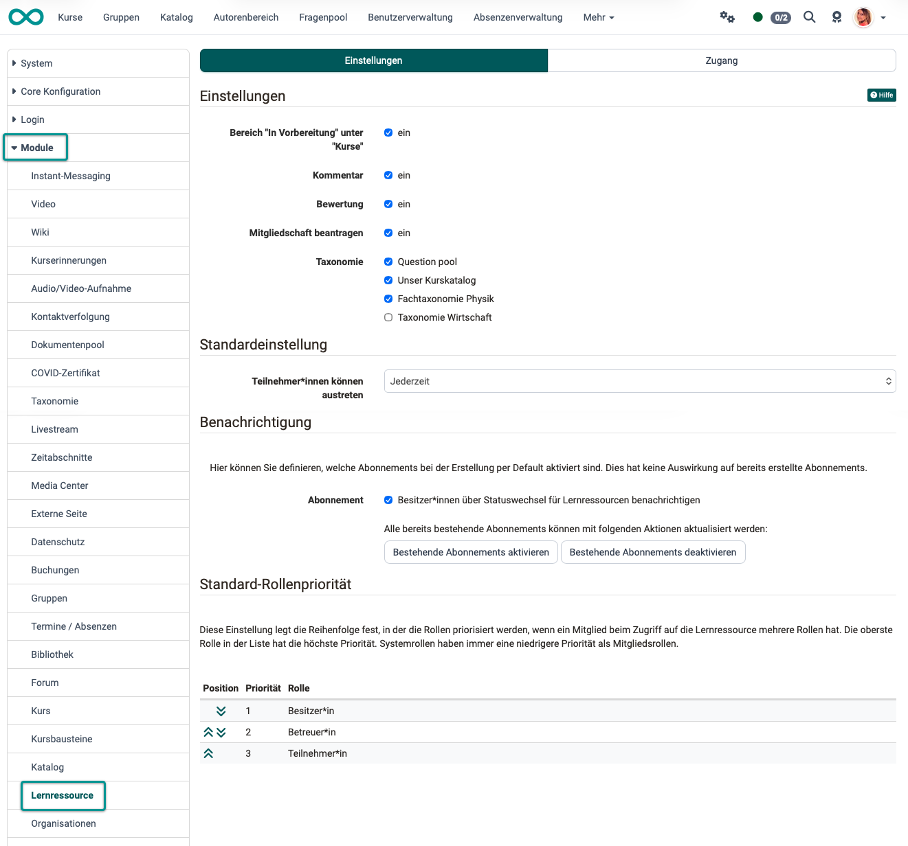
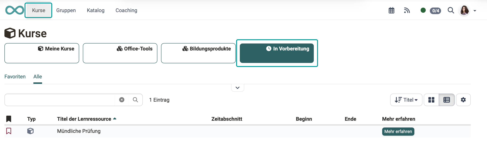
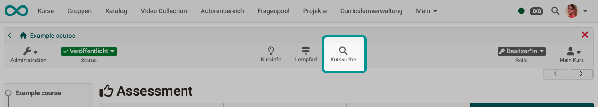
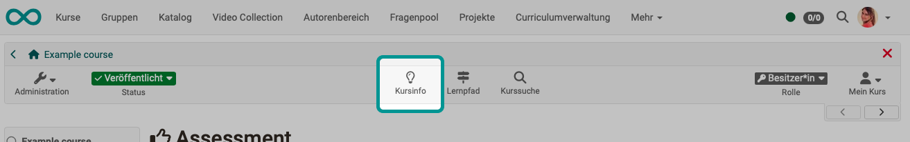
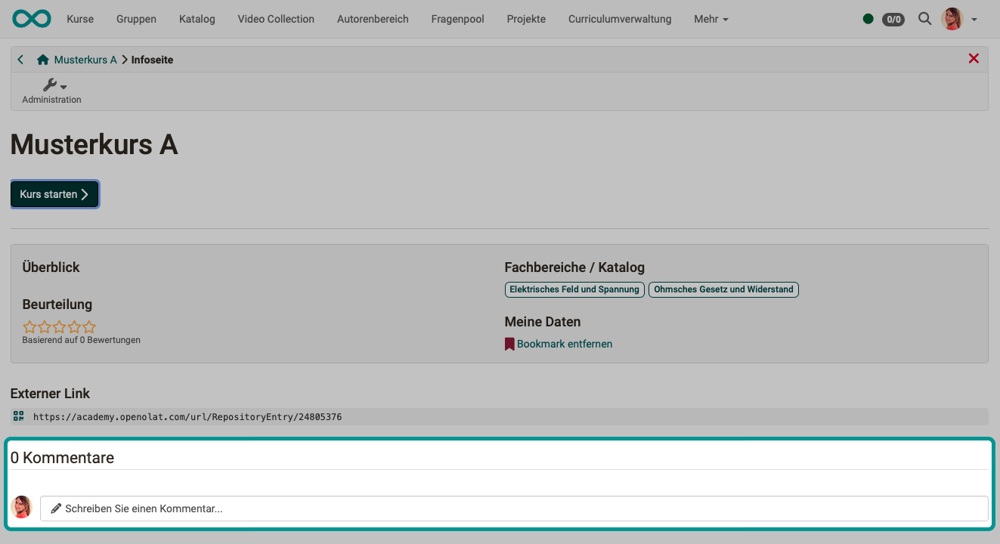
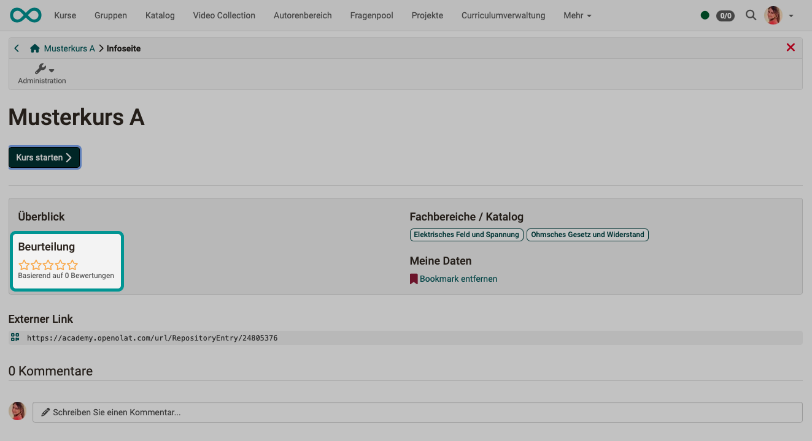
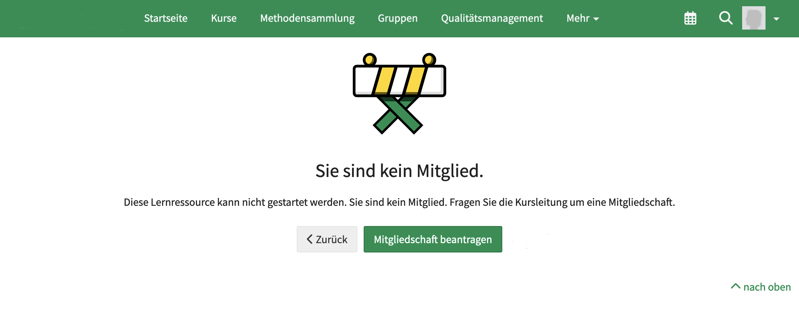
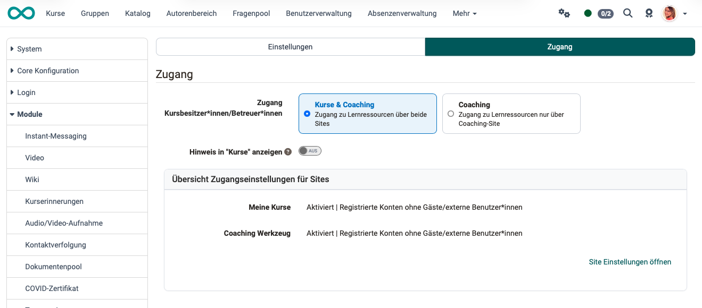

# Modul Lernressource {: #learning_resource} [:octicons-tag-16:{ title="ab Release 20.3 (früher: Repository)" }](https://track.frentix.com/issue/OO-9185){:target="_blank"}

Zum Modul Lernressourcen gehören Einstellungen, die Kurse und Lernressourcen betreffen, welche im Autorenbereich gespeichert sind.

{ class="shadow lightbox" }

[Zum Seitenanfang ^](#learning_resource)

---

## Abschnitt Einstellungen {: #tab_settings}

Mit Aktivierung der ersten Checkbox machen Administrator:innen für Teilnehmer:innen die Vorauswahl "In Vorbereitung" im Menü "Kurse" sichtbar. Dies bewirkt folgendes.

#### Bereich "In Vorbereitung" unter "Kurse":

**Ansicht Teilnehmer:in bei Aktivierung**
{ class="shadow lightbox" }

#### Kurssuche {: #course_search}

Kursbesitzer:innen können im Kurs unter `(Kurs-)Administration > Einstellungen > Tab Toolbar` die [Kurssuche](../../manual_user/basic_concepts/Search_in_Course.de.md) aktivieren, um innerhalb des Kurses nach Inhalten zu suchen.

{ class="shadow lightbox" }

Die Verfügbarkeit dieser Funktion kann von Administrator:innen in diesem Modul global ein-/ausgeschaltet werden. [:octicons-tag-16:{ title="ab Release 20.3.0 (OO-9185)" }](https://track.frentix.com/issue/OO-9185){:target="_blank"}

[Zum Seitenanfang ^](#learning_resource)

---

#### Kommentar {: #comment}

In der Kopfzeile eines Kurses kann die Info-Seite zum Kurs aufgerufen werden. Darin "verbirgt" sich der Kommentar.

{ class="shadow lightbox" }

Auf der Infoseite kann dann ein Eingabefeld zur Abgabe eines Kommentars angezeigt werden.

{ class="shadow lightbox" }

Die Verfügbarkeit dieses Eingabefeldes kann von Administrator:innen in diesem Modul global ein-/ausgeschaltet werden.

[Zum Seitenanfang ^](#learning_resource)

---

#### Bewertung

Auf der Infoseite zu einem Kurs können ebenfalls anklickbare Sterne zur Beurteilung angezeigt werden.

{ class="shadow lightbox" }

Die Verfügbarkeit der Sterne zur Beurteilung eines Kurses kann von Administrator:innen in diesem Modul global ein-/ausgeschaltet werden.

[Zum Seitenanfang ^](#learning_resource)

---

#### Mitgliedschaft beantragen

Wenn jemand einen Kurs öffnet, auf welchen er keinen Zugriff hat, erscheint ein Screen mit Hinweis. 
Hier gibt es einen Button, mit dem eine Mitgliedschaft beantragt werden kann. Beim Anklicken wird damit eine E-Mail an alle Kursbesitzer:innen verschickt.

{ class="shadow lightbox" }

Die Verfügbarkeit dieses Eingabefeldes kann von Administrator:innen in diesem Modul global ein-/ausgeschaltet werden.

[Zum Seitenanfang ^](#learning_resource)

---

#### Taxonomie
**Verwendung von Taxonomie im Katalog** [:octicons-tag-16:{ title="ab Release 20.3.0 (OO-9214)" }](https://track.frentix.com/issue/OO-9214){:target="_blank"}

Die Aktivierung von Taxonomie in der Lernressource führt dazu, dass die gewählte "Struktur" im Katalog verfügbar ist. Damit dieser Weg funktioniert, muss die entsprechende Taxonomie zuerst grundsätzlich erarbeitet und integriert sein.

!!! tip "Grundlage"
    Unter `Administration > Module > Taxonomie` können verschiedene Taxonomien erstellt werden.

Eine Taxonomie kann in diesem Bereich nicht abgewählt werden, solange sie in einem Launcher des **Katalogs verwendet wird**. Beim Versuch der Abwahl erscheint die Meldung: «Die Taxonomie wird noch in einem Launcher des Katalogs verwendet und kann daher nicht abgewählt werden.»

!!! note "Modul Taxonomie"
    Wie Taxonomien erstellt und konfiguriert werden. 
    [Zum Modul Taxonomie >](Modules_Taxonomy.de.md)

[Zum Seitenanfang ^](#learning_resource)

---

### Abschnitt "Standardeinstellung"

#### Teilnehmer:innen können austreten {: #allow_leaving_courses}

Mit dieser Option wird eine Standardeinstellung für alle neuen Kurse vorgegeben. (Bereits bestehende Kurse sind davon nicht betroffen.) Kursteilnehmer:innen können ggf. dann selbst entscheiden, ob sie einen Kurs verlassen möchten.

Als Default-Option kann gewählt werden zwischen

* Jederzeit
* Nach Kursenddatum oder Status "Beendet"
* Nie

!!! tip "Kursspezifisch"
    Diese vorausgewählte Einstellung, kann pro Kurs, von Kursbesitzer:innen kursspezifisch wieder angepasst werden: `(Kurs-)Administration > Einstellungen > Tab Freigabe`

[Zum Seitenanfang ^](#learning_resource)

---

### Abschnitt "Benachrichtigung" {: #notification}

OpenOlat kann an verschiedenen Stellen Benachrichtigungen über Ereignisse versenden. Wenn jemand die Benachrichtigungen erhalten möchte, kann dazu ein Abonnement eingerichtet werden.

!!! info Benachrichtigungen über Ereignisse in der Lernressource betreffen aktuell nur das Abonnement "*Besitzer:innen über Statuswechsel für Lernressourcen benachrichtigen*".

#### Abonnenten

A) Voreinstellung 
Durch Aktivierung/Deaktivierung des Abonnements wird bestimmt, ob bei Erstellung eines neuen Kurses bzw. einer Lernressource im Repository als Default auch ein Abonnement für die beschriebene Zielgruppe eingerichtet wird. Dies hat keine Auswirkung auf bereits erstellte Abonnements.

B) Bereits bestehende Abonnements können aktualisiert werden mit den Buttons 
"Bestehende Abonnements aktivieren" und "Bestehende Abonnements deaktivieren". 

[Zum Seitenanfang ^](#learning_resource)

---

### Abschnitt "Standard-Rollenpriorität" [:octicons-tag-16:{ title="ab Release 20.1.2 (OO-8795)" }](https://track.frentix.com/issue/OO-8795){:target="_blank"}

Diese Einstellung legt die Reihenfolge fest, in der die Rollen priorisiert werden, wenn ein Mitglied beim Zugriff auf die Lernressource mehrere Rollen hat. Die oberste Rolle in der Liste hat die höchste Priorität. Systemrollen haben immer eine niedrigere Priorität als Mitgliedsrollen.

[Zum Seitenanfang ^](#learning_resource)

---

## Tab Zugang {: #tab_accesss}

{ class="shadow lightbox" }

### Abschnitt "Zugang"

#### Zugang Kursbesitzer:innen/Betreuer:innen

Wer in einem Kurs (einer Lernressource) Besitzer:in oder Betreuer:in ist, kann diesen Kurs auf jeden Fall im Coaching Tool finden.
Es kann hier gewählt werden, ob zusätzlich auch unter "Meine Kurse" auf solche Lernressourcen zugegriffen werden kann. 

#### Hinweis in "Kurse" anzeigen

Wird dieser Toggle-Button aktiviert, erhalten die Kursbesitzer:innen/Betreuer:innen Hinweise zu den Auswirkungen der Zugangseinstellung.

#### Übersicht Zugangseinstellungen für Sites

Unter `Administration > Customizing > Sites` können Administrator:innen einstellen, welche Menüpunkte (Sites) in der Hauptnavigation (Kopfzeile) angezeigt werden.

Hier (unter Modul Lernresource) wird angezeigt, was dort betreffend "Meine Kurse" und "Coaching Werkzeug" eingestellt ist. Ob diese Site überhaupt in der Kopfzeile angezeigt werden soll und für welche Rollen es sichtbar ist.

Um die Einstellungen zu ändern, kann direkt mit einem Link zu `Administration > Customizing > Sites` gewechselt werden ("Site Einstellungen öffnen").

[Zum Seitenanfang ^](#learning_resource)

