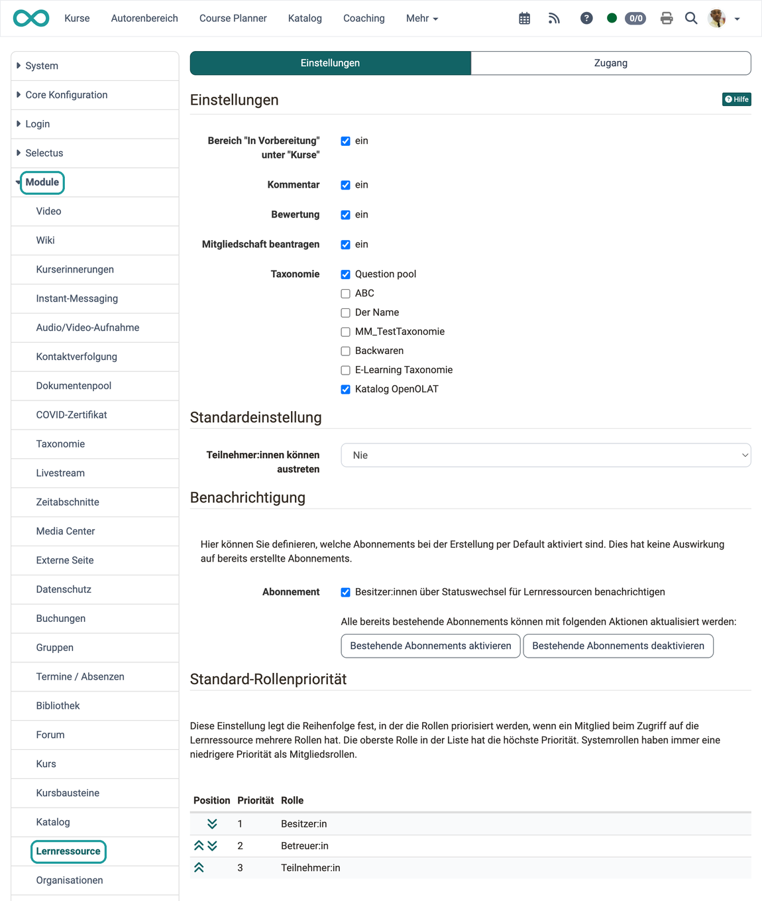
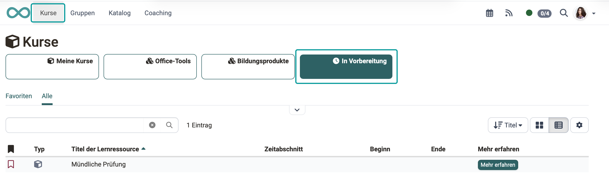
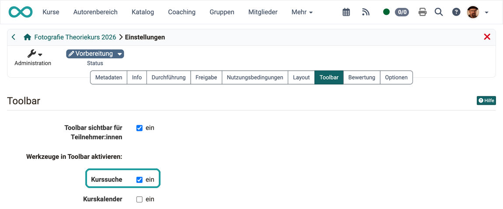
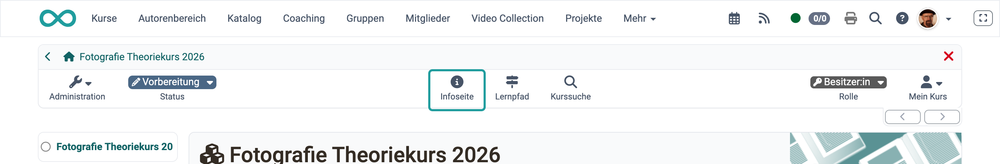
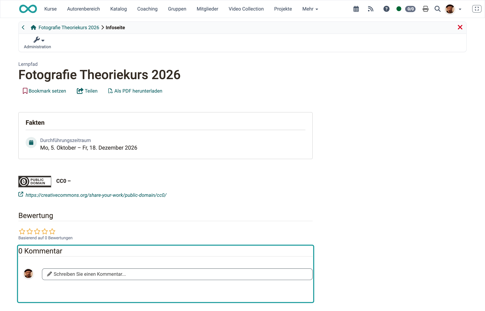
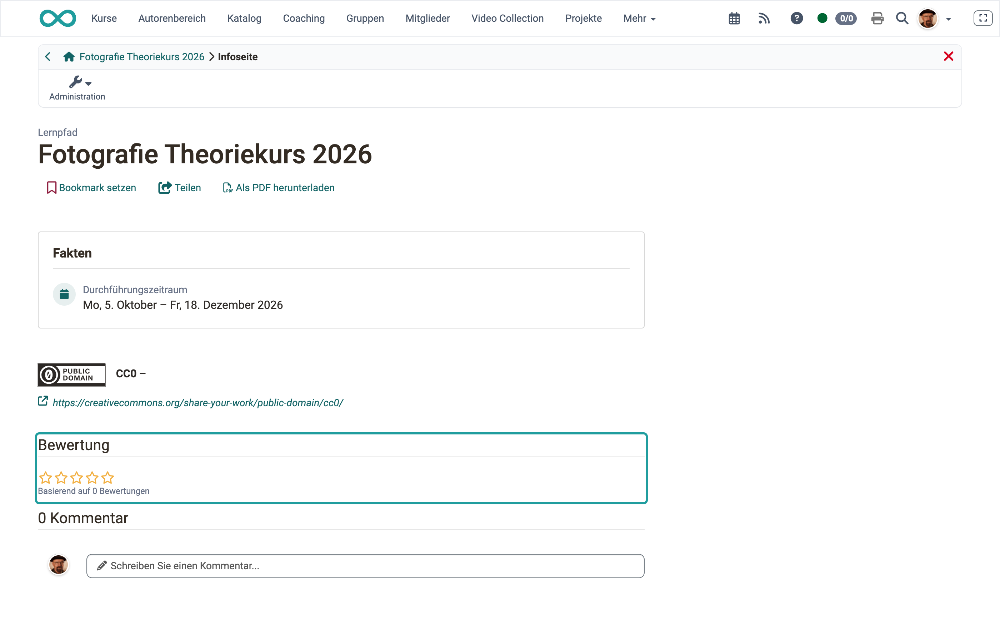
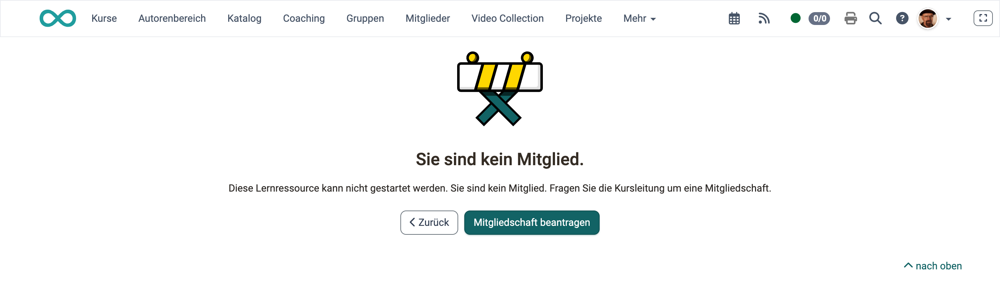
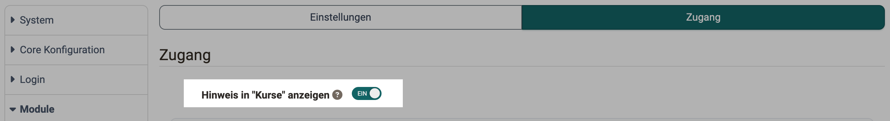
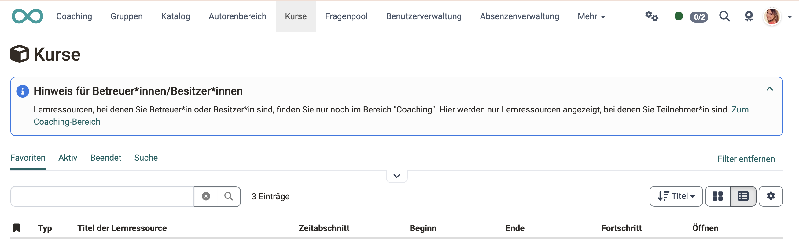

# Modul Lernressource [:octicons-tag-16:{ title="ab Release 20.3 (OO-9185)" }](https://track.frentix.com/issue/OO-9185){:target="_blank"} {: #learning_resource}

Zum Modul Lernressourcen gehören Einstellungen, die Kurse und Lernressourcen betreffen, welche im Autorenbereich gespeichert sind.

{ class="shadow lightbox" }

[Zum Seitenanfang ^](#learning_resource)

---

## Tab Einstellungen {: #tab_settings}

Der Tab "Einstellungen" enthält die Abschnitte Einstellungen, Standardeinstellung, Benachrichtigung und Standard-Rollenpriorität.

### Abschnitt Einstellungen

Mit Aktivierung der ersten Checkbox machen Administrator:innen für Teilnehmer:innen die Vorauswahl "In Vorbereitung" im Menü "Kurse" sichtbar. Dies bewirkt Folgendes.

#### Bereich "In Vorbereitung" unter "Kurse"

**Ansicht Teilnehmer:in bei Aktivierung**
{ class="shadow lightbox" }

#### Kurssuche {: #course_search}

Die [Kurssuche](../../manual_user/basic_concepts/Search_in_Course.de.md) wird pro Kurs konfiguriert, nicht in diesem Modul. Kursbesitzer:innen aktivieren sie unter `Kurs > Administration > Einstellungen > Tab "Toolbar"`. Danach erscheint der Button "Kurssuche" in der Toolbar des Kurses.

{ class="shadow lightbox" }

Wie Kursbesitzer:innen die Kurssuche und die weiteren Werkzeuge der Toolbar aktivieren, beschreibt die Seite [Einsatz weiterer Kursfunktionen der Toolbar](../../manual_user/learningresources/Using_Additional_Course_Features.de.md).

[Zum Seitenanfang ^](#learning_resource)

---

#### Kommentar {: #comment}

In der Kopfzeile eines Kurses kann die Infoseite zum Kurs aufgerufen werden. Darin "verbirgt" sich der Kommentar.

{ class="shadow lightbox" }

Auf der Infoseite kann dann ein Eingabefeld zur Abgabe eines Kommentars angezeigt werden.

{ class="shadow lightbox" }

Die Verfügbarkeit dieses Eingabefeldes kann von Administrator:innen in diesem Modul global ein-/ausgeschaltet werden.

[Zum Seitenanfang ^](#learning_resource)

---

#### Bewertung

Auf der Infoseite zu einem Kurs können ebenfalls anklickbare Sterne zur Beurteilung angezeigt werden.

{ class="shadow lightbox" }

Die Verfügbarkeit der Sterne zur Beurteilung eines Kurses kann von Administrator:innen in diesem Modul global ein-/ausgeschaltet werden.

[Zum Seitenanfang ^](#learning_resource)

---

#### Mitgliedschaft beantragen

Wenn jemand einen Kurs öffnet, auf welchen er keinen Zugriff hat, erscheint ein Hinweis. Dort gibt es einen Button, mit dem eine Mitgliedschaft beantragt werden kann. Beim Anklicken wird damit eine E-Mail an alle Kursbesitzer:innen verschickt.

{ class="shadow lightbox" }

Diese Funktion kann von Administrator:innen in diesem Modul global ein-/ausgeschaltet werden.

[Zum Seitenanfang ^](#learning_resource)

---

#### Taxonomie
**Verwendung von Taxonomie im Katalog** [:octicons-tag-16:{ title="ab Release 20.3.0 (OO-9214)" }](https://track.frentix.com/issue/OO-9214){:target="_blank"}

Die Aktivierung von Taxonomie in der Lernressource führt dazu, dass die gewählte "Struktur" im Katalog verfügbar ist. Damit dieser Weg funktioniert, muss die entsprechende Taxonomie zuerst grundsätzlich erarbeitet und integriert sein.

!!! tip "Grundlage"
    In der System-Administration unter `Administration > Module > Taxonomie` können verschiedene Taxonomien erstellt werden.

Eine Taxonomie kann in diesem Bereich nicht abgewählt werden, solange sie in einem Launcher des **Katalogs verwendet wird**. Beim Versuch der Abwahl erscheint die Meldung: «Die Taxonomie wird noch in einem Launcher des Katalogs verwendet und kann daher nicht abgewählt werden.»

Wie Taxonomien erstellt und konfiguriert werden, beschreibt die Seite [Modul Taxonomie](Modules_Taxonomy.de.md).

[Zum Seitenanfang ^](#learning_resource)

---

### Abschnitt Standardeinstellung [:octicons-tag-16:{ title="ab Release 10.4 (OO-1811)" }](https://track.frentix.com/issue/OO-1811){:target="_blank"}

#### Teilnehmer:innen können austreten {: #allow_leaving_courses}

Mit dieser Option wird eine Standardeinstellung für alle neuen Kurse vorgegeben. (Bereits bestehende Kurse sind davon nicht betroffen.) Kursteilnehmer:innen können ggf. dann selbst entscheiden, ob sie einen Kurs verlassen möchten.

Als Standardeinstellung kann gewählt werden zwischen

* Jederzeit
* Nach Kursenddatum oder Status "Beendet"
* Nie

!!! tip "Kursspezifisch"
    Diese vorausgewählte Einstellung kann pro Kurs von Kursbesitzer:innen kursspezifisch wieder angepasst werden: `Kurs > Administration > Einstellungen > Tab "Freigabe"`

[Zum Seitenanfang ^](#learning_resource)

---

### Abschnitt Benachrichtigung [:octicons-tag-16:{ title="ab Release 17.2.4 (OO-6739)" }](https://track.frentix.com/issue/OO-6739){:target="_blank"} {: #notification}

OpenOlat kann an verschiedenen Stellen Benachrichtigungen über Ereignisse versenden. Wenn jemand die Benachrichtigungen erhalten möchte, kann dazu ein Abonnement eingerichtet werden. Für Ereignisse in der Lernressource gibt es das Abonnement "*Besitzer:innen über Statuswechsel für Lernressourcen benachrichtigen*".

#### Abonnement

A) Voreinstellung 
Durch Aktivierung/Deaktivierung des Abonnements wird bestimmt, ob bei Erstellung eines neuen Kurses bzw. einer Lernressource im Autorenbereich standardmässig auch ein Abonnement für die beschriebene Zielgruppe eingerichtet wird. Dies hat keine Auswirkung auf bereits erstellte Abonnements.

B) Bereits bestehende Abonnements können aktualisiert werden mit den Buttons "Bestehende Abonnements aktivieren" und "Bestehende Abonnements deaktivieren". 

[Zum Seitenanfang ^](#learning_resource)

---

### Abschnitt Standard-Rollenpriorität [:octicons-tag-16:{ title="ab Release 20.1.2 (OO-8795)" }](https://track.frentix.com/issue/OO-8795){:target="_blank"}

Diese Einstellung legt die Reihenfolge fest, in der die Rollen priorisiert werden, wenn ein Mitglied beim Zugriff auf die Lernressource mehrere Rollen hat. Die oberste Rolle in der Liste hat die höchste Priorität. Systemrollen haben immer eine niedrigere Priorität als Mitgliedsrollen.

[Zum Seitenanfang ^](#learning_resource)

---

## Tab Zugang {: #tab_accesss}

Der Tab "Zugang" enthält die Abschnitte Zugang und Status "Beendet".

### Abschnitt Zugang

#### Zugang Kursbesitzer:innen/Betreuer:innen [:octicons-tag-16:{ title="ab Release 21.0 (OO-9576)" }](https://track.frentix.com/issue/OO-9576)

Wer in einem Kurs (einer Lernressource) Besitzer:in oder Betreuer:in ist, findet diese Lernressource im Coaching Werkzeug. Unter "Meine Kurse" werden Lernressourcen angezeigt, bei denen Benutzer:innen mit der Rolle Betreuer:in selbst Teilnehmer:in sind.

#### Hinweis in "Kurse" anzeigen

Wird dieser Toggle-Button aktiviert, erhalten die Kursbesitzer:innen/Betreuer:innen Hinweise zu den Auswirkungen der Zugangseinstellung.

{ class="shadow lightbox" }
{ class="shadow lightbox" }

#### Bereichseinstellungen

Ob die Bereiche "Meine Kurse" und "Coaching Werkzeug" in der Hauptnavigation erscheinen und wer sie sieht, lesen Sie in der "Übersicht Zugangseinstellungen für Bereiche" ab. Sie zeigt je Bereich, ob er aktiviert ist und welche Konten ihn erreichen, zum Beispiel "Aktiviert | Registrierte Konten ohne Gäste/externe Benutzer:innen". Was ein Bereich ist, beschreibt die Seite [Bereiche und Module >](../../manual_user/area_modules/index.de.md).

Über den Button "Bereichseinstellungen öffnen" gelangen Sie direkt zur Seite "Bereiche" der System-Administration: 
`Administration > Customizing > Bereiche`

Dort legen Sie die Reihenfolge der Bereiche in der Hauptnavigation fest und bestimmen, für welche Rollen sie sichtbar sind. Den Bereich "Meine Kurse" können Sie dort auch deaktivieren. Das Coaching Werkzeug lässt sich in der Standardkonfiguration nicht deaktivieren, weil Besitzer:innen und Betreuer:innen ihre Lernressourcen nur dort finden. Mehr dazu: [Customizing: Bereiche >](Customizing.de.md#sites)

!!! note "Zugang zur Einstellung"
    Nur **Administrator:innen** können diese Seite aufrufen und Veränderungen vornehmen.

[Zum Seitenanfang ^](#learning_resource)

---

### Abschnitt Status "Beendet" [:octicons-tag-16:{ title="ab Release 21.0 (OO-9298)" }](https://track.frentix.com/issue/OO-9298)

Hier legen Sie systemweit fest, welchen Zugriff Teilnehmende auf einen Kurs oder eine Lernressource im Status "Beendet" haben. Diese Einstellung gilt als Standard für alle Kurse und kann pro Kurs überschrieben werden.

* **Nur-Lese-Zugriff:** Der Inhalt steht den Teilnehmenden weiterhin im Lesemodus zur Verfügung.
* **Kein Zugriff:** Die Teilnehmenden haben keinen Zugriff mehr auf die Inhalte. Beim Öffnen erscheint ein Hinweis mit Verweis auf die zuständige Ansprechperson.

Kursbesitzer:innen überschreiben die Einstellung für ihren Kurs unter: 
`Kurs > Administration > Einstellungen > Tab "Optionen"`

[Zum Seitenanfang ^](#learning_resource)

---

## Weiterführende Informationen {: #further_information}

**Auf dieser Seite erwähnt** 
[Suche in einem Kurs >](../../manual_user/basic_concepts/Search_in_Course.de.md) 
[Einsatz weiterer Kursfunktionen der Toolbar >](../../manual_user/learningresources/Using_Additional_Course_Features.de.md) 
[Modul Taxonomie >](Modules_Taxonomy.de.md) 
[Bereiche und Module >](../../manual_user/area_modules/index.de.md) 
[Customizing: Übersicht >](Customizing.de.md)

**Weiterführend** 
[Coaching - Übersicht >](../../manual_user/area_modules/Coaching.de.md) 
[Kurseinstellungen - Tab Optionen >](../../manual_user/learningresources/Course_Settings_Options.de.md)

[Zum Seitenanfang ^](#learning_resource)

