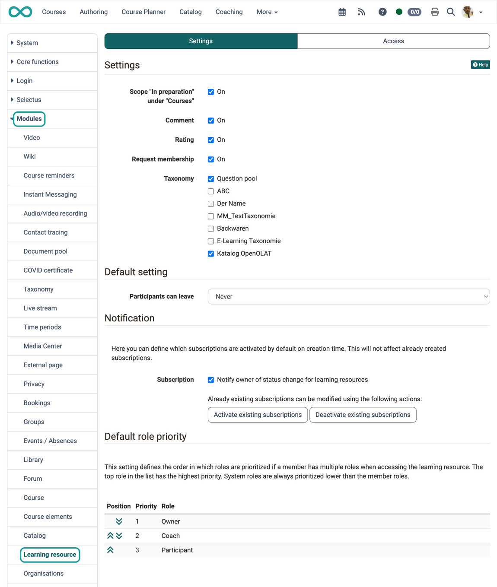
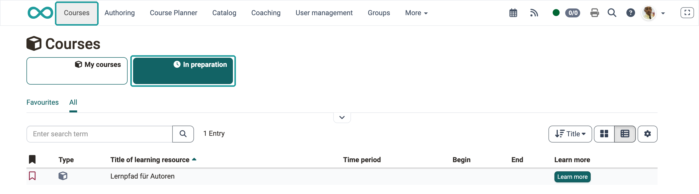
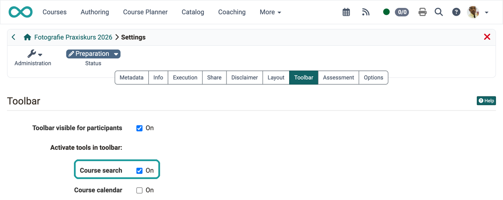
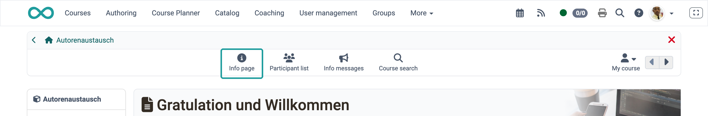
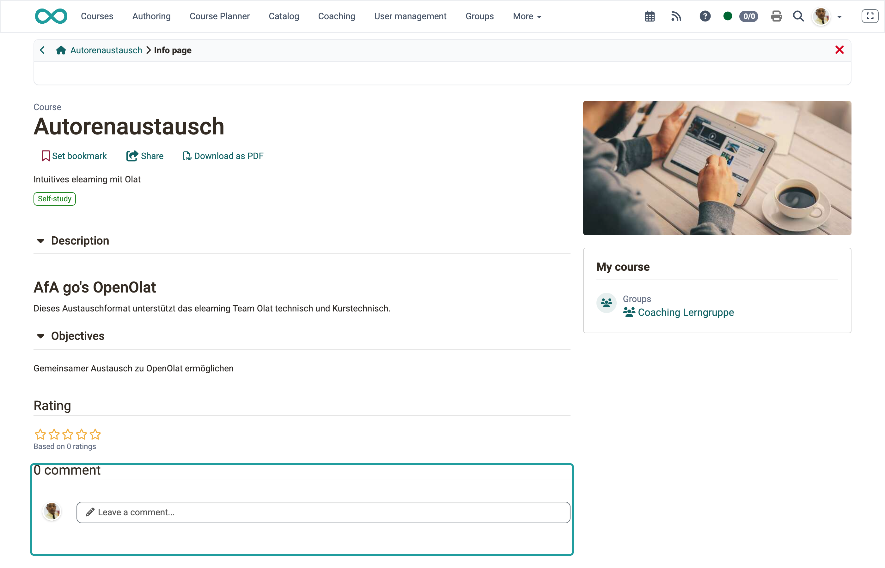
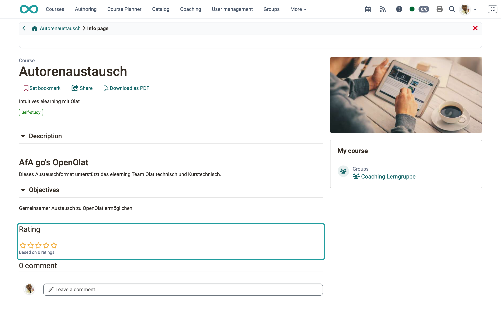
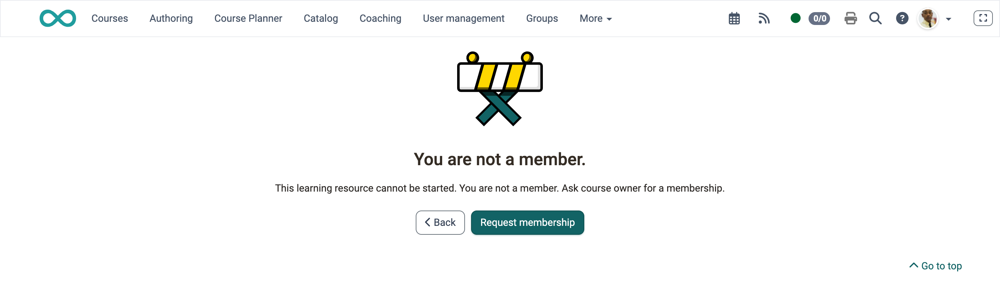
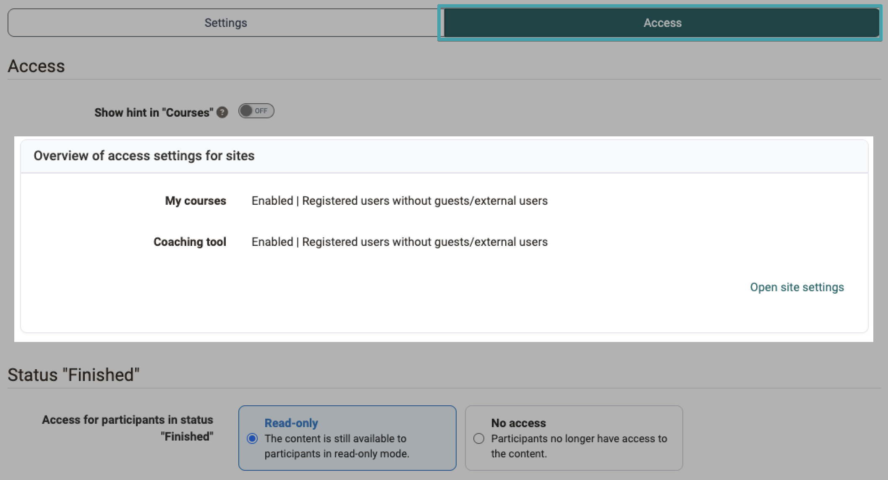
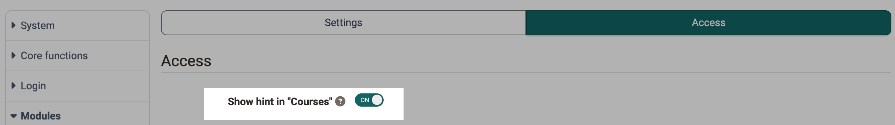
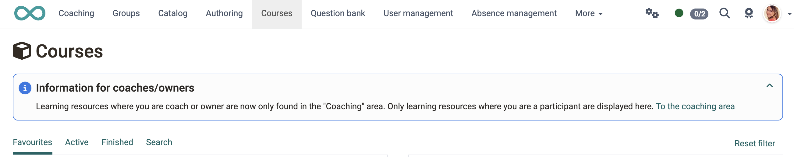

# Module Learning resource [:octicons-tag-16:{ title="from Release 20.3 (formerly: Repository)" }](https://track.frentix.com/issue/OO-9185){:target="_blank"} {: #learning_resource}

The Learning resource module includes settings that affect courses and learning resources stored in the authoring area.

{ class="shadow lightbox" }

[To the top of the page ^](#learning_resource)

---

## Settings tab {: #tab_settings}

The "Settings" tab contains the sections Settings, Default setting, Notification and Default role priority.

### Settings section

Activating the first checkbox makes the pre-selection "In Preparation" visible for participants in the "Courses" menu. This has the following effect.

#### Scope "In preparation" under "Courses"

**Participant view when activated**
{ class="shadow lightbox" }

#### Course search {: #course_search}

The [course search](../../manual_user/basic_concepts/Search_in_Course.md) is configured per course, not in this module. Course owners activate it under `(Course) Administration > Settings > Toolbar tab`. The "Course search" button then appears in the toolbar of the course.

{ class="shadow lightbox" }

!!! note "Configuration in the course"
    How course owners activate the course search and the other toolbar tools. 
    [Using Additional Course Features >](../../manual_user/learningresources/Using_Additional_Course_Features.md)

[To the top of the page ^](#learning_resource)

---

#### Comment {: #comment}

The course info page can be called up in the header of a course. The comment is "hidden" within it.

{ class="shadow lightbox" }

An input field for submitting a comment can then be displayed on the info page.

{ class="shadow lightbox" }

The availability of this input field can be switched on/off globally by administrators in this module.

[To the top of the page ^](#learning_resource)

---

#### Rating

Clickable stars for rating can also be displayed on the info page of a course.

{ class="shadow lightbox" }

The availability of stars for rating a course can be switched on/off globally by administrators in this module.

[To the top of the page ^](#learning_resource)

---

#### Request membership

If someone opens a course to which they do not have access, a notice appears. 
There is a button there that can be used to request membership. When clicked, an email is sent to all course owners.

{ class="shadow lightbox" }

This function can be switched on/off globally by administrators in this module.

[To the top of the page ^](#learning_resource)

---

#### Taxonomy
**Use of taxonomy in the catalog** [:octicons-tag-16:{ title="Available from Release 20.3.0 (OO-9214)" }](https://track.frentix.com/issue/OO-9214){:target="_blank"}

Activating taxonomy in the learning resource means that the selected "structure" is available in the catalog. For this to work, the corresponding taxonomy must first be created and integrated.

!!! tip "Prerequisite"
    Various taxonomies can be created under `Administration > Modules > Taxonomy`.

A taxonomy cannot be deselected in this area as long as **it is used in a launcher of the catalog**. Attempting to deselect it shows the message: "The taxonomy is still used in a launcher of the catalogue and therefore cannot be deselected."

!!! note "Module Taxonomy"
    How taxonomies are created and configured. 
    [To module Taxonomy >](Modules_Taxonomy.md)

[To the top of the page ^](#learning_resource)

---

### Default setting section

#### Participants can leave {: #allow_leaving_courses}

This option specifies a default setting for all new courses. (Existing courses are not affected by this.) Course participants can then decide for themselves whether they want to leave a course.

The following options are available as the default:

* At any time
* After the course end date or status "Finished"
* Never

!!! tip "Course-specific"
    This preselected setting can be adjusted again on a course-specific basis by course owners: `(Course) Administration > Settings > Share tab`

[To the top of the page ^](#learning_resource)

---

### Notification section {: #notification}

OpenOlat can send notifications about events at various points. If someone wants to receive the notifications, a subscription can be set up.

!!! note "Note"
    Notifications about events in the learning resource currently only affect the subscription "*Notify owner of status change for learning resources*".

#### Subscription

A) Default setting 
Activating/deactivating the subscription determines whether a subscription for the described target group is also set up by default when a new course or learning resource is created in the authoring area. This has no effect on already existing subscriptions.

B) Existing subscriptions can be updated using the "Activate existing subscriptions" and "Deactivate existing subscriptions" buttons.

[To the top of the page ^](#learning_resource)

---

### Default role priority section [:octicons-tag-16:{ title="from Release 20.1.2 (OO-8795)" }](https://track.frentix.com/issue/OO-8795){:target="_blank"}

This setting defines the order in which roles are prioritized when a member has multiple roles when accessing the learning resource. The top role in the list has the highest priority. System roles always have a lower priority than member roles.

[To the top of the page ^](#learning_resource)

---

## Access tab {: #tab_accesss}

The "Access" tab contains the sections Access and Status "Finished".

### Access section

#### Access for course owners/coaches [:octicons-tag-16:{ title="from Release 21.0 (OO-9576)" }](https://track.frentix.com/issue/OO-9576)

Anyone who is an owner or coach in a course (a learning resource) finds that learning resource in the Coaching tool. Under "My Courses", learning resources are displayed in which users with the coach role are participants themselves.

{ class="shadow lightbox" }

#### Show hint in "Courses"

If this toggle button is activated, course owners/coaches receive notices about the effects of the access setting.

{ class="shadow lightbox" }
{ class="shadow lightbox" }

#### Site settings

Via the button "Open site settings" you go directly to `Administration > Customizing > Sites`. There you define whether and in which order the sites "My courses" and "Coaching" appear in the header and for which roles they are visible.

!!! note "Access to the setting"
    Only **administrators** can open this page and make changes.

[To the top of the page ^](#learning_resource)

---

### Status "Finished" section [:octicons-tag-16:{ title="from Release 21.0 (OO-9298)" }](https://track.frentix.com/issue/OO-9298)

Here you define system-wide what access participants have to a course or a learning resource in the status "Finished". This setting is the default for all courses and can be overridden per course.

* **Read-only:** The content is still available to participants in read-only mode.
* **No access:** Participants no longer have access to the content. When they open it, a notice appears referring them to the responsible contact person.

Course owners overwrite the setting for their course under: 
`(Course) Administration > Settings > Options tab`

[To the top of the page ^](#learning_resource)

---

## Further information {: #further_information}

**Mentioned on this page** 
[Course search](../../manual_user/basic_concepts/Search_in_Course.md) 
[Using Additional Course Features >](../../manual_user/learningresources/Using_Additional_Course_Features.md) 
[To module Taxonomy >](Modules_Taxonomy.md)

[To the top of the page ^](#learning_resource)
