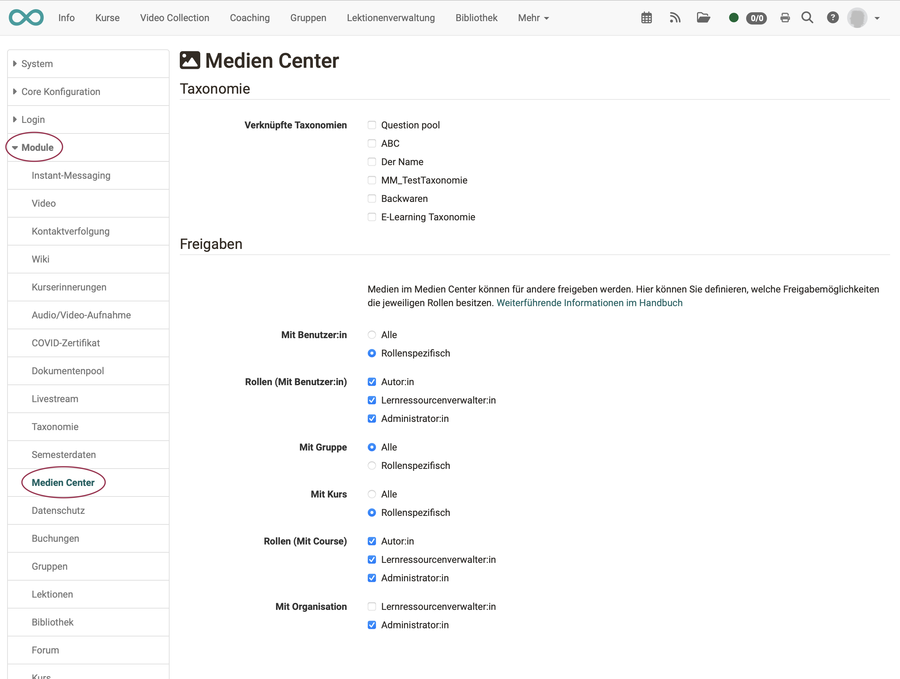

# Modul Medien Center

Die Konfiguration des Medien Centers kann von Administrator:innen vorgenommen werden unter 
**Administration > Module > Medien Center**.

{ class="shadow lightbox" }

## Taxonomie

Alle Inhalte des Medien Centers können einer Taxonomie zugeordnet werden (Metadaten). Da OpenOlat mehrere Taxonomien nebeneinander verwalten kann, muss in der Administration bestimmt werden, welche Taxonomien im Medien Center verwendet werden sollen. 

Weitere Informationen finden Sie im Kapitel [Taxonomie](Modules_Taxonomy.de.md).

## Freigaben

Werden Inhalte im Medien Center abgelegt, können sie zur Verwendung durch andere freigeben werden (Share). Welche Freigabe-Optionen den Autor:innen und anderen Rollen zur Verfügung stehen, kann durch Administrator:innen im Abschnitt "Freigaben" festgelegt werden.

Ansicht der Autor:innen:
{ class="shadow lightbox" }