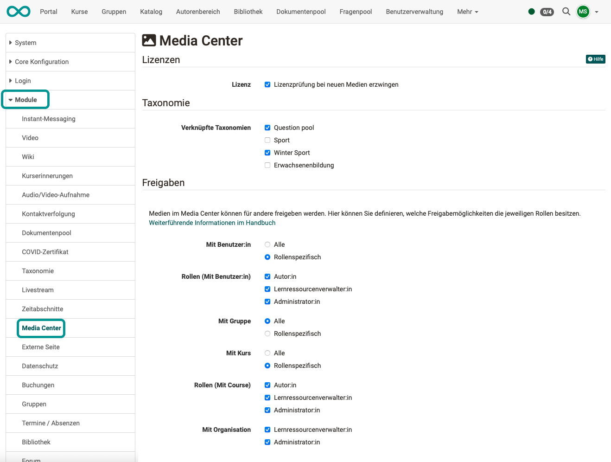
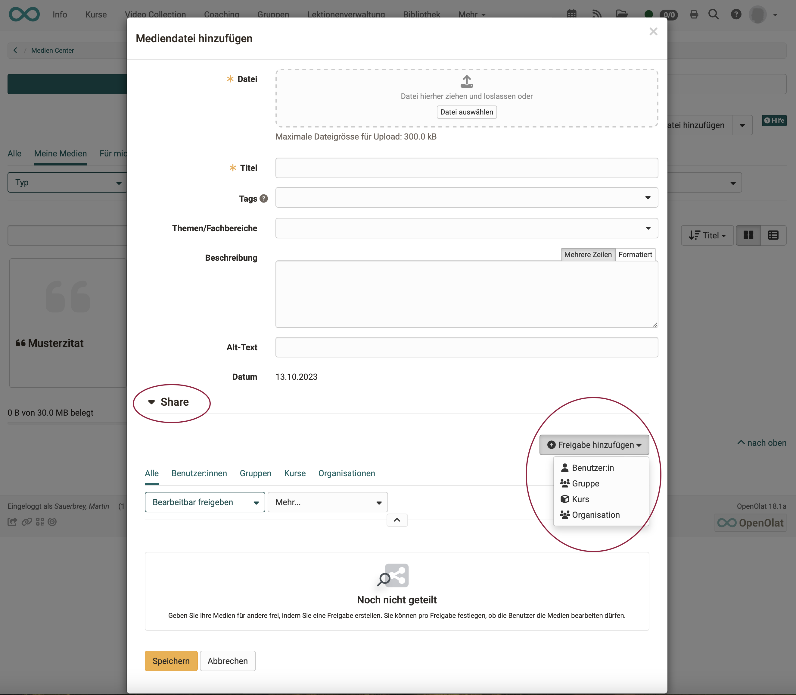

# Modul Media Center {: #module_media_center}

Die Konfiguration des Media Centers kann von Administrator:innen vorgenommen werden unter 
**Administration > Module > Media Center**.

{ class="shadow lightbox" }

---

## Lizenzen {: #licences}

Eine Lizenzüberprüfung bei neuen Medien kann erzwungen werden.

[Zum Seitenanfang ^](#module_media_center)
  
---

## Taxonomie {: #taxonomy}

Alle Inhalte des Media Centers können einer Taxonomie zugeordnet werden (Metadaten). Da OpenOlat mehrere Taxonomien nebeneinander verwalten kann, muss in der Administration bestimmt werden, welche Taxonomien im Media Center verwendet werden sollen. 

Weitere Informationen finden Sie im Kapitel [Taxonomie](Modules_Taxonomy.de.md).

[Zum Seitenanfang ^](#module_media_center)
  
---

## Freigaben {: #shares}

Werden Inhalte im Media Center abgelegt, können sie zur Verwendung durch andere freigeben werden (Share). Welche Freigabe-Optionen den Autor:innen und anderen Rollen zur Verfügung stehen, kann durch Administrator:innen im Abschnitt "Freigaben" festgelegt werden.

Ansicht der Autor:innen:
{ class="shadow lightbox" }

[Zum Seitenanfang ^](#module_media_center)
  
---