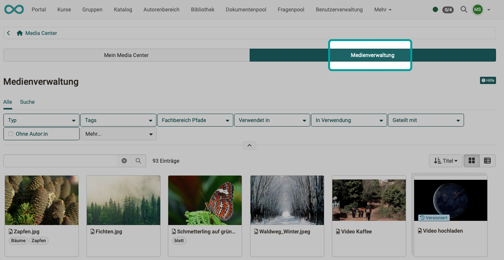

# Modul Media Center {: #module_media_center}

Die Konfiguration des Media Centers kann von Administrator:innen vorgenommen werden unter 
**Administration > Module > Media Center**.

{ class="shadow lightbox" }

[Zum Seitenanfang ^](#module_media_center)

---

## Lizenzen {: #licences}

Falls unter **Core Konfiguration > Lizenzen** die Verwendung von Lizenzen für das Media Center vorgesehen ist, kann anschliessend durch diese Checkbox die Lizenzangabe zum Pflichtfeld für alle ins Media Center hochgeladenen oder erstellten Medien gemacht werden.  

[Mehr zur Verwendung von Lizenzen >](Licenses.de.md) 
[Zum Seitenanfang ^](#module_media_center)
  
---

## Taxonomie {: #taxonomy}

Alle Inhalte des Media Centers können einer Taxonomie zugeordnet werden (Metadaten). Da OpenOlat mehrere Taxonomien nebeneinander verwalten kann, muss in der Administration bestimmt werden, welche Taxonomien im Media Center verwendet werden sollen. 

Weitere Informationen finden Sie im Kapitel [Taxonomie](Modules_Taxonomy.de.md).

[Zum Seitenanfang ^](#module_media_center)
  
---

## Freigaben {: #shares}

Werden Inhalte im Media Center abgelegt, können sie zur Verwendung durch andere freigeben werden (Share). Welche Freigabe-Optionen den Autor:innen und anderen Rollen zur Verfügung stehen, kann durch Administrator:innen im Abschnitt "Freigaben" festgelegt werden.

Ansicht der Autor:innen: 
{ class="shadow lightbox" }

Administrative Benutzer:innen, wie Lernressourcenverwalter:innen und Administrator:innen, haben aufgrund ihrer höher berechtigten Rollen **indirekt** Zugriff auf Medien. Sie haben **administrativen Zugriff** auf alle Medien, die in ihrer Organisation, den Gruppen, den Kursen und mit den Benutzer:innen geteilt werden.

Zur besseren Abgrenzung des administrativen Zugriffs ist neben dem Bereich "Mein Media Center" zusätzlich noch die "Medienverwaltung" verfügbar.
(Benutzer:innen ohne administrativen Zugriff finden dieses Tab nicht vor.)

{ class="shadow lightbox" }

[Zum Seitenanfang ^](#module_media_center)
  
---

## Weitere Information {: #further_information}

[Media Center Konzept >](../../manual_user/basic_concepts/Media_Center_Concept.de.md) 
[Media Center im persönlichen Menü >](../../manual_user/personal_menu/Media_Center.de.md) 

[Zum Seitenanfang ^](#module_media_center)
