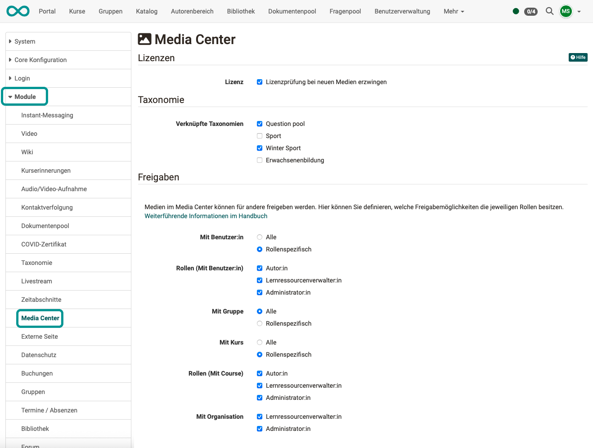

# Module Media Center {: #module_media_center}

Administrators configure the Media Center in the System Administration under: 
`Administration > Modules > Media Center`

{ class="shadow lightbox" }

This module does not define the storage space (quota) of the Media Center itself. You set the quota under `Administration > Core functions > Files and folders`.

See also [Files and Folders](Files_and_Folders.md#files_and_folders_quotas). 
[To the top of the page ^](#module_media_center)

---

## Licences {: #licences}

If the use of licences for the Media Center is specified under `Administration > Core functions > Licenses`, this checkbox can then be used to make the licence information a mandatory field for all media uploaded or created in the Media Center.

[More on the usage of licences >](Licenses.md) 
[To the top of the page ^](#module_media_center)

---

## Taxonomy {: #taxonomy}

All contents of the media center can be assigned to a taxonomy (meta data). Since OpenOlat can manage multiple taxonomies at the same time, it must be determined in the administration, which taxonomies should be used in the media center.

You can find further information in the chapter [Taxonomy](../administration/Modules_Taxonomy.md).

[To the top of the page ^](#module_media_center)

---

## Shares {: #shares}

If contents are deposited in the media center, they can be shared for others to use. Administrators define in the section "Shares" which sharing options are available to authors and other roles.

| My role           | If "User" is allowed by an admin | If "Course"  is allowed by an admin | If "Group"  is allowed by an admin | If "Organisation"  is allowed by an admin |
| ----------------- | ---------------------| ------ | ------ | ------------ |
| I am user (without additional roles)| I can give co-users access, when they belong to org units where they are authorised to use the media center. | I can give co-users access in all courses, where the co-user is an owner. | I can co-users of all groups give access, if the co-user is a group member. | media sharing is not possible |
| I am author       | I can give co-users access, when they belong to org units where they are authorised to use the media center. | I can give co-users access in all courses, where the co-user is an owner. | I can co-users of all groups give access, if the co-user is a group member. | media sharing is not possible |
| I am learning resource manager | I can give co-users access, when they belong to org units where they are authorised to use the media center. | I can give co-users access in all courses in org units, where the co-user is authorised to use the media center. | I can co-users of all groups give access, if the co-user is a group member. | I can give co-users access in all organisations where the co-user is authorised to use the media center. |
| I am administrator  | I can give co-users access, when they belong to org units where they are authorised to use the media center.| I can give co-users access in all courses in org units, where the co-user is authorised to use the media center. | I can co-users of all groups give access. | I can give co-users access in all organisations where the co-user is authorised to use the media center. |

[To the top of the page ^](#module_media_center)

---

## Further information {: #further_information}

[Files and Folders >](Files_and_Folders.md) 
[Licenses >](Licenses.md) 
[Module Taxonomy >](Modules_Taxonomy.md) 
[Media Center concept >](../../manual_user/basic_concepts/Media_Center_Concept.md) 
[Media Center in the personal menu >](../../manual_user/personal_menu/Media_Center.md)

[To the top of the page ^](#module_media_center)

