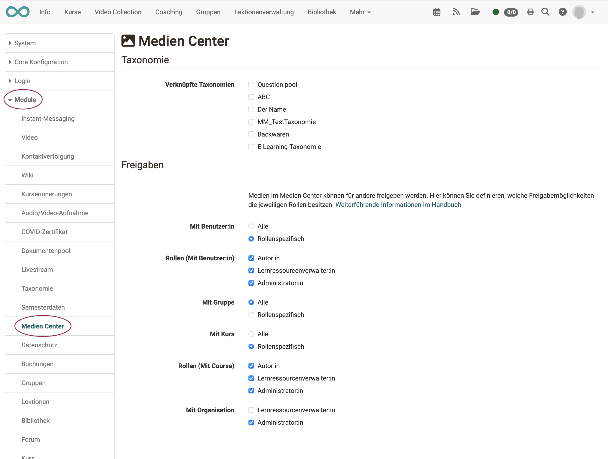

# Module Media Center

The configuration of the media center can be made by the administrator under 
**Administration > Module > Media Center**

{ class="shadow lightbox" }

## Taxonomy

All contents of the media center can be assigned to a taxonomy (meta data). Since OpenOlat can manage multiple taxonomies at the same time, it must be determined in the administration, which taxonomies should be used in the media center.

You can find further information in the chapter [Taxonomy](../administration/Modules_Taxonomy.md).

## Shares

If contents are deposited in the media center, they can be shared for others to use (Share). Which share options are available to authors and other roles can be determined by administrator in the tab "Share".

Author view:
{ class="shadow lightbox" }
