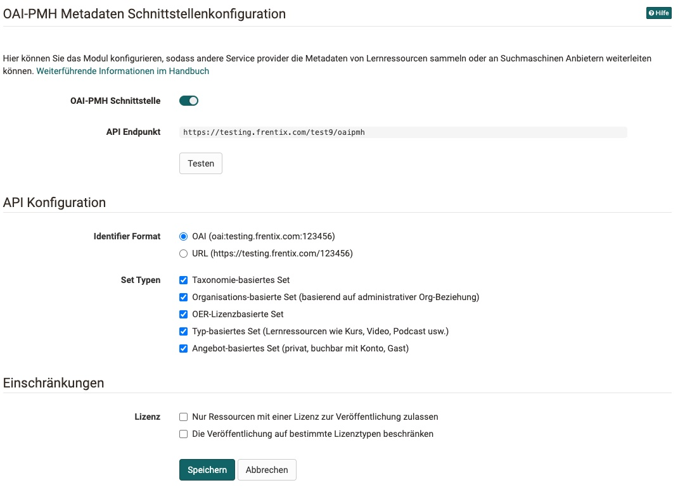
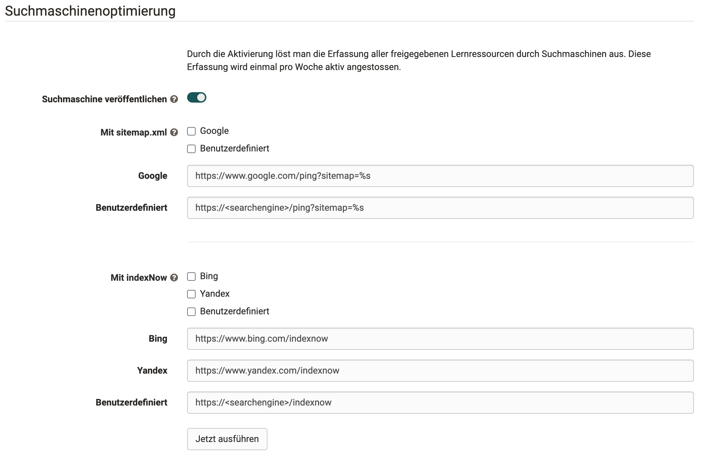

# Modul OAI PMH

!!! abstract ""
    zu :octicons-tag-24: Release 17.2 verfügbar

Der Zweck des "Open Archives Initiative - Protocol for Metadata Harvesting" (OAI-PMH): Zugang zu digitalen Ressourcen, in unserem Falle veröffentlichte Lernressourcen  für die Weitergabe von Metadaten an Portale, Suchmaschinen oder Kataloge. Weitergehende Informationen sind auf der [Open Archives Webseite](https://www.openarchives.org) zu finden.

{ class="shadow lightbox" }

## Metadataprefix

Die Metadatenprefixe zeigen sind zwei verschiedene Metadatensammlungen an:

* OpenOlat spezifisch (Learningressource URL ist im Titel enthalten): _www.yourwebsite.com/oaipmh?verb=listRecords&**metadataprefix=oai_oo**_

* Metadaten nach Dublincore: _www.yourwebsite.com/oaipmh?verb=listRecords&**metadataprefix=oai_dc**_

In Klammern ist das jeweilige XML Element in der passenden Metadatensammlung beschrieben.

Metadaten | OAI OpenOlat | OAI DublinCore
---------|----------|---------
 identifier | **x** | **x**
 url | **x** | --
 info_url | **x** | **x** (source)
 title | **x** (displayname) | **x**
 taxonomy | **x** | **x** (subject)
 resourcename| **x** | --
 initialauthor| **x** | **x** (creator)
 softkey| **x** | --
 location| **x** | --
 description| **x** | **x**
 publisher| **x** | **x**
 requirements| **x** | --
 credits| **x** | --
 allowtoleave| **x** | --
 authors | **x** | **x** (contributer)
 Date |  **x** (creationDate) | **x**
 r_identifier | **x** | --
 resname | **x** | **x** (format)
 expenditureofwork | **x** | --
 teaser | **x** | **x** (coverage)
 teaserImage | **x** | --
 canDownload | **x** | --
 canCopy | **x** | --
 canReference | **x** | --
 status_published_date | **x** | --
 language  |**x** (mainlanguage) | **x**  
 license_name | **x** | **x** (rights = + license_licensor)
 license_licensor | **x** | --
 sets | **x** | **x**
 deleted | **x** | **x**

## Administration

Das Modul kann unter `Administration-> Modules -> OAI PMH` eingeschaltet werden. Es ist standardmässig auf jeder Instanz deaktiviert. Wenn das Modul eingeschaltet ist, ist auch der API-Endpoint verfügbar, wo alle veröffentlichten Ressourcen über XML verfügbar sind.

### API Endpoint

Dies ist die Andwendungsschnittstelle, woher die Metadaten abgefragt werden. Mittels verschiedener Parameter kann man hier nach unterschiedlichen Lernressourcen filtern. Der API Enpoint kann auch mittels Klick auf den Button getestet werden.

### Identifier Typ

Mit dem Identifier typ kann der Typ des Identifiers eingestellt werden. Entweder man benutzt den DublinCore Namespace oder den OpenOlat eigenen Identifier, welcher auch die Ressourceninfo enthält, wo man auch die Infoseite sieht.

### Lizenz Einschränkungen

Man kann Lernressourcen auf Lizenzen einschränken. Entweder nur Lernressourcen mit einer Lizenzen oder die Lernressourcen mit einer bestimmten Lizenzart werden ihre Metadaten über die Schnittstelle schicken. Bei 

## API Konfiguration

### Sets
Verschiedene Sets können angewählt werden. Sets kategorisieren die Metadaten der Lernressourcen verschiedener Art. 

* Taxonomie-basiertes Set
* Organisations-basierte Set, (basierend auf administrativer Org-Beziehung)
* Lizenzbasierte Set, sortiert nach Lizenzarten
* Typ-basiertes Set, sortiert nach den Lernressourcentypen wie Kurs, Video, Podcast.
* Angebot-basiertes Set, sortiert nach den Angebotstypen wie privat, buchbar mit Konto, Gast

## Suchmaschinenoptimierung

Hiermit kann man freigegebene Lernressourcen aktiv für Suchmaschinen zugänglich machen. Dabei gibt es zwei Verfahren: sitemapxml was vorallem google benutzt und [indexnow](https://www.indexnow.org/index) von bing und anderen. Diese Erfassung wird einmal pro Woche aktiv angestossen.

Hat man eine eigenen Suchmaschinenindex, kann man diesen unter "benutzerdefiniert" eintragen.
