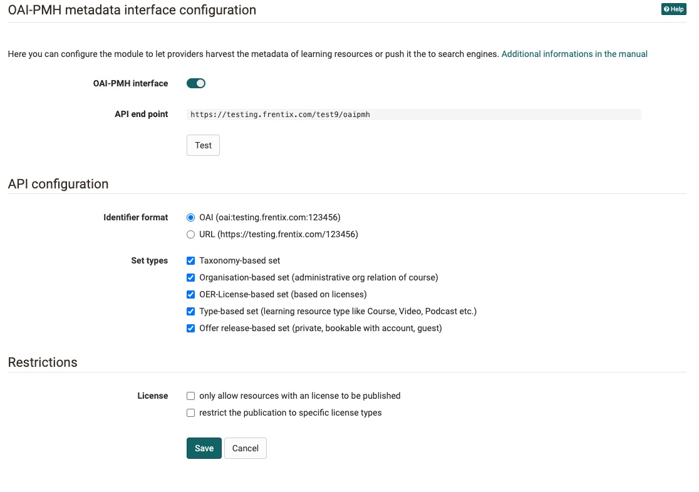

# Modules: OAI-PMH

!!! abstract ""
    available on :octicons-tag-24: Release 17.2 

The purpose of the "Open Archives Initiative - Protocol for Metadata Harvesting" (OAI-PMH): access to digital resources, in our case published learning resources for metadata sharing with portals, search engines or catalogues. More information can be found on the [Open Archives web site](https://www.openarchives.org).

{ class="shadow lightbox" }

## Administration

The module can be switched on under 'Administration-> Modules -> OAI PMH'. It is deactivated by default on every instance. If the module is switched on, the API end-point is also available, where all published resources are available via XML.

### API Endpoint

This is the application interface from which the metadata is retrieved. Different parameters can be used to filter for different learning resources. You can test die API endpoint, by clicking onto the button beneath the URL.

## Metadata prefix

The metadata prefixes indicate two different metadata collections:

OpenOlat specific (learning resource URL is included in the title).

https://testing.frentix.com/test9/oaipmh?verb=listRecords&metadataprefix=oai_oo

Metadata according to Dublincore: 

https://testing.frentix.com/test9/oaipmh?verb=listRecords&metadataprefix=oai_dc

Metadata | OAI OpenOlat | OAI DublinCore
---------|----------|---------
 identifier | **x** | --
 url | **x** | --
 info_url | **x** | --
 title | **x** | **x**
 subject | **x** | --
 displayname| **x** | --
 resource name| **x** | --
 initialauthor| **x** | **x** 
 softkey| **x** | --
 location| **x** | --
 requierements| **x** | --
 credits| **x** | --
 taxonomy| **x** | --
 Allowed to leave| **x** | --
 description| **x** | **x**
 publisher| **x** | **x**
 authors| **x** | --
 date | creationDate | date
 educationType | **x** | --
 resname | **x** | format
 effort | **x** | --
 teaser | **x** | --
 teaserImage | **x** | --
 canDownload | **x** | --
 canCopy | **x** | --
 canReference | **x** | --
 status_published_date | **x** | --
 language | **x** | **x** mainlanguage
 license_name | **x** | --
 licensor | **x** | --
 set | **x** | **x**
 deleted | **x** | **x**

### Identifier Type

The identifier type can be set with the identifier type. Either you use the DublinCore namespace or OpenOlat's own identifier, which also contains the resource info, where you also see the info page.

## License restrictions

One can restrict learning resources. Either only learning resources with licences or learning resources with a specific licence type will send their metadata through the interface.

## API Configuration

### Sets
Different sets can be selected. Sets categorise the metadata of learning resources of different types. 

* Taxonomy-based set
* Organisation-based set, based on administrative org relationship).
* Licence-based set, sorted by licence type
* Type-based set, sorted by learning resource types such as course, video, podcast.
* Offer-based set, sorted by the offer types such as private, bookable with account, guest.
