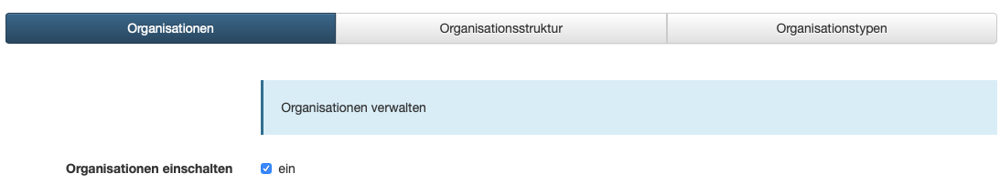
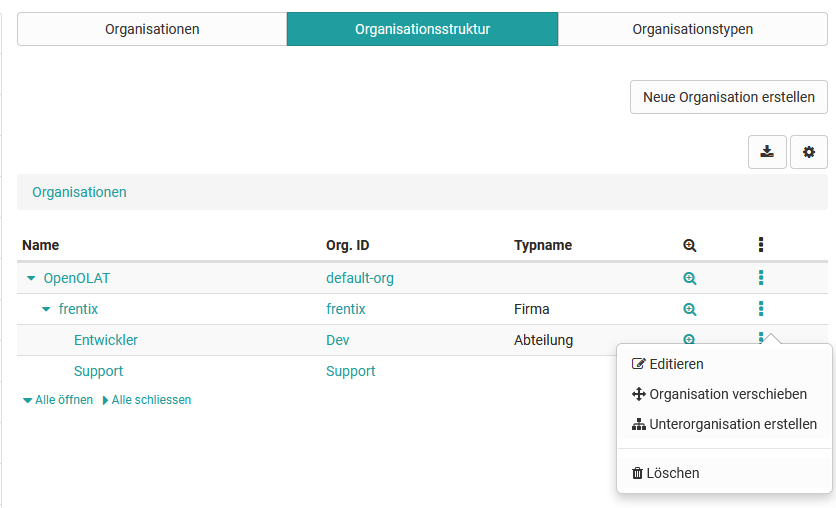
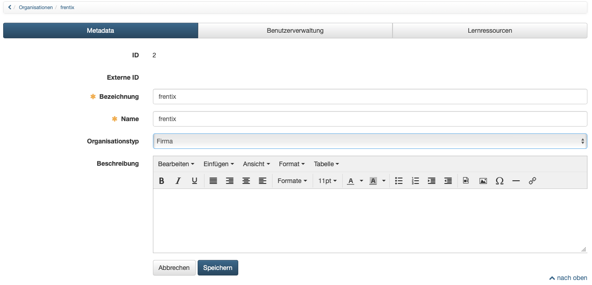
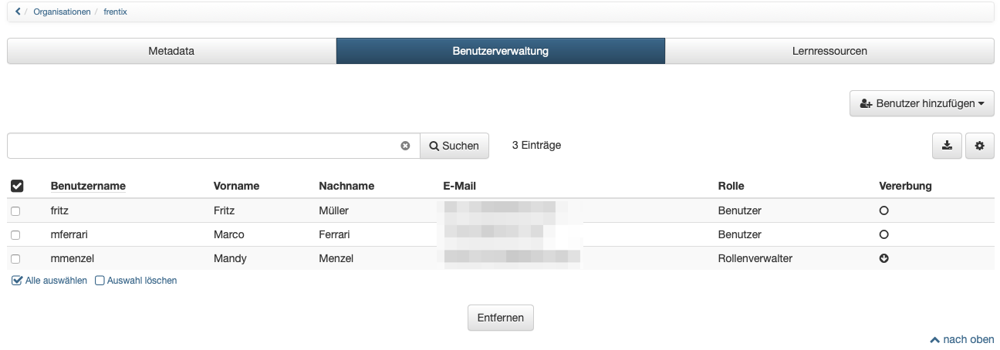

#  [Modules: Organisationen](Modules%EF%B9%95+Organisationen.html)

## Aktivierung der Organisationsstrukturen

Das Modul Organisationen ist optional in OpenOlat verfügbar und muss in der
Administration aktiviert werden. Kunden von frentix kontaktieren dafür bitte
[contact@frentix.com.](mailto:contact@frentix.com.) Nach der Aktivierung
können diverse zusätzliche Einstellungen für die systemweite Konfiguration
vorgenommen werden. Bei Systemen mit dem fx-Release werden diese Anpassung
durch frentix vorgenommen.

  

## Anlegen von Organisationsstrukturen

Im Tab "Organisationsstruktur" finden sich die bereits erstellten
Organisationen mit ihren Unterorganisationen als Baumstruktur dargestellt.

Neue Organisationen können über den Button "Neue Organisation anlegen", oder
bei bestehenden Organisationen über das Zahnrad und "Unterorganisation
erstellen", erstellt werden. Neben der Bezeichnung und dem Namen kann eine
Beschreibung für das Element eingetragen werden. Ausserdem erfolgt hier die
Zuordnung des Organisationstyps.

Bei der Erstellung kann jedes Organisationselement mit einem entsprechenden
Organisationstyp verknüpft und somit eine hierarchische Struktur aufgebaut
werden. Die Abbildung von Ablauf- und Aufbauorganisationen ist möglich, eine
Matrix-Organisation kann hingegen nicht dargestellt werden.

Jeder Stufe der Organisation können zum einen Mitglieder verschiedenster
Rollen zugeordnet werden.  Zum anderen können auf den Organisationsstrukturen
ebenfalls Lernressourcen und Curricula verknüpft werden.

Die **Rollen-Zuordnung** ist möglich

  * auf einer spezifischen Organisation
  * auf einer spezifischen Organisation und allen dieser Organisation untergeordneten Organisationsstrukturen
  * auf einer spezifischen Organisation und allen dieser Organisation übergeordneten Organisationsstrukturen

Auf jedem Organisationselement kann direkt die **Zuordnung von Kursen (oder
Lernressourcen)** zugeordnet werden.

Die **Zuordnung von Curricula** erfolgt in der Curriculumverwaltung am
jeweiligen Curriculum.

Weitere Optionen können über das Zahnrad am jeweiligen Organisationselement
aufgerufen werden. So kann die Organisation bearbeitet oder gelöscht werden.
Es ist auch möglich, das Element im Organisationsbaum zu verschieben bzw.
direkt eine neue Unterorganisation zu erstellen.

  

**Metadaten**

Wird eine Organisationsstruktur ausgewählt, können die Metadaten des
Organisationselementes angepasst oder ergänzt werden. Neben dem Namen und der
Bezeichnung kann die Beschreibung oder der zugeordnete Organisationstyp für
das Element aktualisiert werden.

  

**Benutzerverwaltung**

Im Tab "Benutzerverwaltung" erhält man eine Liste mit den aktuell zu diesem
Element zugeordneten Benutzern. Ebenso können bestehende Benutzer wieder
entfernt werden.

Über "Benutzer hinzufügen" können weitere Benutzer einer bestimmten Rolle
hinzugefügt werden. Hierfür wird aus den aufgelisteten Rollen die gewünschte
ausgewählt. Im anschliessenden Dialog kann nach Benutzern gesucht und
entsprechend der Auswahl hinzugefügt werden. Das Hinzufügen von mehreren
Benutzern ist möglich.

  

**Lernressourcen**

Im Tab "Lernressourcen" werden dem Organisationselement direkt zugeordnete
Kurse angezeigt. Diese können hier auch wieder entfernt werden. Über "Kurse
hinzufügen" kann in einem Dialog nach weiteren eigenen und verfügbaren
Ressourcen gesucht werden, um diese dem Organisationselement zuzuordnen.

  

  

## Definieren von Organisationstypen

Die Organisationstypen definieren, welche Elemente eine Organisationsstruktur
enthalten kann und geben diesen Elementen eine nähere Bedeutung. Die Typen
können dabei auch eine hierarchische Struktur abbilden, dies ist allerdings
nicht zwingend. Ein Beispiel für Organisationstypen ist Firma --> Bereich -->
Abteilung.

Über «Organisationstyp erstellen» können weitere Typen angelegt werden. Neben
der Bezeichnung (Kennzeichen) und dem Namen kann eine Beschreibung angegeben
werden. Es ist an dieser Stelle möglich, per CSS Klasse ein nur für diesen
Organisationstyp geltendes Layout zu hinterlegen. Zudem können dem neuem
Organisationstyp bereits bestehende Typen untergeordnet werden.

